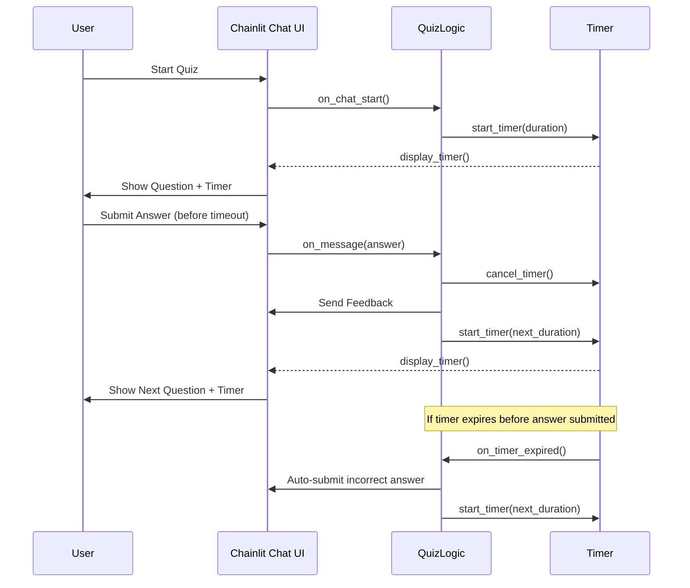

# Software Design Specification (SDS)  
## MCQ Timer Feature  

**Document Version**: 1.0  
**Date**: 2024-06-10  
**Project**: MCQ Application  
**Module**: Quiz Timer Feature  
**Author**: AI-Generated (GitHub Copilot)  
**Reviewed By**: _________________  
**Approved By**: _________________  
**Approval Date**: _________________  

---

### Document History

| Version | Date       | Author        | Changes               |
|---------|------------|---------------|-----------------------|
| 1.0     | 2024-06-10 | AI-Generated  | Initial SDS creation   |
|         |            |               |                       |

---

### Distribution List

| Role           | Name           | Date Sent |
|----------------|----------------|-----------|
| Technical Lead |                |           |
| QA Lead       |                |           |
| Product Owner |                |           |
|                |                |           |

---

## 1. Executive Summary

This document specifies the design of the MCQ Timer Feature for the existing Multiple Choice Question (MCQ) Quiz Application built with Chainlit in Python. The feature introduces a configurable countdown timer for each quiz question, enhancing the challenge and user engagement by limiting the time available for answering.

The MCQ Timer Feature is critical for improving quiz dynamics by enforcing time constraints on user responses while maintaining smooth interaction and accurate scoring.

Key stakeholders include the product owner, development team, QA team, and end-users who participate in quizzes.

Success will be measured by the correct enforcement of the timer, seamless user experience without lag, and accurate scoring with timer expiration.

---

## 2. Scope & Requirements

### Functional Requirements

1. [FR-1] Implement a countdown timer visible to users for each quiz question.
2. [FR-2] Automatically submit the current answer as incorrect if the timer expires before user input.
3. [FR-3] Pause and reset the timer appropriately for each new question.
4. [FR-4] Display timer warnings as the countdown approaches zero.
5. [FR-5] Allow configuration of timer duration per question or globally.

### Non-Functional Requirements

1. [NFR-1] Performance: Timer updates should not cause UI lag or degrade chat responsiveness.
2. [NFR-2] Security: Timer state should be securely managed to prevent tampering.
3. [NFR-3] Scalability: Support multiple concurrent users each with independent timers.
4. [NFR-4] Reliability: Timer must accurately track time, with minimal drift.
5. [NFR-5] Usability: Timer UI should be clear and unobtrusive.

### Scope

**In Scope**:  
- Timer UI integration within the Chainlit chat interface.  
- Backend logic to enforce timer expiration and auto-submission.  
- Configurable timer duration parameters.

**Out of Scope**:  
- Changes to quiz question content or scoring logic beyond timer impact.  
- Integration with external timing or monitoring services.

### Assumptions and Constraints

- The existing quiz application uses Chainlit and Python 3.10+.  
- User sessions are uniquely identified and maintained during the quiz.  
- No external database is used for question storage; data is in-memory.  
- Timer accuracy depends on client and server synchronization within Chainlit's capabilities.

### Dependencies

- Chainlit framework for chat UI and session management.  
- Existing question and answer modules (questions.py).  
- Python asyncio for asynchronous timer management.

---

## 3. Architecture Overview

### System Context

The MCQ Timer Feature integrates into the existing MCQ Quiz Application, which is a chat-based interactive quiz using Chainlit. The system consists of:

- **User Interface**: Chainlit chat interface presenting questions, options, timer display, and feedback.
- **Quiz Logic Module**: Python backend handling question sequencing, answer validation, scoring, and timer management.
- **Data Source**: In-memory Python data providing quiz questions and answers.
- **Session Management**: Using Chainlit's user session context to maintain user progress and timer state.

### Component Interactions

- Upon quiz start, the timer is initialized for the first question.
- Each question triggers a countdown timer visible to the user.
- User input is monitored asynchronously; if input arrives before timer expiration, answer is processed.
- If timer expires first, the system auto-submits an incorrect answer and advances the quiz.
- The timer resets for the next question or quiz end.

### Technology Stack

| Layer              | Technology                                    |
|--------------------|-----------------------------------------------|
| Programming Language| Python 3.10+                                  |
| Framework          | Chainlit (chat application framework)         |
| Data Storage       | In-memory Python lists/dictionaries            |
| Asynchronous Ops   | Python asyncio (for timer and chat handling)  |
| Deployment         | Not specified (assumed containerized or server) |

### Mermaid Diagram: Component Interaction

```mermaid
graph TD
    User[User Interface - Chainlit Chat]
    QuizLogic[Quiz Logic Module]
    Timer[Timer Management]
    Data[Quiz Data (questions.py)]

    User -->|User Input| QuizLogic
    QuizLogic -->|Fetch Question| Data
    QuizLogic -->|Start Timer| Timer
    Timer -->|Timer Expiry Event| QuizLogic
    QuizLogic -->|Send Feedback| User
```

### Integration Points

- Chainlit event hooks for message handling and chat start.  
- User session storage for state maintenance.  
- Quiz data module for question retrieval.  

---

## 4. Component Breakdown

### 4.1 Timer Management Component

**Responsibilities**:  
- Start, pause, reset countdown timers for each question.  
- Detect timer expiration and notify quiz logic.  
- Provide timer updates to UI for display.

**Interfaces**:  
- `start_timer(duration: int, session_id: str)`  
- `cancel_timer(session_id: str)`  
- `on_timer_expired(session_id: str)` callback

**Design Patterns**:  
- Observer pattern for timer expiration events.  
- Singleton or per-session timer instances.

**Code References**:  
- To be implemented as an extension to `app.py`.  
- Utilize Python's `asyncio` module for non-blocking timers.

### 4.2 Quiz Logic Module

**Responsibilities**:  
- Manage quiz state per user session.  
- Validate user answers and update scores.  
- Interact with Timer Management to enforce timing rules.  
- Send questions, feedback, and results to user interface.

**Interfaces**:  
- Event handlers: `on_chat_start()`, `on_message()`.  
- Timer callbacks for timeouts.

**Code References**:  
- `app.py` (main logic)  
- `questions.py` (data source)

### 4.3 User Interface (Chat)

**Responsibilities**:  
- Display questions and options.  
- Show countdown timer visually.  
- Accept and validate user input.  
- Provide feedback and final results.

**Implementation Details**:  
- Chainlit chat messages with markdown formatting.  
- Timer display updated via periodic messages or embedded UI components.

---

## 5. API Overview

The MCQ Timer Feature primarily extends internal asynchronous event handling APIs exposed by Chainlit.

| Endpoint/Event       | Description                                   | Input                         | Output                      | Auth Required |
|---------------------|-----------------------------------------------|-------------------------------|-----------------------------|---------------|
| `on_chat_start`      | Initializes user session and quiz state       | None                          | Sends welcome message, starts first question and timer | Yes           |
| `on_message`         | Processes user answers or commands             | User message content           | Sends feedback, next question or results | Yes           |
| Timer Expiry Event   | Internal event triggered on timer expiration  | Session ID                    | Auto-submit answer, advance quiz | No            |

### Request/Response Formats

- User answers are integer strings representing option indices (1-based).  
- Feedback messages contain markdown formatted text with correctness and explanations.

### Authentication and Authorization

- Based on Chainlit user session context; implicit session tracking per connected user.

### Rate Limiting and Quotas

- Not explicitly defined; depends on Chainlit's connection handling.

### Error Codes and Handling

- User input validation errors result in warning messages prompting correct input.  
- Timer expiration handled gracefully with auto submission.

---

## 6. Data Model & Persistence

### 6.1 Data Model

The MCQ Timer Feature uses in-memory Python data structures for storing quiz questions and user session states.

| Entity            | Attributes                                      | Description                                  |
|-------------------|------------------------------------------------|----------------------------------------------|
| Question          | id: int<br>question: str<br>options: list[str]<br>correct_answer: int<br>explanation: str | Represents a quiz question with multiple choices and the correct answer index. |
| UserSessionData   | current_question: int<br>score: int<br>answers: list[dict]<br>timer_state: dict | Tracks the user’s current quiz progress, score, answered questions, and timer info. |

### 6.2 Persistence Layer

- No external database is used; all data is stored in memory during the session.
- User session data is stored in a global dictionary keyed by session ID.
- Questions are imported from `questions.py`.
- Timer states will be managed per session in memory.

### 6.3 Data Validation Rules

- User answer must be within the valid range of option indices.
- Timer durations must be positive integers.
- Session data must exist for active sessions to avoid errors.

### 6.4 Migration Strategy

- Not applicable as no database or persistent storage changes are required.

### 6.5 Data Retention Policies

- User session data retained only during active chat session lifetime.
- Data is discarded upon session termination or quiz completion.

---

## 7. Configuration & Deployment

### 7.1 Environment Variables

- No environment variables specific to the timer feature detected in the current codebase.
- Future configurable parameters (e.g., timer duration) can be added as environment variables or configuration files.

### 7.2 Configuration Files

- None detected related to timer or quiz configuration.
- Configuration can be extended via `.env` or config YAML/JSON files as needed.

### 7.3 Deployment Steps

- The app is run by executing `app.py` (e.g., `python app.py`).
- Chainlit framework manages the web server and chat interface.
- Deploy on any Python 3.10+ compatible environment.
- Containerization (Docker) or cloud deployment not specified but can be added.

### 7.4 Infrastructure Requirements

- Hosting environment must support Python 3.10+ and Chainlit.
- Network connectivity for user access to chat interface.
- Sufficient memory to hold in-memory quiz data and user sessions.

### 7.5 Scaling Considerations

- Application handles multiple concurrent sessions via Chainlit.
- Timer state management must be thread-safe and session-isolated.
- Horizontal scaling possible if session affinity is maintained.

---

## 8. Security & Compliance

### 8.1 Authentication Mechanisms

- User authentication managed by Chainlit session management (not detailed).
- Assumed users are uniquely identified by session IDs.

### 8.2 Authorization and Access Control

- Access control limited to session scope.
- Each user can only access their own quiz session data and timer.

### 8.3 Data Encryption

- No sensitive user data or PII stored.
- Communication encryption depends on deployment (TLS/SSL not covered).

### 8.4 Input Validation and Sanitization

- User answers validated to be numeric and within option range.
- Invalid inputs prompt user to re-enter.
- No direct SQL or injection risks due to lack of database.

### 8.5 Compliance Requirements

- No explicit GDPR, HIPAA, PCI-DSS compliance requirements detected.
- Minimal personal data involved; consider adding privacy notices if expanded.

### 8.6 Audit Logging

- No audit logging implemented.
- Future enhancements may include logging timer expirations and user responses.

### 8.7 Threat Modeling

- Risks include session hijacking, denial of service by spamming inputs.
- Mitigations involve Chainlit's session security and input throttling.

---

## 9. Observability

### 9.1 Logging Strategy and Levels

- Current codebase lacks explicit logging.
- Recommend adding debug/info logs for timer start/stop and expiry events.

### 9.2 Monitoring and Alerting

- No monitoring or alerting integrated.
- Can be added via external tools or Chainlit extensions.

### 9.3 Performance Metrics

- Track average response time per question.
- Monitor timer accuracy and drift.

### 9.4 Health Checks

- Application health depends on Chainlit server status.
- No custom health endpoints present.

### 9.5 Debugging Approaches

- Use Python debugging tools and Chainlit logs.
- Monitor timer callbacks and user session states.

---

## 10. Non-Functional Requirements

| Requirement             | Description                                      |
|-------------------------|------------------------------------------------|
| Performance             | Timer updates must not degrade chat responsiveness. |
| Scalability             | Support hundreds of concurrent quiz sessions.  |
| Reliability            | Timer accuracy within ±1 second per question.    |
| Availability           | System should be available 99.9% during quiz hours. |
| Accessibility          | Timer UI must be accessible and readable.        |
| Internationalization   | Support for multiple languages in messages (future scope). |

---

## 11. Risks & Mitigation

### 11.1 Technical Risks

| Risk                                   | Mitigation Strategy                                   |
|---------------------------------------|------------------------------------------------------|
| Timer drift causing inaccurate timing | Use high-precision asyncio timers; test accuracy thoroughly. |
| User disconnects mid-quiz             | Save session state frequently; allow quiz resume if possible. |
| Session data loss                     | Store critical state in persistent storage (future enhancement). |
| Performance degradation under load   | Load test; optimize timer and session data handling. |
| Chainlit framework limitations       | Monitor Chainlit updates; contribute fixes if needed. |

### 11.2 Known Limitations

- Timer state is maintained in-memory and lost if server restarts.
- No persistent storage or database integration currently.
- Timer UI updates may lag if network latency is high.
- No multi-language support yet.

### 11.3 Technical Debt

- Lack of logging and monitoring.
- Hardcoded quiz data limits scalability.
- Timer configuration is static; no dynamic adjustment per user.

### 11.4 Dependencies Risks

- Reliance on Chainlit for session and chat management.
- Potential breaking changes if Chainlit updates APIs.

### 11.5 Contingency Plans

- Plan for fallback to untimed quiz mode if timer feature malfunctions.
- Implement session persistence in future versions.

### 11.6 Migration / Rollback Strategy

- No database migration needed.
- Rollback involves redeploying previous application version without timer feature.

---

## 12. Architecture Decision Records (ADRs)

### ADR-001: Choice of Chainlit Framework for Chat-Based Quiz

**Status**: Accepted  
**Date**: 2024-06-10  
**Deciders**: Development Team  

#### Context  
The project requires an interactive chat interface for quizzes.

#### Decision Drivers  
- Ease of building conversational UI  
- Python compatibility  
- Async support for timers  

#### Considered Options  
1. Chainlit  
2. Custom web app with React + backend  
3. Other chat frameworks (Botpress, Rasa)  

#### Decision Outcome  
Chosen option: Chainlit for rapid development and integration with Python.

**Positive Consequences**  
- Fast prototyping  
- Built-in session management  

**Negative Consequences**  
- Limited UI customization  
- Dependency on third-party framework  

---

### ADR-002: In-Memory Data Storage for Questions and Sessions

**Status**: Accepted  
**Date**: 2024-06-10  
**Deciders**: Development Team  

#### Context  
Simple quiz data and session state management needed.

#### Decision Drivers  
- Simplicity  
- No external database overhead  

#### Considered Options  
1. In-memory Python data structures  
2. External database (SQL/NoSQL)  

#### Decision Outcome  
Chose in-memory storage for current scope.

**Positive Consequences**  
- Simple implementation  
- Fast access  

**Negative Consequences**  
- Data lost on restart  
- Not scalable for large user base  

---

### ADR-003: Timer Implementation Using Python asyncio

**Status**: Proposed  
**Date**: 2024-06-10  
**Deciders**: Development Team  

#### Context  
Need non-blocking timer for each quiz session.

#### Decision Drivers  
- Async event handling  
- Precision timing  

#### Considered Options  
1. asyncio timers  
2. Threading and sleep calls  
3. External timer services  

#### Decision Outcome  
Propose asyncio timers to integrate with Chainlit’s async event loop.

---

## 13. Assumptions & Constraints

### Assumptions

- Users have stable network connections for interactive chat.  
- Chainlit framework is stable and maintained.  
- Quiz questions are static and do not change mid-quiz.  
- Timer duration is fixed for all questions initially.

### Constraints

- No persistent storage currently.  
- Timer accuracy depends on event loop scheduling.  
- Limited UI customization within Chainlit chat.  
- Resource limits on hosting environment may affect scaling.

---

## 14. Dependencies & Integration

### Internal Dependencies

- `questions.py` for quiz data.  
- `app.py` for quiz logic and timer management.

### External Dependencies

- Chainlit framework and its dependencies.

### Infrastructure Dependencies

- Python 3.10+ runtime environment.  
- Web hosting or server capable of running Chainlit.

### Integration Sequence

- Deploy Chainlit environment.  
- Deploy quiz application with timer feature.  
- Test timer functionality with user sessions.

---

## 15. Glossary & References

| Term           | Definition                                                         |
|----------------|--------------------------------------------------------------------|
| MCQ            | Multiple Choice Question                                           |
| Chainlit       | Python-based conversational UI framework                          |
| Timer Feature  | Countdown timer enforcing time limits per quiz question           |
| Asyncio        | Python module for asynchronous programming                        |
| Session ID     | Unique identifier for each user quiz session                       |
| Quiz Logic     | Backend logic managing quiz flow, scoring, and timer integration  |

### References

- Chainlit Official Documentation: https://chainlit.io/  
- Python asyncio Documentation: https://docs.python.org/3/library/asyncio.html  
- Business Requirement Specification: [BRS/Business Requirement Specification MCQ Timer Feature.docx](https://github.com/DhilipThiru/PromptPirates/blob/dev/BRS/Business%20Requirement%20Specification%20MCQ%20Timer%20Feature.docx)  

---

## 16. Glossary & References (continued)

- **User Session Data**: The data structure that stores the current state of the user’s quiz including current question, score, answers, and timer state.
- **Timer Expiry Event**: An event triggered when the countdown timer reaches zero, forcing answer submission or quiz progression.
- **Async Event Loop**: Mechanism in Python's asyncio to handle concurrent tasks asynchronously.
- **Observer Pattern**: Design pattern where an object (observer) registers to receive events or updates from another object (subject).

---

## 17. Appendices

### 17.1 Detailed Sequence Diagram: Timer Integration Flow

The following sequence diagram illustrates the interaction between user, quiz logic, and timer component during a timed quiz question:



---

### 17.2 Sample Timer Configuration (Future Extension)

```python
TIMER_DURATION_SECONDS = 30  # Default timer duration per question
```

---

### 17.3 Example Timer Implementation Snippet (Python Asyncio)

```python
import asyncio

timer_tasks = {}

async def start_timer(duration, session_id, on_expire_callback):
    if session_id in timer_tasks:
        timer_tasks[session_id].cancel()
    async def timer_coroutine():
        try:
            await asyncio.sleep(duration)
            await on_expire_callback(session_id)
        except asyncio.CancelledError:
            pass
    timer_tasks[session_id] = asyncio.create_task(timer_coroutine())

def cancel_timer(session_id):
    if session_id in timer_tasks:
        timer_tasks[session_id].cancel()
        del timer_tasks[session_id]
```

---

## 
 Converting to Word (.docx)

To convert this Markdown document to Word format, use Pandoc:

### Prerequisites
- Install Pandoc: https://pandoc.org/installing.html
  - Windows: `choco install pandoc` or download installer
  - Mac: `brew install pandoc`
  - Linux: `apt-get install pandoc`

### Conversion Commands

**Basic Conversion**:
```bash
pandoc docs/SDS_MCQ_Timer_Feature_20240610.md -o docs/SDS_MCQ_Timer_Feature_20240610.docx
```

**With Table of Contents**:
```bash
pandoc docs/SDS_MCQ_Timer_Feature_20240610.md -o docs/SDS_MCQ_Timer_Feature_20240610.docx --toc --toc-depth=3
```

**With Custom Styling** (requires reference.docx template):
```bash
pandoc docs/SDS_MCQ_Timer_Feature_20240610.md -o docs/SDS_MCQ_Timer_Feature_20240610.docx --reference-doc=custom-reference.docx --toc
```

### Mermaid Diagrams in Word
Mermaid diagrams must be manually converted:
1. Copy Mermaid code to https://mermaid.live/
2. Export as PNG/SVG
3. Insert images into Word document

---
