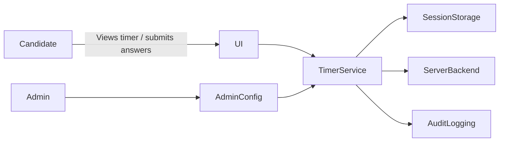
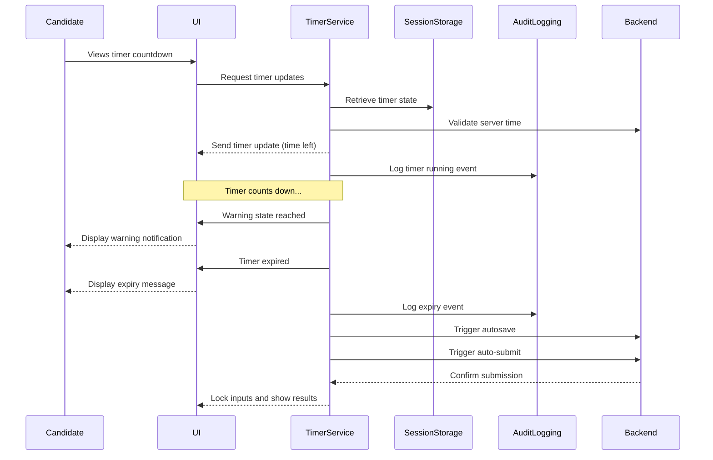

# Software Design Specification (SDS)
## MCQ Timer Feature

**Document Version**: 1.0  
**Date**: 2024-06-13  
**Project**: MCQ Application  
**Module**: Timer Feature  
**Author**: AI-Generated (GitHub Copilot)  
**Reviewed By**: _________________  
**Approved By**: _________________  
**Approval Date**: _________________  

---

### Document History

| Version | Date       | Author          | Changes               |
|---------|------------|-----------------|-----------------------|
| 1.0     | 2024-06-13 | AI-Generated    | Initial SDS creation   |
|         |            |                 |                       |

---

### Distribution List

| Role           | Name | Date Sent |
|----------------|------|-----------|
| Technical Lead |      |           |
| QA Lead       |      |           |
| Product Owner |      |           |
|                |      |           |

---

## 1. Executive Summary

The MCQ Timer Feature is designed to introduce configurable timers to the existing Multiple Choice Question (MCQ) application. This feature aims to enforce time limits on exams, provide real-time countdown visibility, and ensure exam integrity through server-authoritative timing and audit logging. The timer will persist across page refreshes and network interruptions, automatically saving and submitting answers upon expiry. This enhancement supports accessibility and localization, delivering a reliable and compliant exam experience.

Key stakeholders include the Product Manager, UX Designers, Frontend and Backend Developers, QA Team, Support, and Security. Success metrics focus on reducing exam overruns by over 95%, minimizing answer loss with autosave success rates of 99% or higher, and achieving positive candidate feedback on timer visibility.

---

## 2. Scope & Requirements

### Functional Requirements

1. [FR-1] Enforce a time limit for the entire exam.
2. [FR-2] Autosave answers and auto-submit the exam upon timer expiry.
3. [FR-3] Display a visible, accurate countdown timer to candidates.
4. [FR-4] Log all timing-related events for audit purposes.
5. [FR-5] Allow administrators to configure timer settings, warnings, and accommodations.
6. [FR-6] Ensure timer persistence across page reloads and brief network outages.
7. [FR-7] Support accessibility and localization standards.

### Non-Functional Requirements

1. [NFR-1] Performance: Timer updates every second with UI latency under 100 ms.
2. [NFR-2] Reliability: No loss of answers during transient network failures lasting up to 60 seconds.
3. [NFR-3] Security: Server authoritative timing to prevent client-side tampering.
4. [NFR-4] Scalability: Support many concurrent exam sessions without degradation.
5. [NFR-5] Accessibility: Comply with accessibility guidelines for timer visibility and notifications.
6. [NFR-6] Localization: Timer and messages must be translatable and adapt to different locales.

### Scope

**In Scope**:  
- Exam-level countdown timer  
- Auto-save and auto-submit on expiry  
- Warning thresholds and notifications  
- Persistence of timer state  
- Admin configuration interface  
- Accessibility and localization compliance

**Out of Scope**:  
- Section-level timers (handled separately)  
- Question-level timing  
- Integration with external proctoring services

---

## 3. Architecture Overview

The MCQ Timer Feature will be integrated into the existing Python Chainlit-based MCQ application. The architecture follows a modular design with the following key components:

- **User Interface Layer**: Presents the countdown timer, warnings, and notifications to the candidate.
- **Timer Management Service**: Manages timer state, countdown logic, persistence, and expiry actions.
- **Session Storage**: Maintains timer and user session state across page reloads and network interruptions.
- **Audit Logging Module**: Records timing events and user actions for compliance and analysis.
- **Admin Configuration Module**: Allows authorized personnel to set timer parameters and accommodations.
- **Server Backend**: Enforces server-authoritative timing to prevent client manipulation.

### Technology Stack

- **Language**: Python 3.10+
- **Framework**: Chainlit (chat and interactive app framework)
- **Frontend**: Chainlit UI components with dynamic timer display
- **Storage**: In-memory session data for timer state; persistent logs for audit
- **Logging**: Structured event logging for timing events

### System Context Diagram



**Description**: The candidate interacts with the UI, which displays the timer and relays user inputs. The Timer Management Service handles countdowns and expiry logic, consulting the Session Storage and Server Backend for authoritative timing and state persistence. All relevant events are logged. Administrators configure settings through the Admin Configuration Module.

---

## 4. Component Breakdown

### 4.1 User Interface Layer

- **Responsibilities**:  
  - Display the countdown timer prominently (fixed header)  
  - Show warning and critical state messages  
  - Provide non-blocking notifications and optional sounds  
  - Support accessibility features (ARIA labels, keyboard navigation)  
  - Adapt to localization and formatting rules

- **Interfaces**:  
  - Receives timer updates from Timer Management Service  
  - Sends user interaction events (e.g., acknowledgement of warnings)  

- **Related Files**: `app.py` (UI logic with Chainlit messaging)

### 4.2 Timer Management Service

- **Responsibilities**:  
  - Initialize and track exam timers per session  
  - Enforce server-authoritative time limits  
  - Persist timer state across refreshes and network loss  
  - Trigger autosave and auto-submit on expiry  
  - Manage warning thresholds and state transitions  

- **Interfaces**:  
  - Reads configuration from Admin Configuration Module  
  - Updates Session Storage for persistence  
  - Emits audit logs to Audit Logging Module  
  - Communicates with UI for state updates  

- **Related Files**:  
  - Timer logic to be added/enhanced in `app.py` and possibly new modules

### 4.3 Session Storage

- **Responsibilities**:  
  - Store timer and user session state in-memory or persistent store  
  - Handle recovery of timer state after reload or brief outages  

- **Interfaces**:  
  - Accessed by Timer Management Service and UI components  

- **Related Files**:  
  - Existing in-memory structures in `app.py` (e.g., `user_data`)  
  - May require enhancement for persistence

### 4.4 Audit Logging Module

- **Responsibilities**:  
  - Record timing events: start, warnings, expiry, autosave, auto-submit  
  - Store logs for compliance and troubleshooting  

- **Interfaces**:  
  - Receives event data from Timer Management Service  
  - Writes to persistent log storage or external logging service  

- **Related Files**:  
  - To be implemented or integrated with existing logging mechanisms

### 4.5 Admin Configuration Module

- **Responsibilities**:  
  - Provide interface for configuring timer durations, warnings, accommodations  
  - Validate and persist configuration settings  

- **Interfaces**:  
  - Exposes configuration data to Timer Management Service  

- **Related Files**:  
  - Not present in current code; to be designed and integrated

---

## 5. API Overview

The existing MCQ app uses Chainlit event handlers and messaging rather than RESTful APIs. For the Timer Feature, interaction points include:

| Event/Method           | Description                                           | Parameters / Payload                        |
|-----------------------|-------------------------------------------------------|--------------------------------------------|
| `on_chat_start`       | Initializes user session and timer state              | None                                       |
| `send_timer_update`   | Sends timer countdown and state to the candidate UI   | `time_remaining`, `state` (normal, warning, expired) |
| `autosave_answers`    | Automatically saves user's current answers            | `session_id`, `answers`                     |
| `auto_submit_exam`    | Submits the exam on timer expiry                       | `session_id`                                |
| `on_message`          | Handles user responses and timer interactions          | User message content                        |
| `admin_config_update` | API/event to update timer settings (to be implemented) | Configuration payload                       |

**Authentication & Authorization**:  
- Candidate interactions are session-based with Chainlit user session IDs.  
- Admin configuration updates require elevated privileges (to be designed).  

**Error Handling**:  
- Timer state mismatches trigger resync requests from client.  
- Autosave failures retry with exponential backoff.  
- Logging failures are recorded locally with alerts for manual review.

---

## 6. Data Model & Persistence

### 6.1 Timer State Model

| Field           | Type         | Description                                     |
|-----------------|--------------|------------------------------------------------|
| `session_id`    | String       | Unique identifier for the user session          |
| `start_time`    | DateTime     | Timestamp when the timer started                 |
| `duration`      | Integer      | Total timer duration in seconds                   |
| `time_left`     | Integer      | Remaining time in seconds                         |
| `state`        | Enum         | Current timer state: Normal, Warning, Critical, Expired |
| `last_update`  | DateTime     | Timestamp of last timer update                    |

### 6.2 Answer Data Model

| Field           | Type         | Description                                     |
|-----------------|--------------|------------------------------------------------|
| `question_id`   | Integer      | Identifier of the question                       |
| `user_answer`   | Integer      | Index of the user’s selected answer             |
| `correct`      | Boolean      | Whether the answer was correct                   |
| `timestamp`    | DateTime     | When the answer was submitted                    |

### 6.3 Persistence Strategy

- **In-memory session storage**: Timer state and user answers are stored in-memory during the session for performance.
- **Autosave mechanism**: Periodically (or on timer events), user answers and timer state are saved to persistent backend storage (could be database or file system). The current codebase uses in-memory structures; persistent storage is a recommended enhancement.
- **Audit logs**: Timing events and exam submissions are logged to persistent audit storage for compliance and troubleshooting.

---

## 7. Configuration & Deployment

### 7.1 Environment Variables

| Variable               | Description                                 | Default | Required |
|------------------------|---------------------------------------------|---------|----------|
| `TIMER_DEFAULT_DURATION`| Default exam timer duration in seconds     | 1800    | Yes      |
| `TIMER_WARNING_THRESHOLD`| Time remaining to trigger warning state   | 300     | Yes      |
| `TIMER_CRITICAL_THRESHOLD`| Time remaining to trigger critical state | 60      | Yes      |
| `AUTOSAVE_INTERVAL`    | Interval in seconds for autosave             | 30      | Yes      |

### 7.2 Configuration Files

- Timer and autosave settings can be configured via environment variables or a YAML/JSON config file (to be implemented).
- Admin interface to override these settings per exam (future enhancement).

### 7.3 Deployment

- The MCQ app is deployed as a Python Chainlit application.
- Requires Python 3.10+ environment.
- Dependencies managed via `pyproject.toml`.
- Deployment scripts and infrastructure details to remain consistent with existing MCQ app deployment.

---

## 8. Security & Compliance

### 8.1 Authentication & Authorization

- User sessions are managed by Chainlit framework.
- Timer control actions are server-authoritative, preventing client-side manipulation.
- Admin configuration interface requires proper authentication and role-based authorization (to be implemented).

### 8.2 Data Protection

- All timing and answer data transmitted over secure channels (TLS).
- Sensitive data (e.g., user answers) stored securely with access controls.
- Audit logs protected against tampering.

### 8.3 Compliance Requirements

- The timer feature supports compliance with exam integrity policies.
- Full audit trails of timer events and submissions are maintained.
- Accessibility compliance ensures equitable exam access.
- Localization supports multi-lingual candidate base.

---

## 9. Observability

### 9.1 Logging

- All timer events (start, warnings, expiry) and autosave/auto-submit actions are logged.
- Logs include timestamps, session IDs, and event details.

### 9.2 Monitoring & Alerting

- Monitor for timer failures (e.g., missing events, autosave failures).
- Alerts set for repeated autosave failures or suspicious timing anomalies.

### 9.3 Health Checks

- Regular checks on timer service availability.
- Session persistence health monitored.

---

## 10. Non-Functional Requirements

| Requirement            | Target / Metric                              |
|------------------------|----------------------------------------------|
| Performance            | UI timer updates every 1 second, latency <100 ms  |
| Reliability            | No answer loss during transient outages ≤60 s  |
| Scalability            | Support for large concurrent exam sessions       |
| Availability           | 99.9% uptime SLA                                  |
| Accessibility          | WCAG 2.1 compliance                              |
| Localization           | Support for English plus 3 additional languages  |
| Security               | Server authoritative timing, encrypted data      |

---

## 11. Risks & Mitigation

| Risk                                  | Impact                             | Mitigation Strategy                             |
|-------------------------------------|----------------------------------|------------------------------------------------|
| Timer state loss during network loss | Exam integrity compromised       | Persist timer state frequently; resync on reconnect  |
| Client clock tampering                | Inaccurate timer display         | Enforce server-authoritative timing             |
| Autosave failure                     | Data loss                        | Retry autosave with exponential backoff; alert admins   |
| Scalability bottlenecks              | Performance degradation          | Load test; optimize resource usage; scale horizontally |
| Accessibility non-compliance        | Candidate exclusion              | Follow WCAG guidelines; perform accessibility testing |
| Localization errors                  | Confusion for non-English users  | Use trusted translation services; test translations |

---

## 12. Architecture Decision Records (ADRs)

### ADR-001: Choice of Python Chainlit Framework

**Status**: Accepted  
**Date**: 2024-06-13  
**Deciders**: Development Team  

#### Context  
The project uses Chainlit as the base framework for building the MCQ quiz app, enabling conversational UI and event-driven interactions.

#### Decision Drivers  
- Rapid development of interactive quiz features  
- Support for real-time messaging  
- Integration ease with Python backend  

#### Considered Options  
1. Use Chainlit (chosen)  
2. Build custom frontend/backend with REST APIs  
3. Use a traditional web framework (Django/Flask)  

#### Decision Outcome  
Chainlit was selected for its interactive capabilities and alignment with existing codebase.

**Positive Consequences**:  
- Faster development  
- Simplified event handling  

**Negative Consequences**:  
- Less traditional REST API support  
- Potential limitations in complex UI rendering  

---

### ADR-002: Server-Authoritative Timer Enforcement

**Status**: Accepted  
**Date**: 2024-06-13  
**Deciders**: Security Team, Development Team  

#### Context  
Client-side timers can be manipulated, risking exam integrity.

#### Decision Drivers  
- Security and fairness  
- Compliance with exam regulations  

#### Considered Options  
1. Client-side timer only  
2. Server-authoritative timer (chosen)  
3. Hybrid approach  

#### Decision Outcome  
Server-authoritative timer is used to enforce exam duration.

**Positive Consequences**:  
- Prevents cheating via clock tampering  
- Strong audit trail  

**Negative Consequences**:  
- Increased server load  
- More complex synchronization  

---

## 13. Assumptions & Constraints

### Assumptions

- Network outages are brief and infrequent.
- Users have modern browsers supporting JavaScript.
- Admin users have authenticated access to configuration settings.
- The in-memory session store can be extended to persistent storage if needed.

### Constraints

- Current codebase lacks persistent storage for timer state; enhancement required.
- Admin configuration UI is not yet implemented.
- Scalability depends on Chainlit and hosting environment capabilities.

---

## 14. Dependencies & Integration

| Dependency          | Description                           | Impact on Timer Feature                 |
|---------------------|-------------------------------------|----------------------------------------|
| Chainlit Framework  | Base application framework           | Core for event handling and UI         |
| Python 3.10+        | Runtime environment                   | Required for application execution     |
| Logging Infrastructure| For audit logs                      | Required for compliance and monitoring |
| Network Connectivity | For session persistence and autosave | Affects timer reliability              |

Integration with external proctoring or LMS systems is out of scope for this feature.

---

## 15. Glossary & References

| Term           | Definition                                |
|----------------|-------------------------------------------|
| MCQ            | Multiple Choice Question                   |
| Chainlit       | Python framework for chat-based apps      |
| Timer State    | Current status and countdown of the timer |
| Autosave       | Automatic saving of user answers          |
| Audit Log      | Record of system events for compliance    |
| Accessibility  | Design for users with disabilities         |
| Localization   | Adapting content for different languages  |

**References**:  
- BRS Document: [MCQ Timer Feature BRS](https://github.com/DhilipThiru/PromptPirates/blob/dev/BRS/Business%20Requirement%20Specification%20MCQ%20Timer%20Feature.docx)  
- Chainlit Documentation: https://chainlit.io/docs/  
- WCAG 2.1 Guidelines: https://www.w3.org/TR/WCAG21/  

---

## 16. Appendices

### 16.1 Sequence Diagram – Timer Expiry Flow

The sequence diagram below illustrates the flow of events when the exam timer expires:



### 16.2 Database Schema

(Currently, the application uses in-memory storage; persistent schema design is recommended for future enhancements.)

### 16.3 Configuration Examples

```yaml
timer:
  default_duration: 1800 # seconds
  warning_threshold: 300
  critical_threshold: 60
  autosave_interval: 30
```

### 16.4 Code Samples

Refer to `app.py` and `questions.py` for existing quiz logic and question data management.

---

## 4C4 Converting to Word (.docx)

To convert this Markdown document to Word format, use Pandoc:

### Prerequisites
- Install Pandoc: https://pandoc.org/installing.html
  - Windows: `choco install pandoc` or download installer
  - Mac: `brew install pandoc`
  - Linux: `apt-get install pandoc`

### Conversion Commands

**Basic Conversion**:
```bash
pandoc docs/SDS_MCQ_Timer_Feature_20240613.md -o docs/SDS_MCQ_Timer_Feature_20240613.docx
```

**With Table of Contents**:
```bash
pandoc docs/SDS_MCQ_Timer_Feature_20240613.md -o docs/SDS_MCQ_Timer_Feature_20240613.docx --toc --toc-depth=3
```

**With Custom Styling** (requires reference.docx template):
```bash
pandoc docs/SDS_MCQ_Timer_Feature_20240613.md -o docs/SDS_MCQ_Timer_Feature_20240613.docx --reference-doc=custom-reference.docx --toc
```

### Mermaid Diagrams in Word
Mermaid diagrams must be manually converted:
1. Copy Mermaid code to https://mermaid.live/
2. Export as PNG/SVG
3. Insert images into Word document

---
