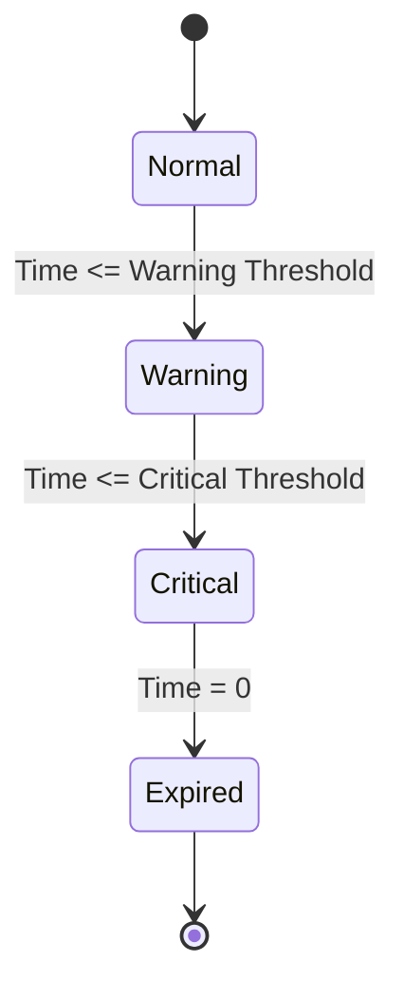

# Software Design Specification (SDS)  
## MCQ Timer Feature  

**Document Version**: 1.0  
**Date**: 2024-06-14  
**Project**: PromptPirates - MCQ Application  
**Module**: Timer Feature Integration  
**Author**: AI-Generated (GitHub Copilot)  
**Reviewed By**: _________________  
**Approved By**: _________________  
**Approval Date**: _________________  

---

### Document History  

| Version | Date       | Author            | Changes                  |  
|---------|------------|-------------------|--------------------------|  
| 1.0     | 2024-06-14 | AI-Generated      | Initial SDS creation     |  
|         |            |                   |                          |  

---

### Distribution List  

| Role           | Name           | Date Sent |  
|----------------|----------------|-----------|  
| Technical Lead |                |           |  
| QA Lead       |                |           |  
| Product Owner |                |           |  
|                |                |           |  

---

## 1. Executive Summary  

The MCQ Timer Feature is designed to introduce configurable timers within the existing MCQ Quiz Application built using the Chainlit framework. This feature will enforce examination time limits, provide autosave and auto-submission capabilities upon expiry, and ensure a consistent and fair testing environment. The timer will offer visual feedback to candidates, including warning thresholds and distinct states, and will be configurable by administrators to handle accommodations and compliance requirements.  

This enhancement aims to reduce exam overruns by over 95%, minimize answer loss to a success rate of 99% or higher, and improve candidate clarity and experience. The system will maintain server-authoritative timing to prevent client-side tampering and log all timing events for auditing purposes.

Key stakeholders include product management, UX/UI teams, backend developers, QA, and security teams, all collaborating to deliver a reliable, scalable, and accessible timer solution integrated with the MCQ app.  

---

## 2. Scope & Requirements  

### Functional Requirements  

| ID    | Requirement                                                                                   |  
|-------|-----------------------------------------------------------------------------------------------|  
| FR-1  | Enforce a time limit for the entire exam with a countdown timer visible to the candidate.     |  
| FR-2  | Autosave answers and auto-submit exam upon timer expiry, locking further edits.               |  
| FR-3  | Provide warning states at configurable threshold times (e.g., warning, critical).              |  
| FR-4  | Persist timer state across page reloads and transient network interruptions up to 60 seconds. |  
| FR-5  | Allow administrators to configure timer modes, durations, warnings, expiry behaviors, and accommodations. |  
| FR-6  | Log all timer events and state changes for audit and compliance.                              |  
| FR-7  | Support accessibility and localization features.                                              |  

### Non-Functional Requirements  

| ID      | Requirement                                                                                     |  
|---------|-------------------------------------------------------------------------------------------------|  
| NFR-1   | Timer UI updates every second with latency ≤100 ms.                                             |  
| NFR-2   | System reliability ensures no answer loss during transient network loss of ≤60 seconds.          |  
| NFR-3   | Server-authoritative timing to prevent client tampering.                                        |  
| NFR-4   | Scalability to support high concurrency of exam sessions without degradation.                    |  
| NFR-5   | Accessibility compliance (WCAG) and localization support.                                       |  

### In Scope  

- Designing and implementing the exam-level countdown timer and its UI states.  
- Backend logic for autosave, auto-submit, and timer persistence.  
- Admin interface adjustments for timer configuration.  
- Logging and audit trail of timing events.  
- Handling network failure scenarios gracefully.  

### Out of Scope  

- Section-level timers or other granular timing features not specified in BRS.  
- Major redesign of the existing MCQ question and answer logic.  
- Integration with third-party proctoring or monitoring services.  

### Assumptions & Constraints  

- The existing MCQ app is a Python Chainlit-based monolithic application without persistent user data storage.  
- User session data is stored in-memory and must be extended or replaced to support timer persistence.  
- No existing database or external storage for user answers; temporary storage may be required.  
- Network interruptions are expected to be brief (<60 seconds).  
- Admins will configure timers before exam start; no dynamic changes during exam.  

### Dependencies  

- Chainlit framework and its session management capabilities.  
- Python 3.10+ runtime environment.  
- Potential addition of lightweight persistent storage (e.g., Redis or file-based) for timer state.  

---

## 3. Architecture Overview  

### System Context  

The MCQ Timer Feature will integrate into the existing MCQ application, operating primarily within the backend Python Chainlit app and the frontend chat UI. The timer logic will enforce exam duration constraints, autosave answers, and trigger auto-submission on expiration.  

Mermaid Component Diagram:  

```mermaid  
graph TD  
    subgraph Client Side  
        UI[Chat UI - Timer Display]  
    end  
  
    subgraph Server Side  
        ChainlitApp[Chainlit Python App]  
        TimerService[Timer Management & Persistence]  
        QuestionService[Question & Answer Logic]  
        Storage[Timer State Storage (Redis / File)]  
        Logger[Audit Logging]  
    end  
  
    UI -->|User Interaction| ChainlitApp  
    ChainlitApp --> TimerService  
    TimerService --> Storage  
    ChainlitApp --> QuestionService  
    ChainlitApp --> Logger  
```  

### Technology Stack  

| Layer          | Technology                 |  
|----------------|----------------------------|  
| Programming    | Python 3.10+               |  
| Framework      | Chainlit                   |  
| Timer Storage  | In-memory / Redis / File   |  
| Logging        | Application logs           |  
| UI             | Chainlit Chat UI           |  

### Component Interactions  

- The UI displays the timer countdown and warning states.  
- ChainlitApp manages user sessions and orchestrates quiz flow.  
- TimerService handles timer countdown, persistence, expiration events, and triggers autosave & auto-submit.  
- Storage holds timer state to survive reloads and network loss.  
- Logger records timer events for audit and compliance.  

---

## 4. Component Breakdown  

| Component         | Description                                                                                       | Interfaces / APIs                      | Code References           |  
|-------------------|-------------------------------------------------------------------------------------------------|-------------------------------------|---------------------------|  
| TimerService      | Manages timer countdown, persistence, warnings, expiry actions, and alarm notifications.        | start_timer(), pause_timer(), get_state(), expire() | To be implemented in `app.py` and supporting modules |  
| TimerStateStorage | Persistent storage for timer state (e.g., Redis or file system) to survive reloads/network loss. | save_state(session_id, state), load_state(session_id) | New module or integration with existing session data |  
| TimerUI           | Frontend display of the timer in the chat interface, with visual states and notifications.       | Render timer countdown and warnings | Chainlit message functions in `app.py` |  
| AdminConfig       | Interface for admin to configure timer settings (durations, thresholds, behaviors).              | Configuration APIs or admin UI       | Pending extension or new module |  
| Logger            | Captures audit logs of timer events, state transitions, and expiry actions.                      | log_event(event_type, details)        | Logging integrated in `app.py` |  

---

## 5. API Overview  

Currently, no external APIs exist specifically for timer management. The timer feature will expose internal methods and event handlers within the Chainlit app to:  

| Endpoint / Method           | Purpose                                          | Authentication | Notes               |  
|----------------------------|-------------------------------------------------|----------------|---------------------|  
| start_timer(session_id)     | Start or resume timer for a user session        | Internal       | Called on exam start |  
| pause_timer(session_id)     | Pause timer (e.g., on network loss)              | Internal       |                     |  
| get_timer_state(session_id) | Retrieve current timer state and remaining time  | Internal       | Used to restore UI   |  
| expire_timer(session_id)    | Trigger timer expiry actions: autosave, submit   | Internal       | Enforce exam end     |  

In addition, the frontend chat UI will handle rendering timer updates and warnings as messages/events in the Chainlit conversation flow.  

---

✅ Part 1/4 complete (Sections 1-5). Shall I continue with Part 2/4 covering Data Model & Persistence, Configuration & Deployment, Security & Compliance, Observability, and Non-Functional Requirements? (yes/no)


## 6. Data Model & Persistence  

### Timer State Model  

| Field            | Type           | Description                               |  
|------------------|----------------|-------------------------------------------|  
| session_id       | String         | Unique identifier for user session        |  
| start_time       | DateTime       | Timestamp when timer started               |  
| elapsed_time     | Integer (sec)  | Total elapsed seconds on timer             |  
| remaining_time   | Integer (sec)  | Seconds left before expiry                  |  
| state            | Enum           | Timer state: Normal, Warning, Critical, Expired |  
| last_update      | DateTime       | Last timestamp timer state was updated     |  
| accommodations   | JSON/Object    | Any special time accommodations applied   |  

### Persistence Strategy  

- Use an in-memory cache (dictionary) for fast access during active sessions.  
- For persistence across reloads and network interruptions, integrate Redis or lightweight file-based storage.  
- On each timer tick or state change, save the timer state to persistent storage.  
- On session reconnect or page reload, load the timer state and synchronize UI accordingly.  
- Ensure persistence layer supports concurrent access for scalability.  

### Data Validation  

- Validate timer durations and thresholds against allowed ranges.  
- Ensure session_id validity and uniqueness.  
- Sanitize accommodations data to prevent injection or malformed input.  

### Migration Strategy  

- If Redis or persistence is newly introduced, plan for deployment and configuration changes.  
- Provide fallback to in-memory storage if persistence is temporarily unavailable, with warnings logged.  

---

## 7. Configuration & Deployment  

### Configuration  

| Configuration Item         | Description                                   | Default / Options              |  
|----------------------------|-----------------------------------------------|-------------------------------|  
| TIMER_DEFAULT_DURATION      | Default exam duration in seconds               | 3600 (1 hour)                  |  
| TIMER_WARNING_THRESHOLD     | Time (sec) before expiry to enter Warning state | 300 (5 minutes)                |  
| TIMER_CRITICAL_THRESHOLD    | Time (sec) before expiry to enter Critical state | 60 (1 minute)                  |  
| TIMER_AUTOSUBMIT_ENABLED    | Enable auto-submit on timer expiry              | true/false                    |  
| TIMER_PERSISTENCE_ENABLED   | Enable timer state persistence                   | true/false                    |  
| TIMER_ACCOMMODATIONS        | JSON config for allowed accommodations          | {}                            |  

### Deployment  

- Deploy as part of existing Python Chainlit application on current hosting environment.  
- If Redis or a persistence service is introduced, deploy and configure it accordingly.  
- Ensure environment variables or config files include new timer-related settings.  
- Coordinate with DevOps for scaling and monitoring adjustments.  

### Scaling Considerations  

- Use Redis or similar distributed cache for timer state to support multiple app instances.  
- Monitor timer-related metrics to prevent overload or performance degradation.  
- Implement session stickiness if necessary to optimize timer state management.  

---

## 8. Security & Compliance  

### Authentication and Authorization  

- Timer management is internal to the MCQ app; no external API exposure.  
- Admin configuration interfaces protected by existing authentication mechanisms.  

### Data Protection  

- Timer state data contains no sensitive personal information.  
- Ensure secure storage for any user-specific timer data in persistence layer.  

### Server-Authoritative Timing  

- Timer logic and expiration enforced solely on server-side to prevent client clock tampering.  
- Client UI displays timer but cannot alter timer state.  

### Audit Logging  

- Log all timer events: start, pause, state changes, expiry, autosave, and auto-submit actions.  
- Logs must be protected and accessible only to authorized roles.  

### Compliance  

- Ensure timer feature supports audit requirements for exam integrity.  
- Accessibility compliance per WCAG (color contrast, keyboard navigation).  
- Localization support for timer messages and states.  

---

## 9. Observability  

### Logging  

- Integrate detailed debug and info logging for timer lifecycle events.  
- Log errors and exceptions related to timer persistence and expiry.  

### Monitoring  

- Track key metrics: active timers count, timer expiry events, autosave success/failures.  
- Monitor Redis or persistence health if used.  

### Alerts  

- Set alerts for timer service failures or unusual expiration rates.  

### Health Checks  

- Include timer service health in overall app health endpoint.  

---

## 10. Non-Functional Requirements  

| Category           | Requirement                                           |  
|--------------------|-------------------------------------------------------|  
| Performance        | Timer UI updates every second with latency ≤100 ms.   |  
| Reliability       | No answer loss during network interruptions ≤60 s.    |  
| Scalability       | Support thousands of concurrent exam sessions.        |  
| Availability      | Timer service uptime ≥ 99.9%.                          |  
| Security          | Server-authoritative timing; audit logs protected.    |  
| Accessibility     | WCAG AA compliance; keyboard and screen reader support. |  
| Localization      | Support multiple languages; messages localized.       |  

---

✅ Part 2/4 complete (Sections 6-10). Shall I continue with Part 3/4 covering Risks & Mitigation, ADRs, Assumptions & Constraints, Dependencies & Integration? (yes/no)


## 11. Risks & Mitigation  

| Risk                                      | Impact                              | Mitigation Strategy                                         |  
|-------------------------------------------|-----------------------------------|-------------------------------------------------------------|  
| Network interruptions causing timer loss | Potential exam unfairness          | Persist timer state in Redis/file; resume on reconnect.     |  
| Client clock tampering                     | Timer manipulation by candidate   | Server-authoritative timing; client only displays timer.    |  
| Performance degradation under load         | Slow timer updates, poor UX       | Use efficient cache (Redis); scale horizontally if needed.  |  
| Admin misconfiguration                      | Incorrect timer settings causing exam issues | Validation of configs; admin UI safeguards.                  |  
| Lack of persistence during failures         | Timer loss or reset               | Fallback to in-memory with warnings; alert on persistence failure. |  
| Accessibility non-compliance                | Legal and usability issues        | WCAG audits and testing; localization support.              |  

---

## 12. Architecture Decision Records (ADRs)  

### ADR-001: Choice of Framework  

**Status**: Accepted  
**Date**: 2024-06-14  
**Deciders**: Development Team  

#### Context  
The existing MCQ app is built on Chainlit, a Python conversational framework. The timer feature must integrate seamlessly with minimal disruption.  

#### Decision Drivers  
- Existing Chainlit usage  
- Python 3.10+ compatibility  
- Ease of integration  
- Minimal additional dependencies  

#### Considered Options  
1. Use Chainlit framework (extend existing app)  
2. Build separate microservice for timer functionality  
3. Use external timer service via API  

#### Decision Outcome  
Chosen option: Option 1 - Extend Chainlit app.  

**Positive Consequences**:  
- Simplified integration  
- Reduced deployment complexity  
- Shared session management  

**Negative Consequences**:  
- Potential app scaling limits  
- Monolithic architecture retention  

---

### ADR-002: Timer State Persistence  

**Status**: Accepted  
**Date**: 2024-06-14  
**Deciders**: Development Team  

#### Context  
Timer state must survive page reloads and brief network loss to ensure accurate exam timing.  

#### Decision Drivers  
- Reliability and persistence  
- Performance and scalability  
- Ease of deployment  

#### Considered Options  
1. In-memory only (existing)  
2. File-based persistence  
3. Redis or in-memory cache with persistence  

#### Decision Outcome  
Chosen option: Option 3 - Use Redis or similar persistent in-memory cache.  

**Positive Consequences**:  
- Fast access  
- Persistence across sessions  
- Supports scaling  

**Negative Consequences**:  
- Additional infrastructure dependency  
- Operational overhead  

---

### ADR-003: Autosave & Auto-submit Mechanism  

**Status**: Proposed  
**Date**: 2024-06-14  
**Deciders**: Development Team  

#### Context  
Autosave and auto-submit actions must occur reliably on timer expiry to prevent exam overruns and answer loss.  

#### Decision Drivers  
- Reliability  
- User experience  
- Backend control  

#### Considered Options  
1. Client-side autosave with server confirmation  
2. Server-side autosave triggered on timer expiry event  
3. Hybrid approach with client and server coordination  

#### Decision Outcome  
Pending decision; recommend server-side autosave on timer expiry to ensure control and compliance.  

---

## 13. Assumptions & Constraints  

### Assumptions  

- The MCQ app users have stable network connections with occasional short interruptions.  
- Admins configure timer settings prior to exam start and do not change settings during exams.  
- Redis or equivalent caching service can be provisioned if required.  
- User sessions are identifiable and managed via Chainlit sessions.  

### Constraints  

- Existing monolithic architecture limits microservice adoption.  
- No current persistent user answer storage; timer persistence is new addition.  
- UI is chat-based; timer display is limited to text/markdown messages.  

---

## 14. Dependencies & Integration  

| Dependency              | Description                                   | Integration Point                     |  
|-------------------------|-----------------------------------------------|-------------------------------------|  
| Chainlit Framework      | Application framework                          | Core app and chat UI                 |  
| Python 3.10+            | Runtime environment                            | App runtime                         |  
| Redis (optional)        | Timer state persistence and caching            | TimerService persistence layer      |  
| Existing question logic | Interaction with questions and answers         | Quiz flow control in app.py          |  
| Logging infrastructure  | Audit trail and monitoring                      | Application logging system           |  

### Integration Sequence  

- Admin configures timer settings before exam start.  
- TimerService initializes timer on exam start event.  
- TimerService updates UI with timer ticks and warnings.  
- Autosave and auto-submit triggered on timer expiry.  
- Audit logs record all timer events.  

---

## 15. Glossary & References  

| Term              | Definition                                            |  
|-------------------|-------------------------------------------------------|  
| MCQ               | Multiple Choice Questions                             |  
| Chainlit          | Conversational Python framework used for app          |  
| TimerService      | Backend service managing timer logic and persistence |  
| Autosave          | Automatic saving of user answers during exam          |  
| Auto-submit       | Automatic submission of exam on timer expiry          |  
| Redis             | In-memory data structure store for persistence       |  
| WCAG              | Web Content Accessibility Guidelines                  |  
| BRS               | Business Requirement Specification                     |  

**References:**  
- [Chainlit Documentation](https://chainlit.io)  
- [WCAG 2.1 Guidelines](https://www.w3.org/WAI/standards-guidelines/wcag/)  
- [Redis Documentation](https://redis.io/docs/)  

---

## 16. Glossary & References  

This section consolidates technical terms, acronyms, and relevant documentation references related to the MCQ Timer Feature SDS, facilitating common understanding among stakeholders.  

| Term              | Definition                                            |  
|-------------------|-------------------------------------------------------|  
| MCQ               | Multiple Choice Questions                             |  
| Chainlit          | Conversational Python framework used for app          |  
| TimerService      | Backend service managing timer logic and persistence |  
| Autosave          | Automatic saving of user answers during exam          |  
| Auto-submit       | Automatic submission of exam on timer expiry          |  
| Redis             | In-memory data structure store for persistence       |  
| WCAG              | Web Content Accessibility Guidelines                  |  
| BRS               | Business Requirement Specification                     |  

**References:**  
- [Chainlit Documentation](https://chainlit.io)  
- [WCAG 2.1 Guidelines](https://www.w3.org/WAI/standards-guidelines/wcag/)  
- [Redis Documentation](https://redis.io/docs/)  

---

## 17. Appendices  

### Appendix A: Sample Timer State JSON  

```json  
{  
  "session_id": "abc123",  
  "start_time": "2024-06-14T10:00:00Z",  
  "elapsed_time": 1200,  
  "remaining_time": 1800,  
  "state": "Warning",  
  "last_update": "2024-06-14T10:20:00Z",  
  "accommodations": {  
    "extra_time_minutes": 15  
  }  
}  
```  

### Appendix B: Timer State Machine Diagram  



### Appendix C: Sample Admin Timer Configuration  

| Setting                 | Value           | Description                                     |  
|-------------------------|-----------------|-------------------------------------------------|  
| Default Duration        | 3600 seconds    | Total exam duration                             |  
| Warning Threshold       | 300 seconds     | Time before expiry when warning state activates|  
| Critical Threshold      | 60 seconds      | Time before expiry when critical state activates|  
| Autosubmit Enabled      | True            | Automatically submit exam on timer expiry      |  
| Accommodations Allowed  | Yes             | Support extra time accommodations               |  

---

## 4c4 Converting to Word (.docx)  

To convert this Markdown document to Word format, use Pandoc:  

### Prerequisites  
- Install Pandoc: https://pandoc.org/installing.html  
  - Windows: `choco install pandoc` or download installer  
  - Mac: `brew install pandoc`  
  - Linux: `apt-get install pandoc`  

### Conversion Commands  

**Basic Conversion**:  
```bash  
pandoc docs/SDS_MCQ_Timer_Feature_20240614.md -o docs/SDS_MCQ_Timer_Feature_20240614.docx  
```  

**With Table of Contents**:  
```bash  
pandoc docs/SDS_MCQ_Timer_Feature_20240614.md -o docs/SDS_MCQ_Timer_Feature_20240614.docx --toc --toc-depth=3  
```  

**With Custom Styling** (requires reference.docx template):  
```bash  
pandoc docs/SDS_MCQ_Timer_Feature_20240614.md -o docs/SDS_MCQ_Timer_Feature_20240614.docx --reference-doc=custom-reference.docx --toc  
```  

### Mermaid Diagrams in Word  
Mermaid diagrams must be manually converted:  
1. Copy Mermaid code to https://mermaid.live/  
2. Export as PNG/SVG  
3. Insert images into Word document  

---  
