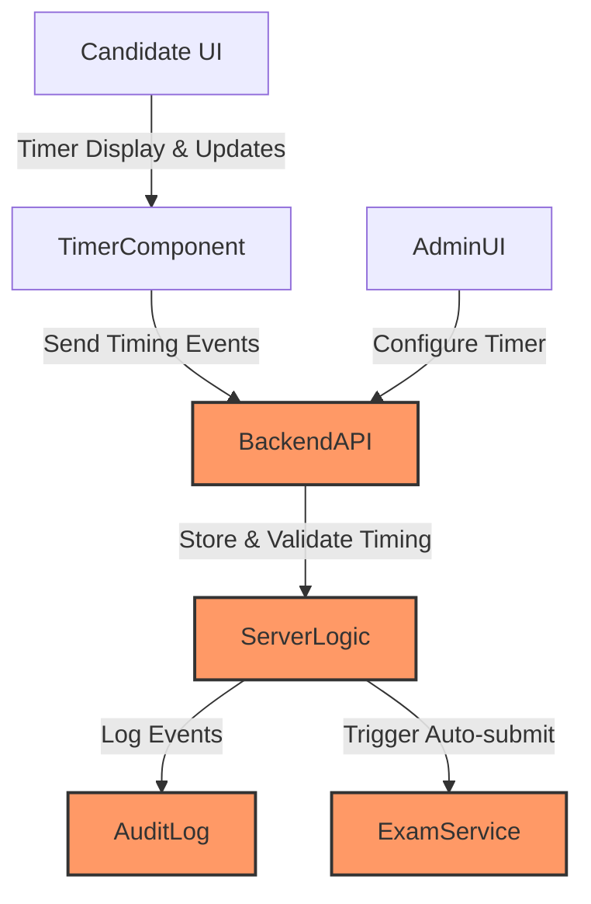
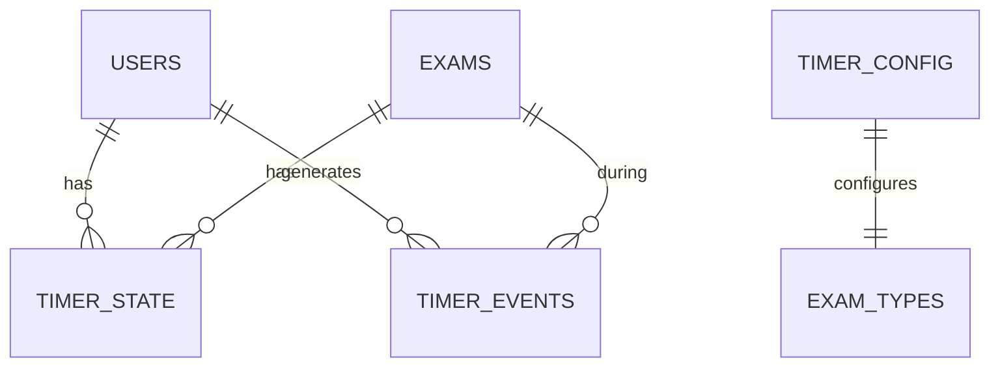
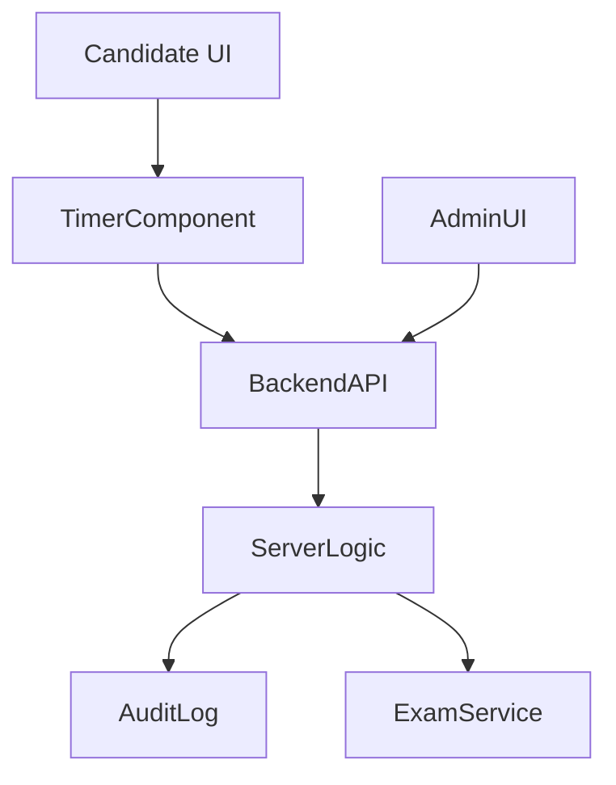
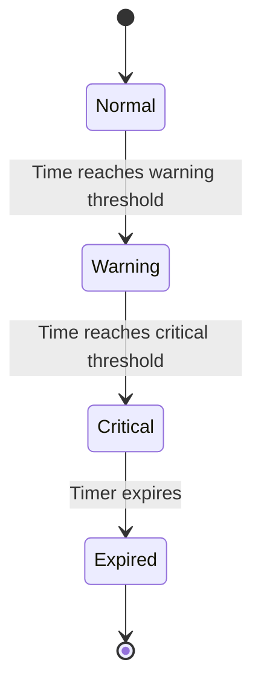

# Software Design Specification (SDS)  
## Timer Feature 	60 MCQ App  

**Document Version**: 1.0  
**Date**: 2024-06-10  
**Project**: mcq-app  
**Module**: Timer Feature  
**Author**: AI-Generated (GitHub Copilot)  
**Reviewed By**: _________________  
**Approved By**: _________________  
**Approval Date**: _________________  

---

### Document History

| Version | Date       | Author             | Changes                |
|---------|------------|--------------------|------------------------|
| 1.0     | 2024-06-10 | AI-Generated       | Initial SDS creation    |
|         |            |                    |                        |

---

### Distribution List

| Role           | Name | Date Sent |
|----------------|------|-----------|
| Technical Lead |      |           |
| QA Lead        |      |           |
| Product Owner  |      |           |
|                |      |           |

---

## 1. Executive Summary

The Timer Feature for the MCQ app introduces a configurable and reliable countdown timer to manage the duration of multiple-choice exams. This feature aims to standardize exam pacing, enforce time limits with server authoritative timing, and support accessibility and localization requirements. The timer will be visible to candidates in a fixed header, providing clear state notifications such as warnings and expiry alerts.

The feature enhances exam security by preventing clock tampering and ensures data integrity via auto-save and auto-submit mechanisms on expiry or network failure. Admin users will have control over timer configurations including accommodations for special needs.

Key stakeholders include product management, UX, frontend and backend development teams, QA, support, and security.

Success will be measured by exam overrun reduction (>95%), autosave success rate (	699%), and positive candidate feedback (	690%).

---

## 2. Scope & Requirements

### Functional Requirements

| ID     | Description                                           |
|--------|-------------------------------------------------------|
| FR-1   | Enforce a time limit for the entire exam.             |
| FR-2   | On timer expiry, auto-save and auto-submit responses, and prevent further edits. |
| FR-3   | Display an accurate, visible timer for candidates.    |
| FR-4   | Log all timing related events for audit purposes.     |
| FR-5   | Allow admins to configure timer modes, durations, warning thresholds, expiry behaviors, and accommodations. |
| FR-6   | Persist timer state across page refreshes and brief network outages. |
| FR-7   | Ensure timer accessibility and localization support.  |

### Non-Functional Requirements

| ID     | Description                                           |
|--------|-------------------------------------------------------|
| NFR-1  | Timer UI updates every 1 second with latency 	6100 ms. |
| NFR-2  | No answer loss under transient network loss 	660 seconds. |
| NFR-3  | Server authoritative timing with prevention of client clock tampering. |
| NFR-4  | System supports large concurrent exam sessions.      |

### Scope Boundaries

**In Scope:**  
- Exam-level countdown timer functionality.  
- Auto-save and auto-submit behavior on expiry.  
- Admin configuration of timer settings and accommodations.  
- Persistence of timer state across refresh and short network interruptions.  
- Accessibility and localization of timer UI.

**Out of Scope:**  
- Section-level timers (handled separately).  
- Timer for non-MCQ assessments.  
- Detailed UI/UX redesign beyond timer placement and notifications.

---

## 3. Architecture Overview

The Timer Feature will be integrated into the existing MCQ application backend and frontend components.

- **Backend:**  
  - Python-based server with Chainlit integration.  
  - Server authoritative timing logic to prevent client manipulation.  
  - REST API endpoints or WebSocket events to communicate timer state, log events, and trigger auto-submit.

- **Frontend:**  
  - UI component displaying timer in a fixed header, updating once per second.  
  - Visual states: normal, warning, critical, and expired with accessible notifications.  
  - Local persistence to handle refresh or network issues.

- **Data Flow:**  
  - Timer state is controlled and validated on the server.  
  - Client receives periodic updates or push notifications.  
  - Auto-save and auto-submit events trigger backend persistence and exam submission workflows.

- **Integration Points:**  
  - Exam management service for exam state and submissions.  
  - Audit logging service for timing event records.  
  - Admin configuration interface for timer settings.



---

## 4. Component Breakdown

| Component         | Description                                                | Responsibilities                                   | References           |
|-------------------|------------------------------------------------------------|--------------------------------------------------|----------------------|
| TimerComponent     | Frontend UI element displaying the countdown timer         | Display timer, update UI states, handle timer expiry notifications | `app.py` (UI logic), Frontend assets |
| BackendAPI        | API endpoints for timer state management and event logging  | Validate timer, record events, trigger auto-submit | `main.py` (API handlers) |
| ServerLogic       | Core timing logic enforcing server authoritative timing      | Validate client timer, enforce expiry rules, support persistence | `app.py` (business logic) |
| AuditLog          | Service or module for logging timing-related events         | Persist timing events for audit and compliance    | Database schema (to be detailed) |
| ExamService       | Exam lifecycle management including submission on expiry    | Handle exam auto-submit and state transitions     | Existing exam modules |
| AdminUI           | Admin interface for configuring timer settings              | Provide configuration controls and validation     | Frontend config UI |

---

## 5. API Overview

The Timer Feature will expose RESTful API endpoints to support frontend and admin interactions.

| Endpoint                  | Method | Description                                    | Authentication | Request/Response Format             |
|---------------------------|--------|------------------------------------------------|----------------|-----------------------------------|
| `/timer/state`            | GET    | Retrieve current timer state for the candidate | Candidate auth | JSON: `{ "remaining": int, "state": string }` |
| `/timer/event`            | POST   | Log timer events (tick, warning, expiry)       | Candidate auth | JSON: `{ "eventType": string, "timestamp": string }` |
| `/timer/auto-submit`      | POST   | Trigger auto-submit of exam on expiry           | Candidate auth | JSON: `{ "examId": string, "status": "submitted" }` |
| `/admin/timer/config`     | GET    | Get current timer configuration                  | Admin auth     | JSON: timer configuration object  |
| `/admin/timer/config`     | PUT    | Update timer configuration                        | Admin auth     | JSON: updated timer config         |

**Authentication:**  
- Candidate endpoints require user session authentication.  
- Admin endpoints require elevated privileges and secure authentication.

**Error Handling:**  
- Standard HTTP error codes for invalid requests, unauthorized access, and server errors.  
- Detailed error messages in JSON format.

---

## 6. Data Model & Persistence

The Timer Feature requires persistent storage of timer states, configuration settings, and audit logs to ensure reliability, compliance, and recovery in case of client issues or network disruptions.

### Database Schema Overview

| Table Name          | Description                                | Key Columns                         |
|---------------------|--------------------------------------------|-----------------------------------|
| `timer_events`       | Stores audit records of timer-related events | `id`, `user_id`, `exam_id`, `event_type`, `timestamp` |
| `timer_state`        | Stores current timer state per user/exam   | `user_id`, `exam_id`, `remaining_time`, `state`, `last_updated` |
| `timer_config`       | Stores admin-configured timer settings     | `config_id`, `exam_type`, `duration`, `warning_thresholds`, `auto_submit_enabled`, `accommodations` |

### Entity Relationships

- Each `timer_state` record is linked to a `user` and an `exam` instance.
- `timer_events` log multiple events per user-exam session.
- `timer_config` is linked to exam types or categories for flexible configuration.



### Data Validation Rules

- Timer duration and warning thresholds must be positive integers.
- Event timestamps must be UTC and monotonically increasing.
- Auto-submit flag is boolean.
- Timer state transition must follow allowed states: Normal 	6 Warning 	6 Critical 	6 Expired.

### Migration Strategy

- Initial migration will create the above tables with appropriate indexes.
- Future migrations will add columns for localization and accessibility flags as needed.

### Data Retention Policies

- Timer event logs retained for a minimum of 1 year for audit and compliance.
- Timer states purged upon exam completion or submission.
- Configuration records versioned for rollback.

---

## 7. Configuration & Deployment

### Environment Variables

| Variable Name              | Description                                    | Default      |
|----------------------------|------------------------------------------------|--------------|
| `TIMER_AUTO_SUBMIT_ENABLED`| Enables or disables auto-submit feature         | `true`       |
| `TIMER_EVENT_LOGGING`      | Enables detailed event logging                   | `true`       |
| `TIMER_MAX_CONCURRENT_SESSIONS` | Max concurrent exams with active timers    | `1000`       |

### Configuration Files

- `config/timer_config.yaml` or JSON equivalent for admin timer settings.
- Frontend config files to control UI placement and localization strings.

### Deployment Steps

1. Apply database migrations for timer schema.
2. Deploy backend services with new timer API endpoints.
3. Deploy frontend UI updates with timer component.
4. Run integration tests to verify timer functionality.
5. Update admin interface for timer configuration.

### Infrastructure Requirements

- Backend servers require stable time synchronization (e.g., NTP).
- Database must support concurrent writes for event logging.
- Load balancers configured for sticky sessions if needed.

### Scaling Considerations

- Use caching strategies for timer state retrieval to reduce DB load.
- Monitor and scale event logging to handle bursts in exam start and expiry times.
- Autoscaling policies triggered by concurrent session metrics.

---

## 8. Security & Compliance

### Authentication & Authorization

- All timer API endpoints require authenticated sessions.
- Admin endpoints require role-based access control (RBAC) with least privilege.
- Token-based authentication (e.g., JWT or session cookies) used.

### Data Encryption

- All data in transit protected by TLS 1.2 or higher.
- Sensitive timer configuration data encrypted at rest.

### Input Validation & Sanitization

- All incoming API requests validated for type, format, and range.
- Reject malformed or suspicious requests immediately.

### Compliance Requirements

- Server authoritative timing to prevent client clock tampering.
- Audit logging enabled for all timing events for GDPR and exam integrity compliance.
- Candidate timer data handled per privacy policies; personal data minimization applied.

### Audit Logging

- Timer events logged with timestamp, user ID, and event type.
- Logs immutable and protected against tampering.
- Regular review process for log integrity.

### Threat Modeling Summary

| Threat               | Mitigation                                         |
|----------------------|----------------------------------------------------|
| Client clock tampering| Server authoritative timing and validation         |
| Unauthorized config changes | RBAC and secure admin authentication           |
| Data loss on network failure | Persistent storage and autosave mechanisms     |
| Replay attacks       | Use of nonce or timestamp validation in API calls  |

---

## 9. Observability

### Logging Strategy

- Backend logs all timer API calls and state changes.
- Log levels: INFO for normal operations; WARN for anomalies; ERROR for failures.
- Logs structured with user ID and exam session context.

### Monitoring & Alerting

- Monitor timer component latency and error rates.
- Alert on high rates of timer expiry failures or auto-submit errors.
- Track concurrent active timers and resource utilization.

### Performance Metrics

- Timer tick accuracy and UI update latency.
- Autosave success and failure rates.
- Network recovery effectiveness metrics.

### Health Checks

- API health endpoints for timer service readiness and liveness.
- Frontend timer component self-checks for rendering and updates.

### Debugging Approaches

- Enable debug logging in test environments.
- Include detailed error codes and messages in API responses.
- Use distributed tracing for timing-related workflows.

---

## 10. Non-Functional Requirements

| Aspect         | Target / Description                                      |
|----------------|-----------------------------------------------------------|
| Performance    | UI timer updates every second with 	6100 ms latency        |
| Scalability    | Support 	61000 concurrent timed exams                      |
| Reliability    | No answer loss during transient network loss 	660 seconds  |
| Availability   | 99.9% uptime SLA for timer services                        |
| Disaster Recovery | Data backups and failover for timer state and logs      |
| Accessibility  | WCAG 2.1 compliance for timer UI components                |
| Localization   | Support multiple languages and regional formats           |

---

## 11. Risks & Mitigation

| Risk                                            | Impact                | Mitigation Strategy                                  |
|-------------------------------------------------|-----------------------|-----------------------------------------------------|
| Client clock tampering affecting timer accuracy | High                  | Server authoritative timing and validation          |
| Network outages causing autosave failures       | Medium                | Local persistence and retry logic                    |
| High concurrent exam sessions overloading system| High                  | Scalability planning, autoscaling, caching          |
| Admin misconfiguration of timer settings        | Medium                | Input validation, UI constraints, and audit trails  |
| Data loss due to system crashes                   | High                  | Frequent backups, transactional database operations |
| Accessibility or localization issues             | Medium                | Conformance testing, user feedback loops             |

---

## 12. Architecture Decision Records (ADRs)

### ADR-001: Use Server Authoritative Timing

**Status**: Accepted  
**Date**: 2024-06-10  
**Deciders**: Architecture Team  

#### Context  
Client-side timers are vulnerable to manipulation which can compromise exam integrity.

#### Decision Drivers  
- Security and compliance needs  
- Accurate timing enforcement  
- Prevention of cheating  

#### Considered Options  
1. Client-only timing  
2. Server authoritative timing  
3. Hybrid approach with client-server sync  

#### Decision Outcome  
Chosen option: "Server authoritative timing" because it ensures trusted timing enforcement and reduces risk of tampering.

**Positive Consequences**:  
- Increased security and compliance  
- Reliable exam duration enforcement  

**Negative Consequences**:  
- Additional server load  
- Increased complexity in timer synchronization  

---

### ADR-002: RESTful API for Timer Management

**Status**: Accepted  
**Date**: 2024-06-10  
**Deciders**: Backend Team  

#### Context  
Need a standardized way for frontend and admin UI to interact with timer functionality.

#### Decision Drivers  
- Simplicity  
- Scalability  
- Integration with existing systems  

#### Considered Options  
1. RESTful APIs  
2. WebSocket real-time communication  
3. GraphQL API  

#### Decision Outcome  
Chosen option: "RESTful APIs" due to simplicity and alignment with existing backend services.

**Positive Consequences**:  
- Easy integration and maintenance  
- Broad client support  

**Negative Consequences**:  
- Less real-time interaction compared to WebSockets  

---

### ADR-003: Autosave and Auto-submit on Timer Expiry

**Status**: Accepted  
**Date**: 2024-06-10  
**Deciders**: Product and Architecture Team  

#### Context  
Ensure no answer loss and enforce exam completion on timer expiry.

#### Decision Drivers  
- User experience  
- Compliance  
- Data integrity  

#### Considered Options  
1. Manual save and submit only  
2. Autosave on timer ticks and auto-submit on expiry  
3. Autosave without auto-submit  

#### Decision Outcome  
Chosen option: "Autosave on timer ticks and auto-submit on expiry" to minimize answer loss and ensure exam closure.

**Positive Consequences**:  
- High data reliability  
- Compliance with exam rules  

**Negative Consequences**:  
- Potential complexity in handling partial saves  

---

## 13. Assumptions & Constraints

### Assumptions

- Candidates have stable enough network connectivity for timer synchronization.
- Admin users are trained on timer configuration.
- Backend infrastructure supports required load and scaling.
- Frontend clients support JavaScript and modern browsers for timer UI.
- Time zones and localization settings are correctly configured.

### Constraints

- Timer feature must integrate into existing MCQ app architecture.
- Limited development time for initial rollout.
- Compliance requirements impose strict audit logging and data retention.
- Accessibility standards (WCAG 2.1) must be met.
- Autosave frequency balanced to reduce server load.

---

## 14. Dependencies & Integration

### Internal Dependencies

- Exam management module for submission and state transitions.
- User authentication and authorization services.
- Audit logging infrastructure.
- Frontend UI framework (Chainlit or equivalent).

### External Dependencies

- Time synchronization services (e.g., NTP).
- Infrastructure services for database and API hosting.
- Localization service or libraries.

### Integration Sequence

1. Backend timer APIs and logic integrated with exam management services.
2. Frontend timer UI deployed alongside exam interface.
3. Admin configuration UI connected to backend config APIs.
4. Logging and monitoring systems configured and tested.

---

## 15. Glossary & References

| Term                | Definition                                               |
|---------------------|----------------------------------------------------------|
| Auto-submit         | Automatic submission of exam answers when timer expires  |
| Autosave            | Periodic saving of candidate answers during exam         |
| Timer State         | Current status of the exam timer (Normal, Warning, etc.) |
| Server Authoritative | Timing enforced and validated by backend server          |
| WCAG                | Web Content Accessibility Guidelines                      |
| RBAC                | Role-Based Access Control                                  |

**References:**

- Timer Feature BRS Document (2024-06-10)  
- WCAG 2.1 Guidelines: https://www.w3.org/TR/WCAG21/  
- Chainlit Documentation: https://chainlit.io/  
- GDPR Compliance Guidelines  

---

## 16. Appendices

### 16.1 Detailed Diagrams

#### Timer Feature Architecture Diagram



#### Timer State Flow



### 16.2 Database Schema Details

| Table           | Columns                                                      |
|-----------------|--------------------------------------------------------------|
| timer_events    | id (PK), user_id, exam_id, event_type, timestamp             |
| timer_state     | user_id (PK), exam_id (PK), remaining_time, state, last_updated |
| timer_config    | config_id (PK), exam_type, duration, warning_thresholds, auto_submit_enabled, accommodations |

---

## 17. References

- Timer Feature BRS Document - Business Requirements Specification for Timer Feature  
- Chainlit Official Documentation - https://chainlit.io/  
- WCAG 2.1 Accessibility Guidelines - https://www.w3.org/TR/WCAG21/  
- GDPR Compliance Documentation  

---

##  Converting to Word (.docx)

To convert this Markdown document to Word format, use Pandoc:

### Prerequisites
- Install Pandoc: https://pandoc.org/installing.html
  - Windows: `choco install pandoc` or download installer
  - Mac: `brew install pandoc`
  - Linux: `apt-get install pandoc`

### Conversion Commands

**Basic Conversion**:
```bash
pandoc docs/SDS_Timer_Feature_20240610.md -o docs/SDS_Timer_Feature_20240610.docx
```

**With Table of Contents**:
```bash
pandoc docs/SDS_Timer_Feature_20240610.md -o docs/SDS_Timer_Feature_20240610.docx --toc --toc-depth=3
```

**With Custom Styling** (requires reference.docx template):
```bash
pandoc docs/SDS_Timer_Feature_20240610.md -o docs/SDS_Timer_Feature_20240610.docx --reference-doc=custom-reference.docx --toc
```

### Mermaid Diagrams in Word
Mermaid diagrams must be manually converted:
1. Copy Mermaid code to https://mermaid.live/
2. Export as PNG or SVG
3. Insert images into Word document

---
