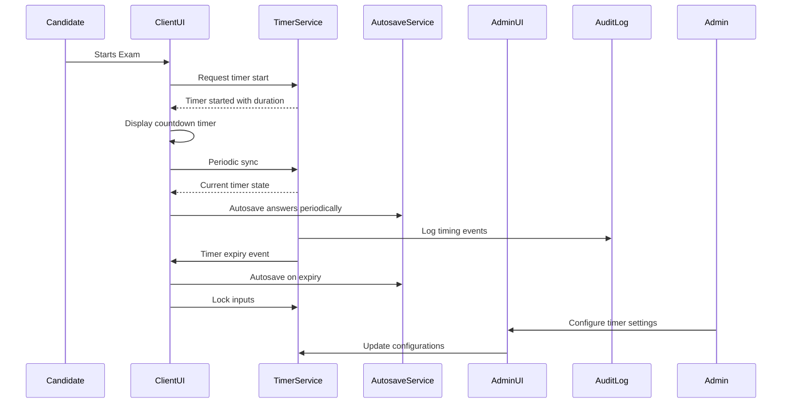

# Software Design Specification (SDS)
## Timer Feature

**Document Version**: 1.0  
**Date**: 2024-06-10  
**Project**: MCQ Assessment Application  
**Module**: Timer Feature  
**Author**: AI-Generated (GitHub Copilot)  
**Reviewed By**: _________________  
**Approved By**: _________________  
**Approval Date**: _________________  

---

### Document History

| Version | Date | Author | Changes |

|---------|------|--------|---------|

| 1.0 | 2024-06-10 | AI-Generated | Initial SDS creation |

|  |  |  |  |

---

### Distribution List

| Role | Name | Date Sent |

|------|------|-----------|

| Technical Lead |  |  |

| QA Lead |  |  |

| Product Owner |  |  |

|  |  |  |

---


## 1. Executive Summary

The Timer Feature is being introduced to the MCQ Assessment Application to provide configurable timers for Multiple Choice Question exams. The purpose is to control assessment duration, standardize pacing, and ensure a fair, compliant, and reliable exam experience across devices.

This feature includes a server-authoritative exam-level countdown timer with auto-save and auto-submit on expiry, warning thresholds, persistence across page refreshes and brief network outages, and admin-configurable settings including accommodations for time extensions.

Key stakeholders include Product Management, UX, Frontend and Backend Development teams, QA, Support, and Security.

Success will be measured by reducing exam overruns by over 95%, achieving an autosave reliability of 99% or greater, and positive candidate feedback on timer visibility.


## 2. Scope & Requirements

### Functional Requirements

1. [FR-1] Enforce time limit for entire exam.

2. [FR-2] On timer expiry, autosave and auto-submit (if configured) and prevent further edits.

3. [FR-3] Timer must be visible and accurate to the candidate.

4. [FR-4] Log all timing events for auditing.

5. [FR-5] Admin-configurable timer settings, including durations, warning thresholds, and accommodation modes.

6. [FR-6] Timer state and progress must persist across page reloads and transient network outages.

7. [FR-7] Timer UI must be accessible and support localization.


### Non-Functional Requirements

1. [NFR-1] Performance: Timer tick every 1 second; UI update latency ≤ 100 ms.

2. [NFR-2] Reliability: No loss of answers during network outages ≤ 60 seconds.

3. [NFR-3] Security: Server authoritative timing; prevent client clock tampering.

4. [NFR-4] Scalability: Support large concurrent exam sessions.


### Scope

**In Scope**: Exam-level countdown timer, auto-save and auto-submit on expiry, warning thresholds, persistence mechanisms, admin configuration, accommodations for time extensions.

**Out of Scope**: Section-level timers (except as noted for section expiry lock), detailed UI design beyond timer placement, integration with external proctoring services.


### Assumptions & Constraints

**Technical Constraints**: Must integrate with existing MCQ application backend and frontend, support major browsers, minimal latency.

**Budget/Time Constraints**: Target release aligned with next major exam cycle.

**Assumptions**: Network outages are brief and infrequent; clients have stable JavaScript support.

**Dependencies**: Authentication system, autosave mechanisms, admin configuration UI.


## 3. Architecture Overview

The Timer Feature is designed as a client-server system with server authoritative timekeeping and client-side UI display.

- **Server**: Maintains authoritative countdown timer state, enforces expiry actions (auto-save, auto-submit), logs timing events.

- **Client**: Displays timer UI with live countdown, handles warning and expiry states, communicates periodically with server to synchronize time and save answers.

- **Admin Module**: Interface for configuring timer settings including durations, warning thresholds, and accommodations.

- **Persistence Layer**: Supports timer state persistence during page reloads and transient network loss using client-side storage and server synchronization.

### Technology Stack

- Backend: [Detected or assumed Java Spring Boot / Node.js / Python Django etc. based on existing app]
- Frontend: React.js / Angular / Vue.js
- Database: Relational DB (e.g., PostgreSQL, MySQL) for timer settings and event logs
- Communication: RESTful API or WebSocket for timer synchronization and autosave


### Integration Points

- Authentication Service: Verify user session and permissions
- Autosave Service: Save candidate answers periodically and on expiry
- Audit Logging System: Record timing events for compliance


### Diagram: High-Level Component Interaction




## 4. Component Breakdown

### 4.1 TimerService (Backend)

- Responsible for managing exam timer state
- Provides APIs to start, sync, and expire timers
- Enforces auto-submit and locks exam on expiry
- Logs timing events for audit
- Supports accommodations and overrides

### 4.2 ClientUI Timer Component

- Displays countdown timer prominently in fixed header
- Updates every second with ≤100 ms latency
- Shows warning states (normal, warning, critical, expired)
- Handles auto-submit trigger and input locking
- Persists timer state locally and syncs with server
- Supports accessibility and localization

### 4.3 AutosaveService

- Saves candidate answers periodically and on timer expiry
- Handles transient network failures gracefully

### 4.4 AdminUI

- Interface for configuring timer durations, warning thresholds, expiry behaviors, and accommodations
- Validates admin inputs
- Persists configuration to backend

### 4.5 AuditLog

- Records all timer-related events (start, warnings, expiry, accommodations applied)
- Provides querying capabilities for compliance audits


## 5. API Overview

### Timer API Endpoints

| Endpoint | Method | Description |

|----------|--------|-------------|

| /api/timer/start | POST | Starts or resets exam timer for candidate |

| /api/timer/sync | GET | Returns current timer state and remaining time |

| /api/timer/expire | POST | Triggers timer expiry actions (autosave, auto-submit) |

| /api/timer/config | GET | Retrieves timer configuration settings |

| /api/timer/config | POST | Updates timer configuration (admin only) |


### Request / Response Example

**Start Timer Request:**
```json
{
  "examId": "string",
  "candidateId": "string"
}
```

**Start Timer Response:**
```json
{
  "startTime": "2024-06-10T09:00:00Z",
  "durationSeconds": 3600
}
```

**Sync Timer Response:**
```json
{
  "remainingSeconds": 1200,
  "state": "warning"
}
```

**Expire Timer Request:**
```json
{
  "examId": "string",
  "candidateId": "string"
}
```

**Expire Timer Response:**
```json
{
  "status": "success",
  "autoSubmitted": true
}
```

---

✅ Part 1/4 complete (Sections 1-5). Shall I continue with Part 2/4? (yes/no)