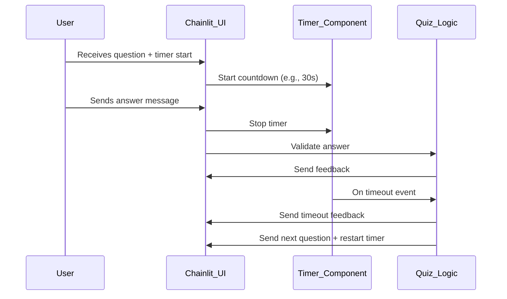
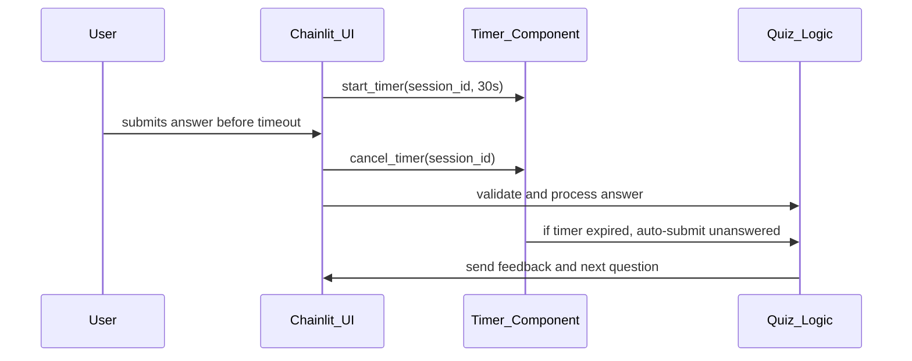

# Software Design Specification (SDS)

## Timer Feature for MCQ App

**Document Version**: 1.0  
**Date**: 2024-06-05  
**Project**: MCQ Quiz App  
**Module**: Timer Feature  
**Author**: AI-Generated  
**Reviewed By**: _________________  
**Approved By**: _________________  
**Approval Date**: _________________  

---

### Document History

| Version | Date       | Author       | Changes               |

|---------|------------|--------------|-----------------------|

| 1.0     | 2024-06-05 | AI-Generated | Initial SDS creation   |

---

### Distribution List

| Role           | Name       | Date Sent |

|----------------|------------|-----------|

| Technical Lead |            |           |

| QA Lead        |            |           |

| Product Owner  |            |           |

|                |            |           |

---

## 1. Executive Summary

This document specifies the design for adding a **timer feature** to the existing Multiple Choice Question (MCQ) Quiz Application built with Python and Chainlit. The timer will enforce a time limit per question to enhance user engagement and simulate real quiz conditions.

The timer feature aims to:

- Limit the response time per question (configurable, e.g., 30 seconds)

- Automatically move to the next question when time expires

- Provide visual countdown feedback to the user

- Handle timeout events gracefully with feedback and scoring logic

Key stakeholders include the development team, QA/testing team, and product management. Success is measured by the seamless integration of the timer without disrupting existing functionality and improving quiz experience.

---

## 2. Scope & Requirements

### Functional Requirements

1. [FR-1] Implement a per-question countdown timer visible to the user.

2. [FR-2] Automatically submit the current question as unanswered or incorrect when time expires.

3. [FR-3] Provide feedback to the user when time runs out.

4. [FR-4] Allow configuration of timer duration per question (default 30 seconds).

5. [FR-5] Pause and resume timer if user navigates away and returns during a question.

6. [FR-6] Ensure timer resets with each new question.

### Non-Functional Requirements

1. [NFR-1] Timer accuracy should have a maximum drift of 1 second.

2. [NFR-2] Timer UI updates must be smooth without degrading chat responsiveness.

3. [NFR-3] The timer feature should not degrade application performance.

4. [NFR-4] Code must be maintainable and extensible for future enhancements.

5. [NFR-5] Security: Timer should prevent user from submitting answers after expiration.

### Scope

**In Scope**:

- Timer implementation for each quiz question.

- UI integration with Chainlit chat messages.

- Backend logic to handle timeouts and scoring.

**Out of Scope**:

- Timer for the entire quiz duration.

- Offline or manual pause functionality.

- Analytics on timing data.

### Priority Areas

- High Priority: Timer accuracy, automatic question submission on timeout.

- Medium Priority: UI countdown display.

- Low Priority: Configurable timer duration per question.

---

## 3. Architecture Overview

The MCQ app is a Python application using the Chainlit framework to manage chat-based quiz interactions. The app maintains user session states, questions, and scoring in-memory.

**Current Flow:**

- On chat start, quiz state is initialized.

- User receives question and inputs answer as chat message.

- The system validates input, updates score, and sends feedback.

- Moves to next question until quiz completion.

**Timer Feature Integration:**

- The timer component will be integrated into the question flow.

- A countdown starts when a question is sent.

- The timer runs asynchronously alongside user input handling.

- On timer expiration, if no answer received, the system auto-submits the question as unanswered and provides timeout feedback.

- Timer resets when the next question is sent.

**Technology Stack**:

- Python 3.x

- Chainlit framework for chat UI and event handling

**Diagram: Component Interaction**



---

## 4. Component Breakdown

### 4.1 Timer Component

- **Responsibilities**:
  - Track countdown per question.
  - Emit timeout event on expiration.
  - Provide UI countdown updates.

- **Interface**:
  - `start_timer(duration_seconds)`
  - `stop_timer()`
  - `reset_timer()`
  - `on_timeout` event callback.

- **Implementation Details**:
  - Use `asyncio` tasks or Chainlit's async utilities to implement timer.
  - Timer runs asynchronously to not block main event loop.
  - Timer UI updates sent via Chainlit messages or ephemeral UI elements.

### 4.2 Quiz Logic

- Integrate timer start when sending each question.

- On timeout callback, mark question as unanswered and provide feedback.

- Prevent answer submissions after timeout.

- Reset timer state when quiz restarts or moves to next question.

### 4.3 User Session Data

- Extend `user_data` dictionary to include timer state if needed.

- Track if question was answered before timeout.

### 4.4 UI Integration

- Modify `send_question()` to include timer start.

- Display countdown timer visually (e.g., message updates or ephemeral chat UI).

- Show timeout message if user fails to answer in time.

---

## 5. API Overview

Since the MCQ app uses Chainlit events and chat messages, the "API" is event-driven:

| Event/Function         | Description                                    | Timer Feature Impact                  |

|-----------------------|------------------------------------------------|-------------------------------------|

| `@cl.on_chat_start`   | Initializes user session and starts quiz       | Start timer with first question     |

| `send_question()`      | Sends current question to user                  | Start/reset timer for each question |

| `@cl.on_message`       | Handles user answer message                      | Stop timer on valid answer           |

| Timer timeout handler  | New event to handle timer expiration             | Auto-submit unanswered question      |

| `show_results()`       | Displays quiz results                             | No change                           |

No external API changes required; all changes internal to event handlers.

---

## 6. Data Model & Persistence

### 6.1 User Session Data Extension

- The existing `user_data` dictionary stores per-user quiz state:

```python
user_data = {
    session_id: {
        "current_question": int,
        "score": int,
        "answers": list of dict,
        // New field for timer state
        "timer_active": bool,
        "timer_task": asyncio.Task (optional, for managing timer)
    }
}
```

- Timer state flags will manage whether timer is running and allow cancellation if user answers early.

### 6.2 Questions Data

- No changes required to the `QUESTIONS` data model.

- Timer duration can be a global configuration or optionally added per question.

---

## 7. Configuration & Deployment

### 7.1 Configuration

- Add a configurable timer duration parameter, defaulting to 30 seconds.

Example:

```python
TIMER_DURATION_SECONDS = 30
```

- Optionally, allow overriding per question later.

### 7.2 Deployment

- No infrastructure changes needed.

- Deploy updated Python app to existing environment.

- Ensure Chainlit dependencies support async timers correctly.

---

## 8. Security & Compliance

### 8.1 Authentication & Authorization

- No changes required; quiz app uses Chainlit user sessions.

### 8.2 Input Validation

- Timer feature restricts acceptance of answers after timeout.

- Validate user input to reject late answers gracefully with informative message.

### 8.3 Data Protection

- No sensitive data introduced.

- Timer state stored in-memory per session; no persistence.

### 8.4 Compliance

- Not applicable for timer feature; no PII or regulated data involved.

---

## 9. Observability

### 9.1 Logging

- Log timer start, stop, and timeout events per session for debugging.

Example log messages:

```
[INFO] Timer started for session {session_id}, question {question_index}
[INFO] Timer stopped for session {session_id} due to user answer
[WARN] Timer expired for session {session_id}, auto-submitting question
```

### 9.2 Monitoring

- No new metrics required.

- Consider adding a metric for number of timed-out questions in future.

---

## 10. Non-Functional Requirements

### 10.1 Performance

- Timer implemented asynchronously to avoid blocking message processing.

- UI updates optimized to avoid excessive messaging.

### 10.2 Scalability

- Feature scales with user sessions; no shared state beyond per-session memory.

### 10.3 Reliability

- Timer must reliably trigger timeout events even under load.

- Handle edge cases like user disconnects or network delays.

### 10.4 Usability

- Timer countdown visible and clear.

- Timeout feedback polite and informative.

---

## 11. Testing Strategy

### 11.1 Unit Testing

- Test timer start, stop, and expiration behavior independently.

- Mock async timer tasks to verify correct callbacks.

- Validate timer resets correctly on new questions.

### 11.2 Integration Testing

- Test full quiz flow with timer enabled.

- Confirm that timeout triggers automatic question submission.

- Verify UI messages for countdown and timeout feedback.

### 11.3 End-to-End Testing

- Simulate user interactions with delayed and timely answers.

- Validate that timer does not interfere with normal answer submission.

- Test timer pause/resume when user refreshes or reconnects.

### 11.4 Performance Testing

- Verify timer accuracy under load with multiple concurrent sessions.

- Confirm no degradation of chat responsiveness.

### 11.5 Security Testing

- Attempt to submit answers after timeout; verify rejection.

- Test for denial-of-service scenarios by spamming timer events.

---

## 12. Risks & Mitigation

| Risk                                             | Probability | Impact | Mitigation                                      |

|--------------------------------------------------|-------------|--------|------------------------------------------------|

| Timer drift causing premature or delayed timeouts | Medium      | Medium | Use accurate asyncio timers; test timing rigorously |

| User confusion if timer is too short or unclear   | Medium      | Low    | Provide clear UI countdown and messages         |

| Timer task leak causing memory bloat               | Low         | High   | Cancel timer tasks properly on question change  |

| Network latency delaying UI updates                | Low         | Medium | Optimize message frequency; use ephemeral UI    |

| User submits answer just after timeout             | Medium      | Low    | Implement strict answer acceptance window       |

---

## 13. Architecture Decision Records (ADRs)

### ADR-001: Choice of Asyncio for Timer Implementation

**Status**: Accepted  
**Date**: 2024-06-05  
**Deciders**: Development Team  

#### Context

A timer mechanism is needed to track countdown per question without blocking main event loop.

#### Decision Drivers

- Must be asynchronous

- Must integrate with Chainlit event loop

- Should support cancellation and restart

#### Considered Options

1. Use Python's `asyncio` sleep and tasks  
2. Use threading.Timer  
3. Use external scheduler or service  

#### Decision Outcome

Chosen option: **Use Python's asyncio**  
- Fits well with async Chainlit framework  
- Allows cancellation and precise control  

#### Positive Consequences

- Efficient resource use  
- Easy integration with existing code  

#### Negative Consequences

- Requires careful management of async tasks  

---

## 14. Assumptions & Constraints

- Users answer questions via chat messages only.

- Timer duration is uniform for all questions in initial version.

- No persistent storage for timer state (in-memory only).

- Chainlit framework supports required async features.

- Network delays may affect timer accuracy but should be minimal.

- Timer UI limited to chat message updates (no custom UI widgets).

---

## 15. Dependencies & Integration

- Depends on Chainlit framework for chat and async event handling.

- Depends on existing `user_data` session management.

- Integrates into existing message handlers (`@cl.on_message`) and question sender.

- No external services or databases affected.

- No changes to question data structures required.

---

## 16. Glossary & References

| Term         | Description                                           |

|--------------|-------------------------------------------------------|

| Chainlit     | Python framework for building chat applications       |

| Asyncio      | Python library for asynchronous programming            |

| Timer        | Mechanism to count down time per quiz question         |

| Session ID   | Unique identifier for user session                      |

| Timeout      | Event when timer expires without user response         |

| ADR          | Architecture Decision Record                            |

**References:**

- Chainlit Documentation: https://docs.chainlit.io  
- Python Asyncio: https://docs.python.org/3/library/asyncio.html  
- Existing MCQ app source code  

---

## 17. Appendices

### 17.1 Sample Timer Implementation Snippet

```python
import asyncio

async def start_timer(session_id, duration, timeout_callback):
    try:
        await asyncio.sleep(duration)
        # Timer expired, invoke timeout handler
        await timeout_callback(session_id)
    except asyncio.CancelledError:
        # Timer cancelled (user answered early)
        pass
```

### 17.2 Sequence Diagram: Timer Integration



---

## 📄 Converting to Word (.docx)

To convert this Markdown document to Word format, use Pandoc:

### Prerequisites

- Install Pandoc: https://pandoc.org/installing.html
  - Windows: `choco install pandoc` or download installer
  - Mac: `brew install pandoc`
  - Linux: `apt-get install pandoc`

### Conversion Commands

**Basic Conversion**:
```bash
pandoc docs/SDS_Timer_Feature_20240605.md -o docs/SDS_Timer_Feature_20240605.docx
```

**With Table of Contents**:
```bash
pandoc docs/SDS_Timer_Feature_20240605.md -o docs/SDS_Timer_Feature_20240605.docx --toc --toc-depth=3
```

**With Custom Styling** (requires reference.docx template):
```bash
pandoc docs/SDS_Timer_Feature_20240605.md -o docs/SDS_Timer_Feature_20240605.docx --reference-doc=custom-reference.docx --toc
```

### Mermaid Diagrams in Word

Mermaid diagrams must be manually converted:

1. Copy Mermaid code to https://mermaid.live/

2. Export as PNG or SVG

3. Insert images into Word document

---