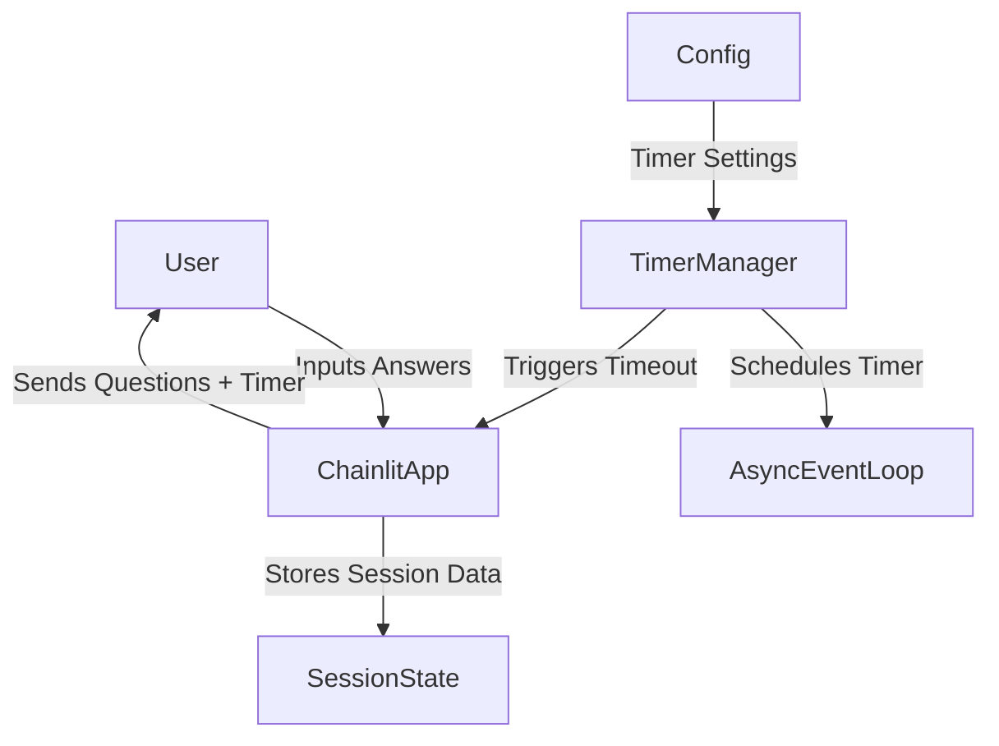
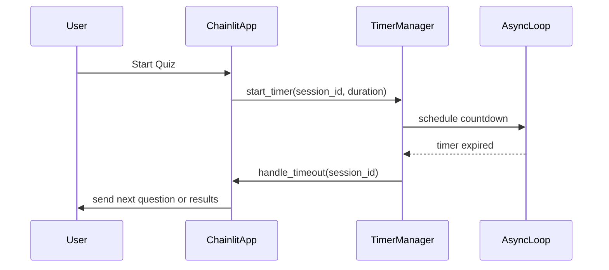

# Software Design Specification (SDS)
## Timer Feature for MCQ App

**Document Version**: 1.0  
**Date**: 2024-06-10  
**Project**: MCQ Quiz Application  
**Module**: Timer Feature  
**Author**: AI-Generated (GitHub Copilot)  
**Reviewed By**: _________________  
**Approved By**: _________________  
**Approval Date**: _________________  

---

### Document History

| Version | Date       | Author        | Changes               |
|---------|------------|---------------|-----------------------|
| 1.0     | 2024-06-10 | AI-Generated  | Initial SDS creation   |
|         |            |               |                       |

---

### Distribution List

| Role           | Name | Date Sent |
|----------------|------|-----------|
| Technical Lead |      |           |
| QA Lead       |      |           |
| Product Owner |      |           |

---

## 1. Executive Summary

This document specifies the design for adding a **Timer Feature** to the existing Multiple Choice Questions (MCQ) Quiz Application built with Python and Chainlit. The timer feature will enable tracking time limits for individual questions or the entire quiz session, enhancing user engagement and providing time-bound challenge capabilities.

The key objectives are:

- Enforce a configurable timer per question or for the whole quiz.
- Provide visual and textual countdown indicators to users.
- Automatically move to the next question or end the quiz upon timer expiry.
- Integrate seamlessly with the existing quiz flow and user session management.
- Allow configuration of timer duration via environment variables or configuration files.
- Maintain existing functionality such as scoring, feedback, and results display.

Key stakeholders include the development team, QA testers, and product management.

Success will be measured by reliable timer enforcement without degrading user experience or system performance.

---

## 2. Scope & Requirements

### Functional Requirements

1. [FR-1] Implement a per-question timer that counts down from a configurable duration (default: 30 seconds).
2. [FR-2] Display the remaining time visibly to the user during each question.
3. [FR-3] Automatically submit a blank or default answer and move to the next question if time runs out.
4. [FR-4] Optionally support a total quiz timer that limits the entire quiz duration.
5. [FR-5] Allow timer configuration via settings or environment variables.
6. [FR-6] Provide feedback to users when time expires on a question.
7. [FR-7] Ensure timer pauses and resumes correctly if the user refreshes or reconnects.
8. [FR-8] Store timing data in user session state for analytics.
9. [FR-9] Maintain compatibility with existing scoring and feedback mechanisms.

### Non-Functional Requirements

1. [NFR-1] The timer must be accurate within 1 second.
2. [NFR-2] Timer updates should not noticeably degrade application responsiveness.
3. [NFR-3] The feature must be secure against client-side tampering.
4. [NFR-4] The timer UI must be accessible (WCAG 2.1 compliant).
5. [NFR-5] The system should allow easy adjustment of timer settings without code changes.
6. [NFR-6] The timer feature should not affect existing functionalities negatively.
7. [NFR-7] Logging of timer events for audit and debugging purposes.

### Scope

**In Scope**:  
- Adding timer logic to the quiz flow in the MCQ app.  
- UI/UX elements for timer display within Chainlit messaging interface.  
- Session state management of timer values.  
- Configuration management for timer durations.

**Out of Scope**:  
- Timer functionality for other unrelated modules.  
- Persistent storage or database changes beyond session state.  
- Complex analytics dashboards for timer data.  
- Support for multi-user timed competitions or real-time multiplayer quiz.

### Assumptions

- Users interact in a single-session mode with one active quiz at a time.
- Timer configuration will be read from environment variables or a config file.
- Network latency may affect timer accuracy slightly but will be minimized.
- Users will use supported browsers that render Chainlit messages properly.

### Dependencies

- Chainlit messaging and session management APIs.
- Python async event loop for timer scheduling.
- User session data structures defined in `app.py`.
- Existing question and answer handling logic.

---

## 3. Architecture Overview

The Timer Feature integrates into the existing MCQ application's architecture primarily at the **session management** and **message handling** layers.

### Technology Stack

- **Language**: Python 3.x  
- **Framework**: Chainlit (for chatbot interface)  
- **Async**: asyncio event loop for timing tasks  
- **State Management**: In-memory dictionary keyed by session IDs (`user_data`)  
- **Configuration**: Environment variables or Python config module  

### High-Level Components

- **Timer Manager**: Implements countdown logic using async scheduling per question or quiz.
- **UI Timer Display**: Enhances Chainlit messages with timer countdown info.
- **Session State Extension**: Stores timer start time, remaining time, and expiry flags.
- **Timer Event Handler**: Detects timeout events and triggers automatic question submission.
- **Configuration Module**: Reads timer durations and mode settings.

### System Context Diagram



### Integration Points

- Timer hooks into the `send_question()` method to start/reset timers.
- Timeout handler triggers `main()` logic to simulate user input or skip.
- Timer display injected in question messages.
- Session state extended with timer metadata.

---

## 4. Component Breakdown

### 4.1 Timer Manager

- **Responsibilities**:  
  - Start, pause, resume, and cancel timers per user session.  
  - Use `asyncio.sleep()` or Chainlit's async utilities for countdown.  
  - Trigger timeout callbacks on expiry.

- **Interfaces**:  
  - `start_timer(session_id: str, duration: int)`  
  - `cancel_timer(session_id: str)`  
  - `get_remaining_time(session_id: str) -> int`

- **Details**:  
  - Maintains a mapping of active timers indexed by session ID.  
  - On timer expiry, calls back to main app logic to handle timeout.

### 4.2 UI Timer Display

- **Responsibilities**:  
  - Show countdown timer prominently in question messages.  
  - Update timer display if possible (via Chainlit message edits or new messages).  
  - Indicate when time is about to expire (e.g., last 5 seconds).

- **Implementation**:  
  - Modify the `send_question()` message content to include timer info.  
  - Consider emoji or color-coded text for urgency.  
  - Use Chainlit's message editing or follow-up messages for dynamic updates.

### 4.3 Session State Extension

- **Responsibilities**:  
  - Store timer start timestamp, duration, and expiration status per user.  
  - Persist timer state across user reconnects or page refreshes.  

- **Data Fields Added**:  
  - `timer_start_time` (timestamp)  
  - `timer_duration` (seconds)  
  - `timer_expired` (bool)

### 4.4 Timer Event Handler

- **Responsibilities**:  
  - Handle timer expiry events by submitting default answer or skipping.  
  - Send feedback message indicating time expiration.  
  - Move quiz forward to next question or end quiz.

- **Implementation**:  
  - Integrate with existing `main()` message handler to simulate timeout input.  
  - Use Chainlit messaging to notify users.

### 4.5 Configuration Module

- **Responsibilities**:  
  - Read timer related configuration values at app startup.  
  - Provide interface for fetching timer durations and mode (per question / total quiz).

- **Settings**:  
  - `QUESTION_TIMER_SECONDS` (default 30)  
  - `QUIZ_TOTAL_TIMER_SECONDS` (optional)  
  - `TIMER_MODE` ("per_question" or "total_quiz")

---

## 5. API Overview

The timer feature interacts primarily through internal APIs and Chainlit event handlers. There is no external REST API exposed.

### Internal Methods and Handlers

| API/Method                  | Description                                       | Inputs                      | Outputs                  |
|----------------------------|-------------------------------------------------|-----------------------------|--------------------------|
| `start_timer(session_id, duration)` | Starts or resets the countdown timer for a session | `session_id`: string, `duration`: int (seconds) | None                     |
| `cancel_timer(session_id)`           | Cancels the active timer for a session            | `session_id`: string         | None                     |
| `get_remaining_time(session_id)`    | Returns remaining time in seconds                   | `session_id`: string         | int (seconds)            |
| `send_question()`                   | Sends the current question message with timer info | None (uses session context) | Async message sent       |
| `handle_timeout(session_id)`        | Handles timer expiry event                          | `session_id`: string         | Triggers next question or ends quiz |
| `main(message: cl.Message)`          | Handles user message input (answer or timeout)     | `message`: Chainlit message  | Async message sent       |

### Message Format Enhancements

- Question messages include timer countdown display.
- Timeout feedback messages inform user of expired time.

---

## 6. Data Model & Persistence

### Session State Extensions

The existing `user_data` dictionary keyed by session ID will be extended with timer-related fields:

```python
user_data[session_id] = {
    "current_question": int,
    "score": int,
    "answers": list,
    "timer_start_time": datetime or timestamp,
    "timer_duration": int,
    "timer_expired": bool
}
```

### Data Flow

- Timer start time is recorded when a question is sent.
- Remaining time calculated as `timer_duration - (current_time - timer_start_time)`.
- On timeout, the `timer_expired` flag is set.
- Timing data is ephemeral and stored in-memory only; no persistent database changes.

### Data Validation

- Timer durations validated to be positive integers.
- Session state checked for consistency before timer operations.

---

## 7. Configuration & Deployment

### Configuration Parameters

| Parameter               | Default Value | Description                                  |
|-------------------------|---------------|----------------------------------------------|
| `QUESTION_TIMER_SECONDS` | 30            | Duration in seconds per question timer       |
| `QUIZ_TOTAL_TIMER_SECONDS` | None        | Optional total duration for entire quiz      |
| `TIMER_MODE`            | "per_question" | Mode of timer operation ("per_question" or "total_quiz") |

### Configuration Sources

- Environment variables read on app startup.
- Alternatively, a Python configuration module or `.env` file.

### Deployment Considerations

- No additional infrastructure required; runs within existing Chainlit environment.
- Ensure environment variables are set in deployment environment.
- Monitor async event loop performance for timer accuracy.

---

## 8. Security & Compliance

### Security Considerations

- Timer logic runs server-side to prevent client tampering.
- Client only receives timer display messages; cannot manipulate timer state.
- Input validation to prevent injection or malformed requests.
- Session state isolated per user session to prevent cross-user leaks.

### Compliance

- No personal data handled by timer feature beyond existing quiz data.
- Complies with standard data protection and privacy policies.
- Logging of timer events anonymized and limited to session IDs.

---

## 9. Observability

### Logging

- Log timer start, cancel, and timeout events with timestamp and session ID.
- Log any timer errors or exceptions.
- Use existing application logging framework.

### Monitoring

- Monitor average timer accuracy and drift.
- Alert if timers frequently expire prematurely or late.
- Track user behavior on timeout events for UX analysis.

### Metrics

- Number of timers started per session/day.
- Number of timeouts per question and per quiz.
- Average time taken per question with timer enabled.

---

## 10. Non-Functional Requirements

- Timer accuracy target: 1 second.
- Minimal CPU and memory overhead.
- Responsive UI updates for timer display.
- Accessibility compliance for visually impaired users.
- Configurable without code redeployment.
- Robustness to user disconnects and reconnects.
- Compatibility with Chainlit async environment.

---

## 11. Testing Strategy

### Unit Testing

- Test timer manager functions: start, cancel, get remaining time.
- Validate timer expiration triggers correct callbacks.
- Mock Chainlit session and async sleep functions.

### Integration Testing

- Verify timer integration with question sending and user input handling.
- Test correct timer display in question messages.
- Simulate timeout event and observe automatic question progression.

### End-to-End Testing

- Complete quiz flow with timer enabled.
- User answers within time limit vs timer expiry scenarios.
- Test reconnect and refresh behavior with timer persistence.

### Performance Testing

- Measure timer accuracy and overhead under load.
- Confirm UI responsiveness during timer countdown.

### Security Testing

- Attempt client-side timer manipulation; ensure server denies tampering.
- Validate input sanitization and session isolation.

### Test Coverage Targets

- 90% coverage on timer-related code.
- 100% coverage on timeout and boundary cases.

---

## 12. Risks & Mitigation

| Risk                               | Likelihood | Impact | Mitigation Strategy                        |
|-----------------------------------|------------|--------|--------------------------------------------|
| Timer inaccuracies due to async delays | Medium     | Medium | Use high precision async timers; monitor drift |
| User refresh disrupts timer state | High       | Medium | Persist timer state in session; resume timer on reconnect |
| Client-side tampering attempts    | Low        | High   | Server-side enforcement of timer; ignore client timer state |
| UI clutter due to timer display    | Low        | Low    | Keep timer display minimal and accessible  |
| Increased server load from timers | Low        | Low    | Efficient async implementation; monitor resource usage |

---

## 13. Architecture Decision Records (ADRs)

### ADR-001: Timer Implementation Strategy

**Status**: Accepted  
**Date**: 2024-06-10  
**Deciders**: Development Team  

#### Context

Need to implement a timer feature to enforce time limits per question or quiz.

#### Decision Drivers

- Accuracy requirements     
- Integration with Chainlit async environment     
- User experience considerations     
- Security against client tampering

#### Considered Options

1. Client-side timer only  
2. Server-side timer only  
3. Hybrid client-server timer synchronization

#### Decision Outcome

**Chosen option**: Server-side timer only

**Positive Consequences**:

- Server controls timer strictly; no client tampering  
- Easier to integrate with existing async app  
- Simplifies security model

**Negative Consequences**:

- Slightly more server resource usage  
- UI updates less granular than client-side timer

#### Links

- None

---

## 14. Assumptions & Constraints

### Assumptions

- Users have stable internet connections for timer accuracy.  
- Chainlit platform supports async operations needed for timers.  
- Existing user session management can be extended safely.

### Constraints

- Timer logic must not block main async event loop.  
- No persistent database changes allowed for timer state.  
- Timer duration configurable only at app startup.  
- UI updates limited to Chainlit message capabilities.

---

## 15. Dependencies & Integration

### Internal Dependencies

- Chainlit event loop and messaging APIs.  
- Existing quiz session and user data management (`user_data` dict).  
- Question and answer modules (`questions.py`).

### External Dependencies

- Environment configuration for timer settings.  
- Python `asyncio` module for scheduling timers.

### Integration Points

- Timer starts on question send (`send_question()` function).  
- Timer expiry triggers simulated user input in message handler (`main()`).  
- Timer UI included in question messages via Chainlit message content.

---

## 16. Glossary & References

- **Chainlit**: Python framework for building chat-based applications.
- **Asyncio**: Python library for asynchronous programming.
- **Session State**: In-memory data store keyed by user session ID.
- **Timer Manager**: Component responsible for managing countdown timers.
- **Timeout**: Event triggered when timer expires.
- **WCAG**: Web Content Accessibility Guidelines.

---

## 17. Appendices

### Example Mermaid Diagram: Timer Integration Flow



---

## 📄 Converting to Word (.docx)

To convert this Markdown document to Word format, use Pandoc:

### Prerequisites
- Install Pandoc: https://pandoc.org/installing.html
  - Windows: `choco install pandoc` or download installer
  - Mac: `brew install pandoc`
  - Linux: `apt-get install pandoc`

### Conversion Commands

**Basic Conversion**:
```bash
pandoc docs/SDS_Timer_Feature_for_MCQ_App_20240610.md -o docs/SDS_Timer_Feature_for_MCQ_App_20240610.docx
```

**With Table of Contents**:
```bash
pandoc docs/SDS_Timer_Feature_for_MCQ_App_20240610.md -o docs/SDS_Timer_Feature_for_MCQ_App_20240610.docx --toc --toc-depth=3
```

**With Custom Styling** (requires reference.docx template):
```bash
pandoc docs/SDS_Timer_Feature_for_MCQ_App_20240610.md -o docs/SDS_Timer_Feature_for_MCQ_App_20240610.docx --reference-doc=custom-reference.docx --toc
```

### Mermaid Diagrams in Word
Mermaid diagrams must be manually converted:
1. Copy Mermaid code to https://mermaid.live/
2. Export as PNG/SVG
3. Insert images into Word document

---
