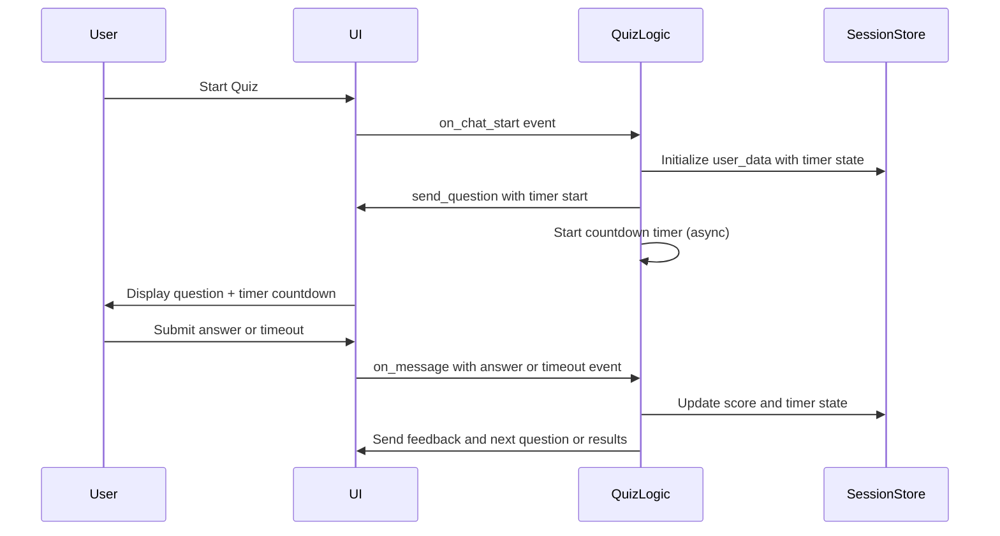
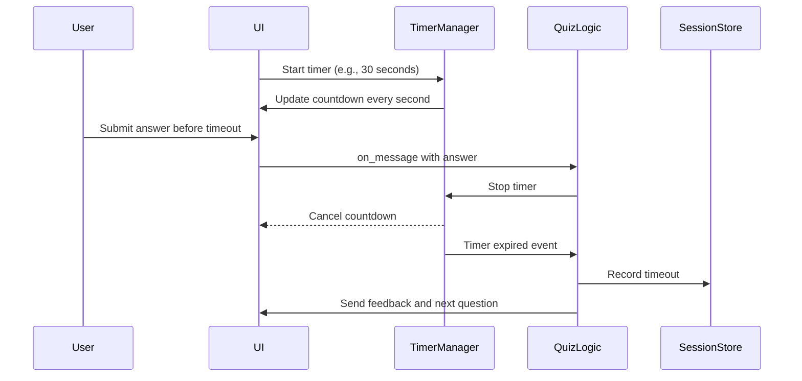

# Software Design Specification (SDS)  
## Timer Feature for MCQ Application  

**Document Version**: 1.0  
**Date**: 2024-06-10  
**Project**: MCQ Quiz Application  
**Module**: Timer Feature  
**Author**: AI-Generated (GitHub Copilot)  
**Reviewed By**: _________________  
**Approved By**: _________________  
**Approval Date**: _________________  

---

### Document History

| Version | Date | Author | Changes |

|---------|------|--------|---------|

| 1.0 | 2024-06-10 | AI-Generated | Initial SDS creation |

|  |  |  |  |

---

### Distribution List

| Role | Name | Date Sent |

|------|------|-----------|

| Technical Lead |  |  |

| QA Lead |  |  |

| Product Owner |  |  |

|  |  |  |

---

## 1. Executive Summary

The Timer Feature is a planned enhancement for the existing MCQ Quiz Application, designed to introduce a time limit per question or for the entire quiz session. This feature aims to improve user engagement by adding a challenge element, encouraging users to answer questions promptly. It will also enable more dynamic quiz sessions and support scenarios such as timed competitions or assessments.

The feature will track the countdown timer for each question or the full quiz duration, provide visual feedback to users, and enforce time expiration by automatically moving to the next question or ending the quiz. This addition aligns with the application's educational and interactive goals to increase challenge and user retention.

Key stakeholders include the development team responsible for quiz features, QA teams for test coverage, and product management focused on user experience improvements. Success will be measured by stable timer functionality, accurate time enforcement, and positive user feedback.

---

## 2. Scope & Requirements

### Functional Requirements

1. [FR-1] Implement a countdown timer for each quiz question with configurable duration.

2. [FR-2] Display the timer countdown visibly to the user during quiz questions.

3. [FR-3] Automatically submit or skip the question when the timer reaches zero.

4. [FR-4] Optionally support a total quiz timer that limits the entire quiz duration.

5. [FR-5] Provide pause/resume control for the timer if the quiz is paused or resumed.

6. [FR-6] Persist timer state in user session to handle page reloads or disconnections.

7. [FR-7] Notify users when time is nearly up (e.g., last 5 seconds warning).

8. [FR-8] Integrate with existing quiz flow without breaking current functionality.

### Non-Functional Requirements

1. [NFR-1] Timer countdown must be accurate with no significant drift (> 1 second).

2. [NFR-2] Timer UI updates must be smooth and responsive with no lag.

3. [NFR-3] The feature must not degrade overall quiz application performance.

4. [NFR-4] Secure handling of timer state to prevent tampering or cheating.

5. [NFR-5] Support scalability to multiple concurrent users without performance loss.

### Scope

**In Scope**:  
- Timer implementation per question and/or total quiz session.  
- UI elements to show countdown.  
- Integration with quiz flow logic in app.py.  
- Session storage for timer states.  

**Out of Scope**:  
- Timer feature for other app modules unrelated to quiz.  
- Analytics or reporting on timer usage.  
- Multi-player or competition modes (future extension).  

### Priority Areas

- High Priority:  
  - Accurate per-question timer and auto progression.  
  - UI timer display and warning.  
  - Session persistence of timer.  

- Medium Priority:  
  - Total quiz timer option.  
  - Pause/resume support.  

- Low Priority:  
  - Custom timer durations per question.  

---

## 3. Architecture Overview

The timer feature will augment the existing MCQ quiz application architecture, which is built using the Chainlit framework in Python. The system currently maintains user session data in-memory and uses asynchronous message handling to present questions and receive answers.

### System Context

- **User Interface**: Displays questions and options, receives user input, and will now show the timer countdown visually.

- **Quiz Logic (app.py)**: Controls quiz flow, current question tracking, answer validation, and result calculation. The timer logic will be integrated here.

- **User Session Storage**: Currently holds quiz progress and answers in a dictionary keyed by session ID. Timer state will be added to this session data.

- **Chainlit Framework**: Handles asynchronous chat message events and session management.

### Component Interactions

- When a question is sent (`send_question()`), the timer for that question is initialized and started.

- The UI is updated every second with the remaining time via asynchronous message updates or reactive UI components.

- If the timer expires before the user submits an answer, the system automatically records a timeout event and advances to the next question.

- Timer state is saved and updated in the `user_data` session dictionary to survive user delays or reconnections.

### Technology Stack

| Component | Technology |

|------------|------------|

| Backend | Python 3.9+, Chainlit Framework |

| Session Management | In-memory dictionary per session |

| Asynchronous Messaging | Chainlit async handlers |

| Timer Implementation | Python asyncio timers and event loops |

### Mermaid Diagram - High-Level Component Interaction



---

## 4. Component Breakdown

### 4.1 Timer Manager

- **Responsibility**: Manage countdown timers for quiz questions and total quiz duration.

- **Interfaces**:  
  - Start timer with specified duration.  
  - Stop, pause, resume timer.  
  - Notify quiz logic on timeout events.

- **Design Patterns**:  
  - Observer pattern for notifying timeout events.  
  - Singleton or per-session instance managed via `user_data`.

- **Relevant Code Locations**:  
  - Extend `app.py` - timer logic integrated with `send_question()`, `main()` handler.  

### 4.2 User Interface Timer Display

- **Responsibility**: Show the countdown timer to users in quiz messages.

- **Interfaces**:  
  - Receive timer updates every second.  
  - Display warning messages near timeout.

- **Implementation Details**:  
  - Use Chainlit message updates or repeated messages with updated timer text.  
  - Consider UI components supporting real-time updates.

### 4.3 Session State

- **Responsibility**: Persist timer values and states per user session.

- **Interfaces**:  
  - Read/write timer start timestamp and remaining time.  
  - Handle page reloads or user reconnections with resumed timer.

- **Implementation Details**:  
  - Extend `user_data` dictionary with timer fields (`timer_start`, `timer_duration`, `timer_remaining`).  
  - Use timestamps to calculate remaining time.

### 4.4 Timer Warning and Notification

- **Responsibility**: Notify users when time is almost up.

- **Interfaces**:  
  - Trigger warning message at configurable threshold (e.g., 5 seconds left).  
  - Integrate with UI display.

---

## 5. API Overview

The application currently does not expose external APIs; all interactions are via the Chainlit chat interface. The timer feature will augment existing message handlers:

| Event/Handler | Description | Changes for Timer Feature |

|---------------|-------------|--------------------------|

| `on_chat_start` | Initializes user session and quiz start. | Initialize timer state. |

| `send_question()` | Sends current question message. | Start timer, send timer display message. |

| `on_message` | Handles user answers or commands. | Handle timer expiration events, ignore answers after timeout. |

| Timer Async Callbacks | Internal to timer logic. | Trigger question skip or quiz end on timeout. |

The timer implementation will not introduce new external endpoints but will modify the internal flow to incorporate timing logic and UI updates.

---

## 6. Data Model & Persistence

### 6.1 Session Data Structure

The timer feature requires extending the existing `user_data` dictionary structure to include timer-related fields for each user session:

| Field Name         | Data Type | Description                                          |
|--------------------|-----------|------------------------------------------------------|
| `timer_start`      | timestamp | The timestamp when the timer started                 |
| `timer_duration`   | int       | Duration of the timer in seconds                      |
| `timer_remaining`  | int       | Remaining time in seconds (updated on pause/resume)  |
| `timer_paused`     | bool      | Flag indicating if the timer is currently paused     |

This data will be stored in-memory within the running instance of the application, keyed by user session ID.

### 6.2 Persistence Considerations

- Since the current implementation uses in-memory storage, timer state will be lost if the server restarts.

- To improve persistence and scalability, future versions may implement external session storage (Redis or database).

- Timer state must be updated atomically to avoid race conditions with asynchronous handlers.

- For reconnections or page reloads, the timer state will be recalculated based on stored timestamps.

---

## 7. Configuration & Deployment

### 7.1 Configuration Parameters

To support flexible timer behavior, the following configuration parameters will be introduced:

| Parameter                | Type   | Default | Description                                  |
|--------------------------|--------|---------|----------------------------------------------|
| `QUESTION_TIMER_SECONDS` | int    | 30      | Duration of timer per question in seconds    |
| `TOTAL_QUIZ_TIMER_SECONDS`| int    | None    | Optional total quiz timer duration in seconds|
| `TIMER_WARNING_SECONDS`  | int    | 5       | Seconds before timeout to trigger warning    |

These can be configured via environment variables or a configuration file.

### 7.2 Deployment Considerations

- The timer feature will require the application to run asynchronously to handle countdowns accurately.

- No additional infrastructure components are required.

- The feature will be backward compatible; if timer config is disabled or zero, the quiz operates as before.

---

## 8. Security & Compliance

### 8.1 Security Considerations

- Timer state stored in-memory must be protected against tampering.

- Since the application is single-user session scoped, risk of cross-user tampering is low.

- Input validation remains critical; user answers submitted after timeout will be ignored.

- Timer state will not be exposed to clients directly, only reflected in UI messages.

### 8.2 Compliance

- No personal or sensitive data is processed in the timer feature.

- No additional GDPR or HIPAA compliance impacts.

- Time tracking data is ephemeral and session-scoped.

---

## 9. Observability

### 9.1 Logging

- Log timer start and expiration events with timestamps and session IDs for troubleshooting.

- Log timer warnings sent to users.

- Errors or exceptions in timer logic must be captured in error logs.

### 9.2 Monitoring & Alerts

- Monitor average timer durations and failures to auto-advance questions.

- Alert on abnormal timer behavior (e.g., timers not expiring or triggering multiple times).

### 9.3 Metrics

- Track metrics such as average time spent per question.

- Capture user behavior on timer warnings and timeouts.

---

## 10. Non-Functional Requirements

| Requirement        | Description                                              |

|--------------------|----------------------------------------------------------|

| Performance        | Timer updates and UI must not add noticeable latency.    |

| Scalability        | Support hundreds of concurrent sessions with timers.     |

| Reliability        | Timer must consistently trigger at correct times.        |

| Usability          | Timer display should be clear and unobtrusive.            |

| Accessibility      | Timer UI must be accessible to screen readers and keyboard navigation. |

---

## 11. Testing Strategy

### 11.1 Unit Testing

- Test timer start, pause, resume, and expiration logic independently.

- Validate correct calculation of remaining time based on timestamps.

- Verify timer warning triggers at configured thresholds.

### 11.2 Integration Testing

- Test full quiz flow with timer enabled.

- Verify that questions auto-advance on timer expiration.

- Check UI displays timer countdown correctly.

- Validate session persistence of timer state on page reloads.

### 11.3 End-to-End Testing

- Simulate user answering questions within time and on timeout.

- Confirm feedback messages and score calculations are accurate.

- Test pause/resume scenarios if implemented.

### 11.4 Performance Testing

- Load test multiple concurrent users with timers.

- Measure timer accuracy and UI responsiveness under load.

### 11.5 Security Testing

- Attempt to submit answers after timeout to verify rejection.

- Verify timer state cannot be manipulated via client inputs.

---

## 12. Risks & Mitigation

| Risk | Impact | Mitigation Strategy |

|------|--------|---------------------|

| Timer drift causing inaccurate countdown | Medium | Use precise asyncio timers and server timestamps |

| Loss of timer state on server restart | Medium | Consider external session storage in future releases |

| UI lag or flickering due to frequent updates | Low | Optimize message sending frequency and UI updates |

| User confusion if timer is not visible or warnings missed | Medium | Provide clear visual cues and warnings |

| Potential for user cheating by manipulating client time | Low | Do not trust client time; enforce server-side timer logic |

---

## 13. Architecture Decision Records (ADRs)

### ADR-1: Timer Implementation Location

**Status**: Accepted  
**Date**: 2024-06-10  
**Deciders**: Development Team  

#### Context  
Decide where to implement the timer logic: client-side only, server-side only, or hybrid.

#### Decision Drivers  
- Security and prevention of cheating  
- Accuracy and synchronization  
- Complexity of implementation  

#### Considered Options  
1. Client-side timer only  
2. Server-side timer only  
3. Hybrid approach (server authoritative, client display)  

#### Decision Outcome  
**Chosen option**: Server-side timer only with client display updates  

**Positive Consequences**:  
- Secure against client manipulation  
- Centralized control of quiz flow  

**Negative Consequences**:  
- Increased server load for timer management  

---

### ADR-2: Session Storage of Timer State

**Status**: Accepted  
**Date**: 2024-06-10  
**Deciders**: Development Team  

#### Context  
Where to store timer state for persistence and reconciliation?

#### Decision Drivers  
- Performance  
- Persistence during user reconnects  
- Simplicity  

#### Considered Options  
1. In-memory per-session dictionary  
2. External cache (Redis)  
3. Database persistence  

#### Decision Outcome  
**Chosen option**: In-memory per-session dictionary, with future plans for Redis  

**Positive Consequences**:  
- Simple implementation  
- Fast access  

**Negative Consequences**:  
- Loss on server restart  

---

## 14. Assumptions & Constraints

- Assumption that users will not attempt to bypass timer by refreshing or disconnecting frequently.

- Constraint: Current in-memory session storage limits horizontal scaling without sticky sessions.

- Assumption that Chainlit framework supports sufficient async timing accuracy.

- Constraint: UI updates limited by Chainlit message update capabilities.

---

## 15. Dependencies & Integration

- Depends on Chainlit framework's async event handling.

- Integrates with existing `user_data` session dictionary in `app.py`.

- Uses existing question and answer data structures from `questions.py`.

- May depend on environment configuration management for timer durations.

---

## 16. Glossary & References

| Term           | Definition                                         |

|----------------|---------------------------------------------------|

| Timer          | A countdown mechanism to limit time per question or quiz |

| Chainlit       | Python framework for building conversational applications |

| Session        | User interaction state stored temporarily during quiz |

| Asyncio        | Python library for asynchronous programming used to implement timers |

---

## 17. Appendices

### 17.1 Mermaid Diagram - Timer Sequence

The following sequence diagram illustrates the timer flow during a quiz question:



---

## 📄 Converting to Word (.docx)

To convert this Markdown document to Word format, use Pandoc:

### Prerequisites
- Install Pandoc: https://pandoc.org/installing.html  
  - Windows: `choco install pandoc` or download installer  
  - Mac: `brew install pandoc`  
  - Linux: `apt-get install pandoc`  

### Conversion Commands

**Basic Conversion**:
```bash
pandoc docs/SDS_Timer_Feature_20240610.md -o docs/SDS_Timer_Feature_20240610.docx
```

**With Table of Contents**:
```bash
pandoc docs/SDS_Timer_Feature_20240610.md -o docs/SDS_Timer_Feature_20240610.docx --toc --toc-depth=3
```

**With Custom Styling** (requires reference.docx template):
```bash
pandoc docs/SDS_Timer_Feature_20240610.md -o docs/SDS_Timer_Feature_20240610.docx --reference-doc=custom-reference.docx --toc
```

### Mermaid Diagrams in Word
Mermaid diagrams must be manually converted:
1. Copy Mermaid code to https://mermaid.live/  
2. Export as PNG/SVG  
3. Insert images into Word document  

---
