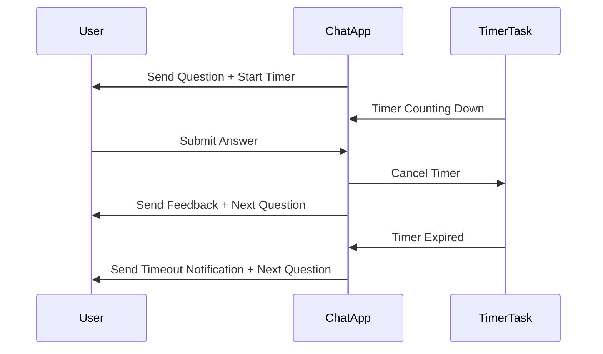

# Software Design Specification (SDS)  
## Timer Feature for MCQ Application

**Document Version**: 1.0  
**Date**: 2024-06-10  
**Project**: MCQ Quiz Application  
**Module**: Timer Feature  
**Author**: AI-Generated (GitHub Copilot)  
**Reviewed By**: _________________  
**Approved By**: _________________  
**Approval Date**: _________________  

---

### Document History

| Version | Date       | Author          | Changes               |

|---------|------------|-----------------|-----------------------|

| 1.0     | 2024-06-10 | AI-Generated    | Initial SDS creation   |

|         |            |                 |                       |

---

### Distribution List

| Role           | Name | Date Sent |

|----------------|------|-----------|

| Technical Lead |      |           |

| QA Lead       |      |           |

| Product Owner |      |           |

|                |      |           |

---

## 1. Executive Summary

The MCQ Quiz Application currently allows users to answer multiple-choice questions in a chat interface with immediate feedback and score tracking. The proposed Timer Feature will enhance the user experience by introducing a countdown timer for each question, encouraging timely responses and adding a gamified challenge element.

This feature aims to limit the time allowed per question and automatically move to the next question if time expires, providing feedback accordingly. It will also display the remaining time visually to users.

Key stakeholders include the product owner, development team, and QA team. Success criteria are seamless integration without disrupting existing quiz functionality, accurate timer operation, and positive user feedback.

---

## 2. Scope & Requirements

### Functional Requirements

1. [FR-1] Display a countdown timer for each quiz question visible to the user in the chat interface.

2. [FR-2] Set a configurable time limit per question (default 30 seconds).

3. [FR-3] Automatically move to the next question when the timer expires.

4. [FR-4] Provide feedback indicating that time has expired for the question.

5. [FR-5] Allow users to answer within the time limit and receive immediate feedback as currently implemented.

6. [FR-6] Pause or reset timer when quiz restarts.

### Non-Functional Requirements

1. [NFR-1] Timer accuracy must be within +/- 1 second.

2. [NFR-2] Timer updates must not cause noticeable latency or degrade chat responsiveness.

3. [NFR-3] Feature must be compatible with existing Chainlit chat framework and Python backend.

4. [NFR-4] Timer UI must be visually clear and accessible.

5. [NFR-5] System must handle concurrent users correctly, with isolated timers per session.

### Scope

**In Scope**:  
- Timer functionality per question in quiz flow  
- Timer display in chat UI  
- Automatic question advancement on timeout  
- Integration with existing answer validation and feedback logic  

**Out of Scope**:  
- Timer for quiz overall (total quiz time)  
- Timer customization UI for users  
- Analytics or reporting on timing data  

### Priority Areas

- High Priority: Timer countdown logic, automatic progression, user notification  
- Medium Priority: Configurable timer duration, UI clarity  
- Low Priority: Performance optimization beyond basic responsiveness  

---

## 3. Architecture Overview

The MCQ Quiz application is a Python-based chat app running on the Chainlit framework. It maintains user session state in a dictionary keyed by session ID, tracking current question index, user score, and answers.

The Timer Feature will integrate primarily with the existing message handling and question sending asynchronous functions. A per-session timer will be started when a question is sent, counting down asynchronously in the backend. If the user submits an answer before timeout, the timer stops. If the timer expires first, the system will send a timeout notification and advance to the next question.

The interaction flow:

- User receives question + timer start  
- Timer counts down (visible in UI if supported by Chainlit message updates)  
- User submits answer 12 timer cancelled 12 feedback sent 12 next question sent  
- Timer expires 12 timeout message sent 12 next question sent  

The timer logic will be implemented asynchronously using Chainlit's async capabilities, ensuring no blocking of the main event loop.

### Technology Stack

- Python 3.x  
- Chainlit framework for chat interactions  
- Asyncio for asynchronous timer handling  
- Existing QUESTIONS data model in Python dictionaries  

### Integration Points

- `send_question()` function extended to start timer  
- `main()` message handler extended to cancel timer on valid answer  
- New async timer coroutine per session  

---

## 4. Component Breakdown

| Component            | Responsibility                                    | Interfaces / References           |

|----------------------|-------------------------------------------------|---------------------------------|

| Timer Manager        | Manage timers per user session                    | Integrated with `send_question()`, `main()` in app.py |

| Chat UI Timer Display | Visual countdown timer display in chat messages | Via Chainlit message updates     |

| Session State Store  | Store current question timer task per session    | `user_data` dictionary extension |

| Timeout Handler      | Handle timer expiration event                     | Sends timeout feedback message, advances quiz |

---

## 5. API Overview

The application exposes no external APIs but uses Chainlit event handlers:

| Event Handler        | Description                                     |

|----------------------|------------------------------------------------|

| `@cl.on_chat_start`   | Initializes user session state                  |

| `@cl.on_message`      | Handles user messages, including answers and restart commands |

| `send_question()`    | Sends current question; will be extended to start timer |

No external endpoints are introduced for the Timer Feature. Internally, the timer management uses Python async tasks.

---

## 6. Data Model & Persistence

The Timer Feature does not require persistent storage beyond the existing in-memory `user_data` dictionary. The timer state for each user session will be stored transiently with the following additions:

| Data Field        | Type           | Description                              |

|-------------------|----------------|--------------------------------------|

| `timer_task`      | `asyncio.Task` | Reference to the async timer coroutine running for the session |

This will enable cancelling timers when users answer early or restart the quiz.

No changes to the QUESTIONS data model or database (as none exists) are required.

---

## 7. Configuration & Deployment

### Configuration

- Default timer duration is configurable via a constant variable, e.g., `TIMER_DURATION_SECONDS = 30`.

- This can be adjusted in `app.py` or externalized to an environment variable if desired.

### Deployment

- No changes to deployment process; the updated `app.py` will be redeployed as usual.

- Ensure Python environment supports asyncio and Chainlit dependencies.

---

## 8. Security & Compliance

### Security Considerations

- Timer data is stored per user session in memory; no sensitive data is stored.

- No external API calls are introduced.

- No new attack surface added; existing input validation remains.

- Asynchronous tasks are managed carefully to avoid resource leaks or denial of service.

### Compliance

- No personal data modifications.

- No logging of timer data beyond session state.

- Compliance with existing application policies maintained.

---

## 9. Observability

- Add logging for timer start, cancellation, and expiration events per session ID for troubleshooting.

- Use Chainlit's existing logging framework or Python standard logging.

- Monitor for any exceptions in async timer tasks.

---

## 10. Non-Functional Requirements

| Requirement            | Description                                   | Metric / Target                      |

|------------------------|-----------------------------------------------|------------------------------------|

| Timer Accuracy         | Timer should expire within +/- 1 second       | Measured via test logs and timing  |

| Performance            | No noticeable latency or blocking in chat UI | Response time < 200ms for user inputs |

| Scalability            | Support concurrent users with isolated timers | No cross-session interference      |

| Availability           | Timer feature must not crash the app          | 99.9% uptime                       |

| Accessibility          | Timer display must be clear and non-disruptive | User feedback                      |

---

## 11. Testing Strategy

### Unit Testing

- Test timer start and cancellation logic independently.

- Mock user sessions and verify timer triggers timeout correctly.

### Integration Testing

- Verify that sending a question starts the timer.

- Confirm that answering before timeout cancels the timer and proceeds as normal.

- Validate timeout event triggers automatic question advancement.

### End-to-End Testing

- Simulate user interactions with timer enabled, verifying UI updates and quiz progress.

- Test restart functionality resets timers properly.

### Performance Testing

- Measure timer accuracy and application responsiveness with multiple concurrent sessions.

### Security Testing

- Test for race conditions or resource leaks with timers.

- Verify no unauthorized data access occurs due to timer implementation.

---

## 12. Risks & Mitigation

| Risk                          | Mitigation Strategy                                  |

|-------------------------------|-----------------------------------------------------|

| Timer task leaking (not cancelled) | Ensure proper cancellation in message handler and restart logic |

| User confusion if timer not visible | Provide clear UI timer display and timeout notification |

| Performance degradation under load | Monitor and optimize async task handling |

| Chainlit limitations on UI updates | Test timer display compatibility and degrade gracefully |

---

## 13. Architecture Decision Records (ADRs)

### ADR-1: Use Asyncio Tasks for Timer Implementation

**Status**: Accepted  
**Date**: 2024-06-10  
**Deciders**: Development Team

#### Context

Need a non-blocking timer for each user session integrated into async Chainlit app.

#### Decision Drivers

- Non-blocking behavior   
- Per-session isolation   
- Easy cancellation on answer submit  

#### Considered Options

1. External timer service  
2. Thread-based timers  
3. Asyncio coroutine tasks  

#### Decision Outcome

Chosen option: Asyncio coroutine tasks for lightweight, integrated async timers.

**Positive Consequences**: Simple integration, efficient, no extra infrastructure.  
**Negative Consequences**: Care needed to cancel tasks to avoid leaks.

---

## 14. Assumptions & Constraints

### Assumptions

- Chainlit supports async message handling and concurrent sessions.  
- Users have stable connections to interact within timer duration.  
- Timer duration fixed or configurable by developers, no user customization.  

### Constraints

- Timer accuracy depends on event loop scheduling and system load.  
- No persistent storage for timer state; timer resets if server restarts.  

---

## 15. Dependencies & Integration

- Depends on Chainlit event handling framework.  
- Integration with existing `user_data` session storage.  
- Requires Python 3.7+ for asyncio features.  
- No external dependencies introduced.  

---

## 16. Glossary & References

| Term              | Definition                                                  |

|-------------------|-------------------------------------------------------------|

| Chainlit          | Python framework for building chat applications             |

| Asyncio           | Python library for asynchronous programming                  |

| Coroutine         | A function that can pause and resume its execution           |

| Timer Task        | Asyncio coroutine instance managing countdown per session   |

| Session ID        | Unique identifier for a user chat session                    |

### References

- Chainlit Documentation: https://chainlit.io/docs  
- Python Asyncio: https://docs.python.org/3/library/asyncio.html  
- MCQ Application Source Code: `app.py`, `questions.py`

---

## 17. Appendices

### 17.1 Sequence Diagram: Timer Integration Flow

The following diagram illustrates the timer flow for each question in the quiz:



---

## 📄 Converting to Word (.docx)

To convert this Markdown document to Word format, use Pandoc:

### Prerequisites

- Install Pandoc: https://pandoc.org/installing.html  
  - Windows: `choco install pandoc` or download installer  
  - Mac: `brew install pandoc`  
  - Linux: `apt-get install pandoc`  

### Conversion Commands

**Basic Conversion**:

```bash
pandoc docs/SDS_Timer_Feature_20240610.md -o docs/SDS_Timer_Feature_20240610.docx
```

**With Table of Contents**:

```bash
pandoc docs/SDS_Timer_Feature_20240610.md -o docs/SDS_Timer_Feature_20240610.docx --toc --toc-depth=3
```

**With Custom Styling** (requires reference.docx template):

```bash
pandoc docs/SDS_Timer_Feature_20240610.md -o docs/SDS_Timer_Feature_20240610.docx --reference-doc=custom-reference.docx --toc
```

### Mermaid Diagrams in Word

Mermaid diagrams must be manually converted:

1. Copy Mermaid code to https://mermaid.live/  
2. Export as PNG or SVG  
3. Insert images into Word document  

---
