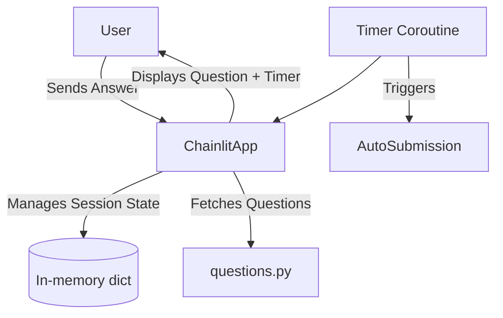
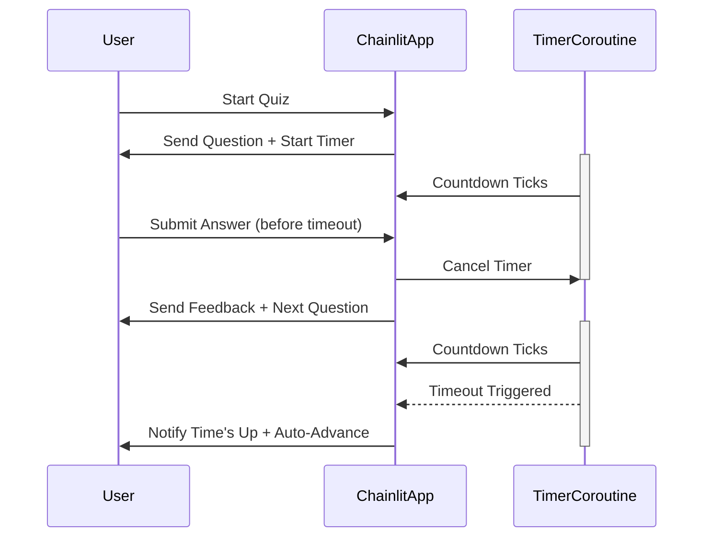

# Software Design Specification (SDS)
## Timer Feature for MCQ Quiz App

**Document Version**: 1.0  
**Date**: 2024-06-12  
**Project**: MCQ Quiz App  
**Module**: Timer Feature  
**Author**: AI-Generated (GitHub Copilot)  
**Reviewed By**: _________________  
**Approved By**: _________________  
**Approval Date**: _________________  

---

### Document History

| Version | Date       | Author       | Changes                |

|---------|------------|--------------|------------------------|

| 1.0     | 2024-06-12 | AI-Generated | Initial SDS creation    |

|         |            |              |                        |

---

### Distribution List

| Role           | Name         | Date Sent  |

|----------------|--------------|------------|

| Technical Lead |              |            |

| QA Lead       |              |            |

| Product Owner |              |            |

|                |              |            |

---

## 1. Executive Summary

The Timer Feature is an enhancement to the existing MCQ Quiz App built with Python and Chainlit. It introduces a countdown timer for each quiz question to encourage timely responses and improve user engagement. The timer will automatically submit the current answer or move to the next question when time expires.

This document outlines the design, architecture, and implementation plan for integrating this feature into the current system. Key objectives include maintaining the current user experience flow, ensuring smooth integration with Chainlit's asynchronous message handling, and preserving existing scoring and feedback mechanisms.

The success of this feature will be measured by its seamless operation within the quiz flow, lack of regressions in existing functionality, and positive user feedback on the enhanced quiz pacing.

## 2. Scope & Requirements

### Functional Requirements

1. [FR-1] Add a countdown timer visible to the user during each quiz question.

2. [FR-2] Timer duration configurable per question or globally (default e.g., 30 seconds).

3. [FR-3] Automatically submit the current answer or mark unanswered when timer expires.

4. [FR-4] Provide user feedback when time is up (e.g., "Time's up! Moving to next question.").

5. [FR-5] Pause and reset timer when user restarts the quiz.

6. [FR-6] Ensure timer synchronizes correctly with question display and answer validation.

### Non-Functional Requirements

1. [NFR-1] Timer UI updates must be responsive and not degrade app performance.

2. [NFR-2] Implementation must be compatible with Chainlit's async event model.

3. [NFR-3] Timer feature should be extensible for future enhancements (e.g., per-question timers).

4. [NFR-4] Security: Prevent timer manipulation by users.

### Scope

**In Scope**: Timer integration into the quiz question display and answer flow within the MCQ app.

**Out of Scope**: Changes to question content, scoring logic (other than timer-triggered submissions), or overall app architecture beyond timer feature.

### Priority Areas

- High Priority: Timer countdown integration, auto-submission on timeout, user feedback messaging.

- Medium Priority: Timer configuration flexibility.

- Low Priority: UI styling enhancements for timer display.

## 3. Architecture Overview

### Current System Overview

The MCQ app is a Python-based interactive quiz leveraging Chainlit for chat-based UI and async messaging. It stores user session state in a dictionary keyed by session ID, tracking current question, score, and answers.

Flow:

- On chat start, quiz initializes user session data and sends first question.

- User replies with answer number, validated and checked against correct answer.

- Feedback sent, score updated, next question sent.

- Final results displayed after last question.

### Timer Feature Integration

The timer will be implemented as an asynchronous countdown tied to question display. Using Chainlit's async capabilities, a timer coroutine will start with each question sent. It will track remaining seconds and update the UI accordingly.

If the user answers before time expires, the timer cancels. If the timer expires first, the system records the question as unanswered or auto-submits the last answer if applicable, then proceeds to next question.

### Technology Stack

- Python 3.x

- Chainlit framework for chat UI and async event handling

- Existing modules: `app.py`, `questions.py`

- User session state stored in-memory dictionary

### Mermaid Component Diagram



## 4. Component Breakdown

### 4.1 Chainlit App (`app.py`)

- Central application module handling user chat events.

- Manages user session data dictionary.

- Contains async handlers for chat start, message received.

- Responsible for sending questions, feedback, and results.

- Will be extended to include timer coroutine management.

### 4.2 Questions Module (`questions.py`)

- Stores question data as a list of dictionaries.

- Provides functions to get question by ID and total question count.

- Unaffected by timer feature except possible exposure of per-question timer config in future.

### 4.3 Timer Coroutine

- New async coroutine started with each question.

- Counts down time in seconds, updates user interface (if feasible).

- Cancels on user answer submission.

- Triggers auto-submission and moves quiz forward on timeout.

- Integrated tightly with Chainlit's async event loop.

### 4.4 User Session Data

- Extended to track timer state if needed.

- May add fields to support timer cancellation and state management.

## 5. API Overview

The app does not expose a public API but relies on Chainlit's event-driven handlers.

### Relevant Handlers

| Event           | Description                               |

|-----------------|-------------------------------------------|

| `@cl.on_chat_start` | Initializes quiz session and sends first question |

| `@cl.on_message` | Handles user answer input and validation  |

| New Timer Coroutine | Manages countdown and timeout per question |

### Message Formats

- Question message: Markdown formatted question with options.

- Feedback message: Correct/incorrect feedback with explanation.

- Timer messages: Optional real-time timer updates or timeout notification.

## 6. Data Model & Persistence

### 6.1 User Session Data

User session data is stored in-memory within a Python dictionary keyed by the user's session ID. It currently tracks:

- `current_question`: Integer index of the current question.

- `score`: Integer tally of correct answers.

- `answers`: List of dictionaries recording question ID, user answer, correctness.

For the timer feature, the data model will be extended to include:

- `timer_task`: Reference to the asynchronous timer coroutine/task for cancellation and management.

- `timer_remaining`: Optional integer tracking remaining seconds (for UI updates if implemented).

All session data remains ephemeral and is reset upon quiz restart or user session expiration.

### 6.2 Questions Data

Questions are statically defined in `questions.py` as a list of dictionaries containing:

- `id`: Question identifier.

- `question`: Text of the question.

- `options`: List of answer options.

- `correct_answer`: Index of the correct option.

- `explanation`: Explanation text for feedback.

Timer durations may be optionally added in the future as a per-question attribute (e.g., `timer_seconds`), defaulting to a global default timer.

### 6.3 Persistence Considerations

No persistent database storage is currently used. All state is in-memory per user session.

Adding timer state does not require persistent storage but careful management of async tasks per session.

---

## 7. Configuration & Deployment

### 7.1 Configuration

Add new configuration parameters to control timer behavior:

- `DEFAULT_TIMER_SECONDS`: Integer, default countdown per question (e.g., 30 seconds).

- `TIMER_ENABLED`: Boolean flag to enable/disable timer feature.

These can be configured via environment variables or a config file (not currently used but recommended).

### 7.2 Deployment

The MCQ app runs using Chainlit's runtime environment.

Deploying the timer feature requires:

- Updating `app.py` to include timer coroutine logic.

- Testing to ensure no regressions in chat flow or performance.

- Redeploying the app with the updated codebase.

No additional infrastructure or external services are required.

### 7.3 Scaling Considerations

Since state and timers are in-memory per session, scaling horizontally requires sticky sessions or shared session storage if deployed in multi-instance environments.

For current single-instance setups, no changes needed.

---

## 8. Security & Compliance

### 8.1 Security Considerations

- **Timer Integrity**: Prevent client-side manipulation of timer (e.g., by disabling client-side timer if implemented; rely on server-side timer enforcement).

- **Denial of Service**: Ensure that timer tasks are properly cancelled to avoid resource leaks.

- **Session Validation**: Maintain session validation to prevent unauthorized access or timer manipulation across sessions.

### 8.2 Compliance

No sensitive personal data is processed by the timer feature. Existing app compliance remains applicable.

---

## 9. Observability

### 9.1 Logging

- Log timer start, cancellation, and timeout events per user session for auditing and debugging.

- Log any errors in timer coroutine execution.

### 9.2 Monitoring

- Monitor resource usage related to async timer tasks to detect leaks or performance degradation.

### 9.3 Metrics

- Track metrics such as average time taken per question, number of timeouts per session, to evaluate timer effectiveness.

---

## 10. Non-Functional Requirements

| Requirement                | Description                                        |

|----------------------------|--------------------------------------------------|

| Performance                | Timer must not introduce noticeable latency.     |

| Scalability               | Support multiple concurrent users with timers.   |

| Reliability               | Timer must reliably trigger timeout actions.    |

| Availability              | Timer feature must not cause downtime.           |

| Usability                 | Timer display should be clear and intuitive.     |

| Extensibility             | Support future customization of timer durations. |

---

## 11. Testing Strategy

### 11.1 Unit Testing

- Test the timer coroutine behavior including countdown, cancellation, and timeout triggering.

- Test integration of timer with question display and answer submission logic.

### 11.2 Integration Testing

- Simulate user sessions to verify timer starts with each question.

- Verify auto-submission occurs when timer expires.

- Confirm manual answer submission cancels the timer correctly.

### 11.3 End-to-End Testing

- Conduct full quiz runs with timer enabled to verify user experience.

- Test edge cases such as restarting quiz mid-timer, rapid answer submission.

### 11.4 Performance Testing

- Measure impact of timer tasks on app responsiveness with multiple concurrent users.

### 11.5 Security Testing

- Test for timer manipulation attempts.

- Validate session isolation and prevention of cross-user timer interference.

---

## 12. Risks & Mitigation

| Risk                                         | Mitigation Strategy                                |

|----------------------------------------------|---------------------------------------------------|

| Timer tasks leak causing memory bloat        | Ensure proper task cancellation and cleanup       |

| User confusion with timer behavior            | Provide clear UI messaging and feedback           |

| Timer causing race conditions with answers   | Use atomic async control flow in Chainlit         |

| Performance degradation under load            | Monitor and optimize async task management        |

| Timer manipulation by client                   | Enforce timer logic server-side only              |

---

## 13. Architecture Decision Records (ADRs)

### ADR-001: Choice of Timer Implementation

**Status**: Accepted  
**Date**: 2024-06-12  
**Deciders**: Development Team  

#### Context

Implementing a timer feature in an async Chainlit app requires choosing between client-side timers or server-side timers.

#### Decision Drivers

- Reliability of timeout enforcement   
- User experience responsiveness  
- Security against timer manipulation  

#### Considered Options

1. Client-side countdown timer (JavaScript/Chainlit UI)  
2. Server-side async timer coroutine in Python  

#### Decision Outcome

**Chosen option**: Server-side async timer coroutine to ensure control and prevent manipulation.

**Positive Consequences**

- Secure timer enforcement  
- Centralized timer management  

**Negative Consequences**

- Slightly increased server resource usage  

#### Links

- Chainlit documentation on async programming  
- Timer implementation patterns  

---

## 14. Assumptions & Constraints

- User sessions persist for the duration of the quiz.

- Chainlit's async environment supports timer coroutine management.

- No persistent storage of timer state is required.

- Users interact via chat interface only.

- Timer duration is uniform unless future per-question timer is implemented.

---

## 15. Dependencies & Integration

- Depends on Chainlit framework for async event handling.

- Integrates with existing user session management in `app.py`.

- Uses question data from `questions.py`.

- No external service dependencies.

---

## 16. Glossary & References

### Glossary

| Term             | Definition                                     |

|------------------|------------------------------------------------|

| Chainlit         | Python framework for building interactive chat apps |

| Coroutine        | A function that can pause and resume execution asynchronously |

| Asyncio          | Python library for asynchronous programming    |

| Timer Coroutine  | Async function managing countdown and timeout  |

| Session Data     | In-memory storage of user quiz state            |

### References

- Chainlit Documentation: https://docs.chainlit.io  
- Python Asyncio Documentation: https://docs.python.org/3/library/asyncio.html  
- Mermaid Live Editor: https://mermaid.live/  

---

## 17. Appendices

### 17.1 Timer Coroutine Example (Pseudocode)

```python
import asyncio

async def timer(session_id, duration_seconds):
    remaining = duration_seconds
    while remaining > 0:
        await asyncio.sleep(1)
        remaining -= 1
        # Optionally send timer update to user UI
    # Time expired - trigger auto-submission or mark unanswered
    await handle_timeout(session_id)
```

### 17.2 Sample Configuration

```python
DEFAULT_TIMER_SECONDS = 30
TIMER_ENABLED = True
```

### 17.3 Sequence Diagram: Timer-Enabled Question Flow



---

## 📄 Converting to Word (.docx)

To convert this Markdown document to Word format, use Pandoc:

### Prerequisites

- Install Pandoc: https://pandoc.org/installing.html  
  - Windows: `choco install pandoc` or download installer  
  - Mac: `brew install pandoc`  
  - Linux: `apt-get install pandoc`  

### Conversion Commands

**Basic Conversion**:

```bash
pandoc docs/SDS_Timer_Feature_for_MCQ_Quiz_App_20240612.md -o docs/SDS_Timer_Feature_for_MCQ_Quiz_App_20240612.docx
```

**With Table of Contents**:

```bash
pandoc docs/SDS_Timer_Feature_for_MCQ_Quiz_App_20240612.md -o docs/SDS_Timer_Feature_for_MCQ_Quiz_App_20240612.docx --toc --toc-depth=3
```

**With Custom Styling** (requires reference.docx template):

```bash
pandoc docs/SDS_Timer_Feature_for_MCQ_Quiz_App_20240612.md -o docs/SDS_Timer_Feature_for_MCQ_Quiz_App_20240612.docx --reference-doc=custom-reference.docx --toc
```

### Mermaid Diagrams in Word

Mermaid diagrams must be manually converted:

1. Copy Mermaid code to https://mermaid.live/  
2. Export as PNG or SVG  
3. Insert images into Word document  

---
