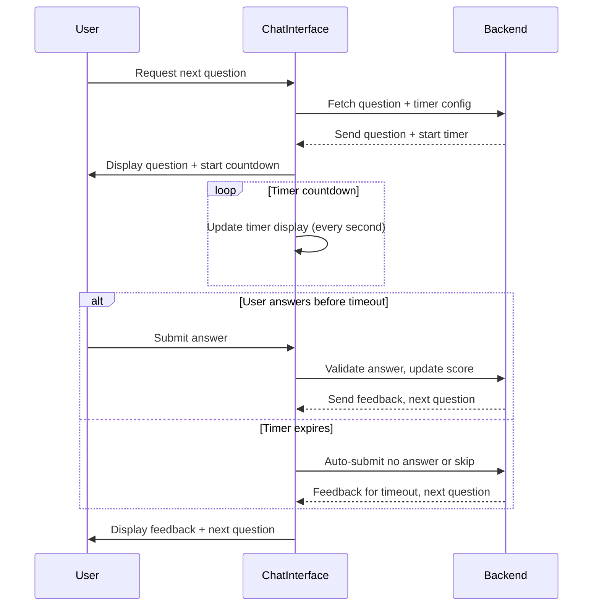

# Software Design Specification (SDS)
## Timer Feature

**Document Version**: 1.0  
**Date**: 2024-06-10  
**Project**: MCQ Quiz Application  
**Module**: Timer Feature  
**Author**: AI-Generated (GitHub Copilot)  
**Reviewed By**: _________________  
**Approved By**: _________________  
**Approval Date**: _________________  

---

### Document History

| Version | Date | Author | Changes |

|---------|------|--------|---------|

| 1.0 | 2024-06-10 | AI-Generated | Initial SDS creation |

|  |  |  |  |

---

### Distribution List

| Role | Name | Date Sent |

|------|------|-----------|

| Technical Lead |  |  |

| QA Lead |  |  |

| Product Owner |  |  |

|  |  |  |

---

## 1. Executive Summary

The Timer Feature adds a countdown timer to the MCQ Quiz Application, enhancing user experience by enforcing a time limit per question or for the entire quiz session. This feature aims to increase quiz challenge and simulate real exam conditions.

The timer will start when a question is presented and either automatically submit the current answer when time expires or move the user to the next question. It will visually display remaining time to the user in the chat interface.

Key stakeholders include the product owner, development team, QA team, and end users. Success will be measured by seamless timer integration without disrupting existing quiz flow and improved user engagement.

## 2. Scope & Requirements

### Functional Requirements

1. [FR-1] Display a countdown timer for each question in the quiz interface.

2. [FR-2] Allow configuration of timer duration per question and optionally for the entire quiz.

3. [FR-3] Automatically submit or skip to the next question when the timer expires.

4. [FR-4] Pause or reset the timer if the quiz is restarted.

5. [FR-5] Provide visual feedback of time remaining.

6. [FR-6] Ensure timer works across different devices and screen sizes.

### Non-Functional Requirements

1. [NFR-1] Performance: Timer updates must not cause UI lag or delays in message delivery.

2. [NFR-2] Security: Prevent timer manipulation or bypass.

3. [NFR-3] Scalability: Timer logic should support multiple concurrent users.

4. [NFR-4] Reliability: Timer must not fail silently or cause quiz state inconsistencies.

### Scope

**In Scope**:

- Timer implementation integrated with question delivery and answer submission.

- Configuration options for timer duration.

- Visual countdown display in chat interface.

**Out of Scope**:

- Timer for other app features beyond quiz questions.

- Advanced analytics on timer usage.

- Server-side enforcement beyond basic control.

### Priority Areas

- High Priority: Timer display, automatic submission on expiry, per-question timer configuration.

- Medium Priority: Pause/reset functionality on quiz restart.

- Low Priority: Visual styling customization.

## 3. Architecture Overview

The Timer Feature will be integrated into the existing Chainlit-based MCQ Quiz Application.

The architecture includes:

- **Frontend (Chainlit Chat Interface)**: Displays countdown timer alongside quiz questions, updates timer every second.

- **Backend (Python app.py)**: Manages timer settings, triggers automatic submission or question skip when time expires, synchronizes timer state with user session data.

- **User Session Management**: Stores timer state (start time, remaining time) per user session to support concurrent users.

- **Configuration Layer**: Allows timer duration settings to be defined globally or overridden per quiz.

The timer will be implemented using asynchronous tasks and timing functions supported by Chainlit and Python async features.

### Mermaid Diagram: Timer Integration Sequence

The following sequence diagram illustrates the timer interaction flow during a quiz question:



## 4. Component Breakdown

### 4.1 Timer Manager

- Responsible for tracking countdown per question.

- Maintains timer state in user session data.

- Triggers events on timeout.

### 4.2 UI Timer Display

- Frontend component integrated with Chainlit chat messages.

- Renders visual countdown and updates every second.

### 4.3 Quiz Controller (Enhancement)

- Coordinates question delivery and timer start.

- Handles automatic submission or skipping on timer expiry.

- Updates user score and quiz state accordingly.

### 4.4 Configuration Module

- Provides API for timer duration settings.

- Supports default and per-question configuration.

## 5. API Overview

The Timer Feature will extend the existing chat message handling API with:

- Timer start and stop commands embedded in question messages.

- Automatic answer submission triggers on timeout.

- Configuration endpoints (if any) for timer settings.

No new external REST API endpoints are required since the app is chat-driven.

---

## 6. Data Model & Persistence

### 6.1 Timer State in User Session

The timer state will be persisted in the in-memory `user_data` dictionary keyed by user session ID. The following fields will be added:

| Field | Type | Description |
|-------|------|-------------|
| timer_start | datetime or timestamp | Timestamp when timer started for current question |
| timer_duration | int (seconds) | Duration of the timer for current question |
| timer_remaining | int (seconds) | Remaining seconds on timer |

This allows the backend to track timer progress and enforce timeout logic.

### 6.2 Configuration Storage

Timer duration configuration can be stored as constants or loaded from environment variables or config files. For example:

```python
DEFAULT_TIMER_DURATION = 30  # seconds per question
```

The configuration can be extended to support per-question overrides if needed.

### 6.3 Migration Strategy

No database schema changes are required as timer state is session-based and transient. If persistent storage is introduced later, migration scripts will be prepared accordingly.

## 7. Configuration & Deployment

### 7.1 Configuration

- Add timer duration settings to config files or environment variables.

- Enable/disable timer feature via config toggle.

Example environment variables:

```
TIMER_ENABLED=true
TIMER_DURATION_SECONDS=30
```

### 7.2 Deployment

- Deploy updated `app.py` with timer logic.

- No changes to infrastructure required.

- Ensure Chainlit server supports async timers and scheduled tasks.

### 7.3 Scaling Considerations

- Since timer state is stored in-memory, scaling horizontally requires sticky sessions or moving session state to centralized store (Redis) if needed.

- Monitor resource usage to prevent timer overhead under load.

## 8. Security & Compliance

### 8.1 Authentication and Authorization

No changes to authentication flow. The timer operates per authenticated user session.

### 8.2 Input Validation

- Validate timer configuration inputs.

- Prevent user manipulation of timer values by enforcing timer logic server-side.

### 8.3 Data Protection

No sensitive data handled by timer feature. Timer state is ephemeral.

### 8.4 Compliance

No specific compliance impacts anticipated.

## 9. Observability

### 9.1 Logging

- Log timer start events per user.

- Log timeout events and automatic submissions.

- Log any timer errors or anomalies.

### 9.2 Monitoring

- Track metrics on average time taken per question.

- Monitor frequency of timer expirations.

- Use logs to debug timing-related issues.

### 9.3 Alerts

- Alert if timer system fails or causes performance issues.

## 10. Non-Functional Requirements

| Requirement | Detail |
|-------------|--------|
| Performance | Timer updates every second without UI lag. |
| Scalability | Support concurrent users with independent timers. |
| Reliability | Timer must trigger auto-submission reliably. |
| Security | Prevent timer tampering or bypass. |
| Usability | Timer display should be clear and non-intrusive. |

---

## 11. Testing Strategy

### 11.1 Unit Testing

- Test timer countdown logic for correct decrement.

- Test timer start, pause, reset functions.

- Validate automatic submission triggers on timeout.

### 11.2 Integration Testing

- Verify timer integration with question delivery and answer submission.

- Test timer state persistence across user sessions.

### 11.3 End-to-End Testing

- Simulate user taking quiz with timer enabled.

- Validate correct behavior on timer expiry (auto-submit, feedback).

- Test timer display updates in chat UI.

### 11.4 Performance Testing

- Measure impact of timer updates on system responsiveness.

- Test under load with multiple simultaneous users.

### 11.5 Security Testing

- Attempt to bypass timer restrictions.

- Validate server-side enforcement of timer expiry.

### 11.6 Test Coverage Targets

- Achieve 90% coverage on timer-related code.

- Cover both positive and negative test cases.

## 12. Risks & Mitigation

| Risk | Mitigation |
|------|------------|
| Timer causes UI lag or chat delays | Optimize timer update frequency, use efficient async methods |
| User session loss causes timer inconsistencies | Implement robust session management and recovery |
| Timer bypass through client manipulation | Enforce timer logic server-side, do not trust client timers |
| Scalability issues under heavy load | Monitor resource usage, consider centralized session store |
| User frustration with strict timer | Provide configuration toggle and reasonable defaults |

## 13. Architecture Decision Records (ADRs)

### ADR-001: Timer State Management

**Status**: Accepted  
**Date**: 2024-06-10  
**Deciders**: Development Team  

#### Context

Need to decide how to manage timer state per user session in a stateless web environment.

#### Decision Drivers

- Performance  
- Scalability  
- Simplicity

#### Considered Options

1. Store timer state in-memory per server instance.  
2. Use centralized session store (Redis).  
3. Use client-side timers only.

#### Decision Outcome

Chosen option: **Store timer state in-memory per server instance.**

**Positive Consequences**:

- Simple to implement.  
- Low latency access to timer state.

**Negative Consequences**:

- Requires sticky sessions for multi-instance deployment.  
- Not suitable for horizontal scaling without session affinity.

#### Pros and Cons

##### Option 1

- ✅ Simple, fast access.  
- ❌ Limits scalability.

##### Option 2

- ✅ Scalable, suitable for distributed systems.  
- ❌ Adds infrastructure complexity.

##### Option 3

- ✅ Offloads timer logic to client.  
- ❌ Vulnerable to manipulation.

#### Links

- N/A

### ADR-002: Timer Enforcement Mechanism

**Status**: Accepted  
**Date**: 2024-06-10  
**Deciders**: Development Team  

#### Context

Deciding whether timer enforcement should be client-side, server-side, or hybrid.

#### Decision Drivers

- Security  
- User experience

#### Considered Options

1. Client-side timer only.  
2. Server-side timer only.  
3. Hybrid approach with client display and server enforcement.

#### Decision Outcome

Chosen option: **Hybrid approach with client display and server enforcement.**

**Positive Consequences**:

- Secure enforcement.  
- Responsive user experience.

**Negative Consequences**:

- Requires synchronization logic.

#### Pros and Cons

##### Option 1

- ✅ Simple UI implementation.  
- ❌ Easily bypassed.

##### Option 2

- ✅ Secure.  
- ❌ May cause lag in UI updates.

##### Option 3

- ✅ Balance of security and UX.  
- ❌ More development effort.

#### Links

- N/A

## 14. Assumptions & Constraints

### Assumptions

- Users have stable network connections.

- Chainlit framework supports async timers.

- Single-instance deployment or sticky sessions are available.

### Constraints

- Timer state stored in-memory limits horizontal scaling.

- Timer duration configurable but not dynamically adjustable mid-quiz.

- No persistent storage for timer state.

## 15. Dependencies & Integration

### Internal Dependencies

- Depends on existing user session management in `app.py`.

- Integrates with question delivery and answer handling logic.

### External Dependencies

- Chainlit framework features for async and chat UI updates.

### Integration Sequence

- Timer feature deployed alongside quiz app.

- Configuration enabled before users start quiz.

---

## 16. Glossary & References

| Term | Definition |

|------|------------|

| Chainlit | Framework used for building conversational AI apps in Python |

| Timer | Countdown mechanism to limit time per quiz question |

| User Session | Contextual data stored per user during a quiz session |

| ADR | Architecture Decision Record |

| Async | Asynchronous programming allowing concurrent tasks |

| UI | User Interface |

| NFR | Non-Functional Requirement |

| FR | Functional Requirement |

## 17. Appendices

### 17.1 Sample Code Snippet: Timer Integration in app.py

```python
import asyncio
import datetime

# Add timer fields to user_data session dictionary
user_data[session_id]['timer_start'] = datetime.datetime.now()
user_data[session_id]['timer_duration'] = 30  # seconds

async def timer_countdown(session_id):
    while True:
        elapsed = (datetime.datetime.now() - user_data[session_id]['timer_start']).total_seconds()
        remaining = user_data[session_id]['timer_duration'] - elapsed
        if remaining <= 0:
            # Auto-submit or skip question
            await auto_submit(session_id)
            break
        await asyncio.sleep(1)
```

### 17.2 Configuration Example

```python
TIMER_ENABLED = True
TIMER_DURATION_SECONDS = 30
```

### 17.3 Deployment Checklist

- [ ] Update `app.py` with timer logic

- [ ] Verify timer configuration environment variables

- [ ] Test timer functionality in staging

- [ ] Deploy to production

### 17.4 Known Limitations

- Timer state is in-memory; horizontal scaling requires sticky sessions.

- No persistent timer state; user refresh may reset timer unexpectedly.

- Timer visual updates rely on chat interface capabilities.

---

## Converting to Word (.docx)

To convert this Markdown document to Word format, use Pandoc:

### Prerequisites
- Install Pandoc: https://pandoc.org/installing.html
  - Windows: `choco install pandoc` or download installer
  - Mac: `brew install pandoc`
  - Linux: `apt-get install pandoc`

### Conversion Commands

**Basic Conversion**:
```bash
pandoc docs/SDS_Timer_Feature_20240610.md -o docs/SDS_Timer_Feature_20240610.docx
```

**With Table of Contents**:
```bash
pandoc docs/SDS_Timer_Feature_20240610.md -o docs/SDS_Timer_Feature_20240610.docx --toc --toc-depth=3
```

**With Custom Styling** (requires reference.docx template):
```bash
pandoc docs/SDS_Timer_Feature_20240610.md -o docs/SDS_Timer_Feature_20240610.docx --reference-doc=custom-reference.docx --toc
```

### Mermaid Diagrams in Word
Mermaid diagrams must be manually converted:
1. Copy Mermaid code to https://mermaid.live/
2. Export as PNG/SVG
3. Insert images into Word document

---
