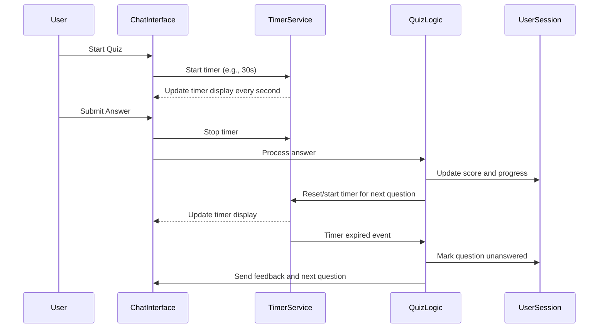

# Software Design Specification (SDS)
## Timer Feature for MCQ Quiz Application

**Document Version**: 1.0  
**Date**: 2024-06-10  
**Project**: MCQ Quiz Application  
**Module**: Timer Feature  
**Author**: AI-Generated (GitHub Copilot)  
**Reviewed By**: _________________  
**Approved By**: _________________  
**Approval Date**: _________________  

---

### Document History

| Version | Date | Author | Changes |
|---------|------|--------|---------|
| 1.0 | 2024-06-10 | AI-Generated | Initial SDS creation |

---

### Distribution List

| Role | Name | Date Sent |
|------|------|-----------|
| Technical Lead |  |  |
| QA Lead |  |  |
| Product Owner |  |  |

---

## 1. Executive Summary

The Timer Feature is an enhancement to the existing MCQ Quiz Application designed to add a countdown timer for each question or for the entire quiz session. This feature aims to improve time management during quizzes, increase engagement, and simulate real exam environments. The timer will provide users with visual feedback on the remaining time and automatically move to the next question or submit the quiz when time expires.

Key objectives include:
- Integrate a configurable timer that can be set per question or per quiz
- Provide real-time countdown display within the chat interface
- Automatically handle timeout events (e.g., move to next question, mark unanswered)
- Allow users and administrators to configure timer settings
- Ensure the timer feature works seamlessly with existing quiz logic and user session data

Stakeholders:
- Development Team: Responsible for implementation
- QA Team: Responsible for testing timer functionality
- Product Owner: Prioritizes timer feature requirements
- End Users: Quiz participants who benefit from time-bound quizzes

Success criteria include reliable timer operation, intuitive user feedback, and zero impact on existing quiz functionality.

---

## 2. Scope & Requirements

### Functional Requirements

1. [FR-1] Implement a countdown timer visible to users during each quiz question.
2. [FR-2] Allow configuration of timer duration per question or as a total quiz timer.
3. [FR-3] Automatically submit or skip the current question when the timer expires.
4. [FR-4] Display a warning notification as the timer approaches zero (e.g., last 10 seconds).
5. [FR-5] Pause and resume timer functionality if the user temporarily loses connection or refreshes.
6. [FR-6] Store timer state and remaining time in user session data to maintain continuity.
7. [FR-7] Provide an admin interface or configuration file option to set default timer values.
8. [FR-8] Ensure timer feature is compatible with restart functionality and multiple quiz attempts.

### Non-Functional Requirements

1. [NFR-1] Performance: Timer updates should not degrade the responsiveness of the chat interface.
2. [NFR-2] Security: Prevent users from manipulating timer state on the client side.
3. [NFR-3] Scalability: Timer implementation should support multiple concurrent users without performance loss.
4. [NFR-4] Reliability: Timer must accurately track time and trigger events precisely.
5. [NFR-5] Usability: Timer display should be clear, visually distinct, and accessible.

### Scope

**In Scope**:
- Timer implementation integrated within current Chainlit chat interface
- Configuration management for timer durations
- Handling of timer expiration events in quiz flow

**Out of Scope**:
- Major UI redesign beyond timer display
- Timer for non-quiz related app features
- Analytics or reporting on timer usage

### Priority Areas

- High Priority: Timer countdown display, automatic question progression on timeout, session persistence
- Medium Priority: Warning notifications, admin configuration options
- Low Priority: Pause/resume on connection loss

---

## 3. Architecture Overview

The Timer Feature will be integrated into the existing Python Chainlit-based MCQ Quiz Application. The application uses an event-driven architecture with asynchronous message handling.

### System Context

- **User Interface**: Chat interface powered by Chainlit where questions, answers, feedback, and timer display appear.
- **Backend Logic**: Python async functions handling quiz state, user answers, and now timer events.
- **Data Storage**: In-memory session data (`user_data` dictionary) storing current question, answers, score, and now timer state.
- **Timer Mechanism**: Implemented as asynchronous countdown timers per user session managed in backend, with updates pushed to frontend via Chainlit messages.

### Technology Stack

| Component | Technology |
|-----------|------------|
| Programming Language | Python 3.10+ |
| Framework | Chainlit |
| Session Storage | In-memory per user dictionary |
| Deployment | Local or cloud-hosted Python application |

### Integration Points

- Chainlit message handlers (`@cl.on_chat_start`, `@cl.on_message`) extended to manage timer lifecycle.
- Timer state synchronized with quiz progression logic.
- Configuration read from environment variables or config files for timer durations.

### Mermaid Diagram: Timer Integration Flow



---

## 4. Component Breakdown

### 4.1 Timer Service

- **Responsibility**: Manage countdown timers per user session.
- **Interfaces**:
  - `start_timer(session_id, duration)`
  - `stop_timer(session_id)`
  - `pause_timer(session_id)`
  - `resume_timer(session_id)`
  - `get_remaining_time(session_id)`
- **Implementation Details**:
  - Use Python `asyncio` tasks or Chainlit's async utilities to handle countdown.
  - Store timer state in `user_data` or separate structure keyed by session id.
  - Emit periodic timer update messages to frontend for display.
  - Trigger timeout event when countdown reaches zero.

### 4.2 User Session Management

- Extend existing `user_data` dictionary to include:
  - `timer_task`: Reference to async timer task (if needed)
  - `timer_remaining`: Seconds left on timer
  - `timer_active`: Boolean flag

### 4.3 UI Timer Display

- Add timer message components in Chainlit chat flow.
- Timer updates sent as ephemeral or updated messages to avoid clutter.
- Display time in seconds, optionally styled (color change near timeout).

### 4.4 Configuration Manager

- Define default timer durations in environment variables or config files.
- Provide admin override via config file (e.g., `timer_duration_per_question=30` seconds).

---

## 5. API Overview

This application does not expose external REST APIs. The timer feature will extend internal asynchronous event handling and messaging within Chainlit.

### Internal API Methods (Example Signatures)

| Method | Description |
|--------|-------------|
| `start_timer(session_id: str, duration: int)` | Begins countdown for given session |
| `stop_timer(session_id: str)` | Stops and clears timer for session |
| `pause_timer(session_id: str)` | Pauses running timer |
| `resume_timer(session_id: str)` | Resumes paused timer |
| `send_timer_update(session_id: str, remaining: int)` | Sends timer update message to user |

### Error Handling

- Invalid session ids will be logged and ignored.
- Timer task failures will trigger retries or safe cleanup.
- User disconnections handled by pausing timer and resuming on reconnect.

---

## 6. Data Model & Persistence

### 6.1 Data Structures

The timer feature will extend the existing in-memory `user_data` dictionary to include timer-related fields:

| Field           | Type    | Description                                   |
|-----------------|---------|-----------------------------------------------|
| timer_task      | async Task | Reference to the running asynchronous timer task |
| timer_remaining | int     | Remaining time in seconds for the current timer |
| timer_active    | bool    | Flag indicating if the timer is currently active |

These fields ensure timer state persistence during the user session lifecycle.

### 6.2 Persistence Strategy

- The timer state is stored in-memory during the quiz session.
- Upon user disconnection or refresh, the remaining time will be preserved by saving `timer_remaining`.
- The timer task will be reinitialized upon reconnection with the preserved remaining time.
- No permanent storage (database) changes are required as the timer is session-scoped.

---

## 7. Configuration & Deployment

### 7.1 Configuration Parameters

The timer feature will support configuration through environment variables or configuration files:

| Configuration Key           | Default Value | Description                             |
|-----------------------------|---------------|-------------------------------------|
| TIMER_DURATION_PER_QUESTION  | 30            | Timer duration in seconds per question |
| TIMER_DURATION_TOTAL_QUIZ    | 0             | Total quiz timer in seconds (0 disables) |
| TIMER_WARNING_THRESHOLD      | 10            | Seconds remaining to trigger warning notification |

### 7.2 Deployment Considerations

- No additional infrastructure is required.
- The existing Python environment suffices.
- The timer feature will be included in the standard deployment package.
- Ensure environment variables are set correctly in deployment pipelines or environment.

---

## 8. Security & Compliance

### 8.1 Security Considerations

- Timer state is managed server-side to prevent client-side manipulation.
- Client receives only timer updates for display purposes.
- All timer events triggering question progression are validated server-side.
- User input is sanitized as per existing application standards.

### 8.2 Compliance

- No personal or sensitive data is affected by this feature.
- Ensure adherence to existing compliance policies for session management.
- No changes to GDPR, HIPAA, or PCI-DSS compliance are necessary for this feature.

---

## 9. Observability

### 9.1 Logging

- Timer start, stop, pause, resume, and expiration events will be logged with session IDs.
- Errors in timer tasks will be logged with stack traces for troubleshooting.

### 9.2 Monitoring & Alerts

- Monitor system resource usage for timer async tasks under load.
- Configure alerts if timer tasks fail or exceed expected execution time.

---

## 10. Non-Functional Requirements

| Requirement         | Description                                                  | Target     |
|---------------------|--------------------------------------------------------------|------------|
| Performance         | Timer updates should not cause noticeable latency (>100ms)    | <100ms update latency |
| Scalability         | Support at least 100 concurrent quiz users with timers        | 100 users  |
| Reliability        | Timer accuracy within b11 second per countdown                   | b11 second  |
| Usability          | Timer display visible and updated every second                 | Real-time  |
| Accessibility      | Timer text compliant with WCAG 2.1 AA standards                | WCAG 2.1 AA|

---

## 11. Testing Strategy

### 11.1 Unit Testing

- Test timer start, stop, pause, resume functions.
- Validate timer expiration triggers expected quiz progression.
- Mock user sessions to verify timer state persistence.
- Test configuration loading and fallback defaults.

### 11.2 Integration Testing

- Verify timer updates sent during live quiz sessions.
- Test timer behavior on user disconnection and reconnection.
- Validate timer interaction with quiz restart and answer submission.

### 11.3 End-to-End Testing

- Simulate full quiz session with timer enabled.
- Confirm UI timer display matches backend timer state.
- Validate automatic question progression on timeout.
- Confirm warning notification displays near timeout.

### 11.4 Performance Testing

- Load test with 100+ concurrent users running timers.
- Measure timer update latency and system resource usage.

### 11.5 Security Testing

- Attempt client-side timer manipulation and verify server-side enforcement.
- Test session hijacking scenarios related to timer state.

---

## 12. Risks & Mitigation

| Risk                                     | Probability | Impact | Mitigation                                    |
|------------------------------------------|-------------|--------|-----------------------------------------------|
| Timer desynchronization with UI display  | Medium      | High   | Send frequent timer updates; verify on frontend |
| Timer task resource exhaustion on scale  | Low         | High   | Optimize async tasks; limit concurrent timers |
| User disconnection causes timer errors   | Medium      | Medium | Persist timer state; resume on reconnect       |
| Client-side manipulation attempts         | Low         | High   | Manage timer server-side; validate actions     |

---

## 13. Architecture Decision Records (ADRs)

### ADR-001: Timer Implementation Using Async Tasks

**Status**: Accepted  
**Date**: 2024-06-10  
**Deciders**: Development Team  
**Technical Story**: Implement timer feature for MCQ quiz

#### Context

The timer feature requires accurate countdown timers per user session with minimal performance impact.

#### Decision Drivers

- Need for asynchronous countdown without blocking main thread
- Integration with Chainlit async event system
- Scalability to multiple concurrent users

#### Considered Options

1. Use Python `asyncio` tasks for timers  
2. Use separate timer threads per session  
3. Use client-side JavaScript timers with server sync

#### Decision Outcome

**Chosen option**: Use Python `asyncio` tasks as they integrate well with Chainlit async framework and provide efficient concurrency.

**Positive Consequences**:
- Lightweight async timers
- Easy cancellation and restart
- Centralized server-side control

**Negative Consequences**:
- Requires careful management of async tasks to avoid leaks

#### Links

- [Chainlit Async Docs](https://chainlit.io/docs/async)
- [Python asyncio](https://docs.python.org/3/library/asyncio.html)

---

## 14. Assumptions & Constraints

### 14.1 Assumptions

- Users have stable enough connection to receive timer updates.
- Timer durations will be reasonable (seconds to a few minutes).
- Existing quiz logic remains unchanged except for timer integration.
- User sessions are maintained in-memory for quiz duration.

### 14.2 Constraints

- Timer state is volatile and lost if server restarts occur.
- Limited UI space in chat interface restricts timer display options.
- No database persistence for timer state is planned.
- Dependence on Chainlit async messaging capabilities.

---

## 15. Dependencies & Integration

### 15.1 Internal Dependencies

- `user_data` session dictionary extended for timer state.
- Chainlit message handlers extended to manage timer lifecycle.
- Existing quiz question and answer logic.

### 15.2 External Dependencies

- Python 3.10+ environment with async support.
- Chainlit framework for chat interface and async messaging.

### 15.3 Integration Sequence

| Step | Description                     |
|-------|--------------------------------|
| 1     | User starts quiz; timer starts |
| 2     | Timer updates sent periodically |
| 3     | User submits answer or timer expires |
| 4     | Quiz logic processes answer and resets timer |
| 5     | Repeat until quiz completes |

---

## 16. Glossary & References

| Term | Definition |
|-------|------------|
| Chainlit | Python framework for building conversational AI applications |
| Async Task | Asynchronous function execution to allow concurrency without threading |
| Session | User-specific data context maintained during quiz |
| Timer Task | Async task managing countdown timer for each user session |
| NFR | Non-Functional Requirement |
| FR | Functional Requirement |

**References**

- Chainlit Documentation: https://chainlit.io/docs/
- Python asyncio Library: https://docs.python.org/3/library/asyncio.html
- UV Package Manager: https://github.com/astral-sh/uv

---

## 17. Appendices

### 17.1 Example Code Snippet: Timer Integration

```python
import asyncio

async def start_timer(session_id, duration):
    user_data[session_id]['timer_remaining'] = duration
    user_data[session_id]['timer_active'] = True

    while user_data[session_id]['timer_remaining'] > 0 and user_data[session_id]['timer_active']:
        await cl.Message(content=f"⏰ Time left: {user_data[session_id]['timer_remaining']} seconds").send()
        await asyncio.sleep(1)
        user_data[session_id]['timer_remaining'] -= 1

    if user_data[session_id]['timer_remaining'] == 0:
        user_data[session_id]['timer_active'] = False
        # Trigger timeout event: auto-move to next question
```

### 17.2 Mermaid Diagram: Timer Flow (Repeat for Reference)


---

## 📄 Converting to Word (.docx)

To convert this Markdown document to Word format, use Pandoc:

### Prerequisites
- Install Pandoc: https://pandoc.org/installing.html
  - Windows: `choco install pandoc` or download installer
  - Mac: `brew install pandoc`
  - Linux: `apt-get install pandoc`

### Conversion Commands

**Basic Conversion**:
```bash
pandoc docs/SDS_Timer_Feature_20240610.md -o docs/SDS_Timer_Feature_20240610.docx
```

**With Table of Contents**:
```bash
pandoc docs/SDS_Timer_Feature_20240610.md -o docs/SDS_Timer_Feature_20240610.docx --toc --toc-depth=3
```

**With Custom Styling** (requires reference.docx template):
```bash
pandoc docs/SDS_Timer_Feature_20240610.md -o docs/SDS_Timer_Feature_20240610.docx --reference-doc=custom-reference.docx --toc
```

### Mermaid Diagrams in Word
Mermaid diagrams must be manually converted:
1. Copy Mermaid code to https://mermaid.live/
2. Export as PNG/SVG
3. Insert images into Word document

---
