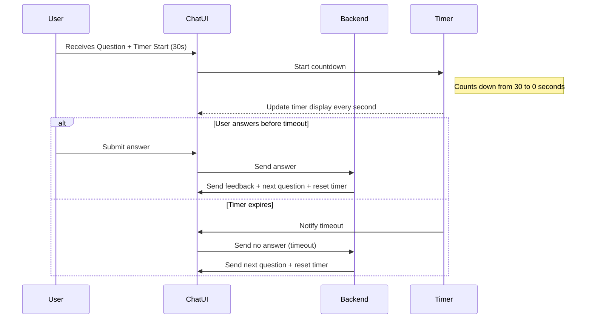

# Software Design Specification (SDS)  
## Timer Feature for MCQ Quiz Application

**Document Version**: 1.0  
**Date**: 2024-06-10  
**Project**: MCQ Quiz Application  
**Module**: Timer Feature  
**Author**: AI-Generated (GitHub Copilot)  
**Reviewed By**: _________________  
**Approved By**: _________________  
**Approval Date**: _________________  

---

### Document History

| Version | Date     | Author        | Changes               |

|---------|----------|---------------|-----------------------|

| 1.0     | 2024-06-10 | AI-Generated | Initial SDS creation   |

|         |          |               |                       |

---

### Distribution List

| Role           | Name        | Date Sent |

|----------------|-------------|-----------|

| Technical Lead |             |           |

| QA Lead       |             |           |

| Product Owner |             |           |

|                |             |           |

---

## 1. Executive Summary

The Timer Feature is designed to enhance the existing MCQ Quiz Application by introducing a time constraint for answering each question. This feature will add an engaging challenge aspect, encouraging users to answer within a limited time, improving quiz pacing and user experience.

The timer will start as soon as a question is presented and will count down per question. If the timer expires before the user answers, the system will automatically move to the next question, marking the current question as unanswered or incorrect.

Key stakeholders include the product owner, development team, QA team, and end users. Success criteria include seamless integration of the timer, accurate countdown display, automatic progression on timeout, and no negative impact on existing quiz functionalities.

---

## 2. Scope & Requirements

### Functional Requirements

1. [FR-1] Display a countdown timer for each quiz question.

2. [FR-2] Start the timer immediately when a question is displayed.

3. [FR-3] Allow configuration of the timer duration (e.g., default 30 seconds per question).

4. [FR-4] Automatically submit or skip the question if the timer expires.

5. [FR-5] Notify the user visually when time is about to expire (e.g., last 5 seconds).

6. [FR-6] Pause and reset the timer on quiz restart.

7. [FR-7] Maintain timer state per user session.

### Non-Functional Requirements

1. [NFR-1] Timer countdown must be accurate within 1 second.

2. [NFR-2] Timer updates must not degrade application performance or responsiveness.

3. [NFR-3] The timer UI must be accessible and visible on all supported devices.

4. [NFR-4] The feature must be secure against client-side manipulation (consider server-side validation).

### Scope

**In Scope**:  
- Timer integration with question display and answer submission flow.  
- User interface for timer display.  
- Timer configuration and default duration.  
- Handling timer expiration logic.

**Out of Scope**:  
- Changes to question content or quiz scoring logic beyond timer effects.  
- Analytics or reporting on timer usage or user timing behavior.  
- Multi-user or collaborative quiz sessions.

### Priority Areas

- High Priority: Timer countdown display and expiration handling.  
- Medium Priority: Timer configuration options and UI notifications.  
- Low Priority: Analytics and advanced timer controls.

---

## 3. Architecture Overview

The MCQ Quiz Application is built using Python and Chainlit framework, providing an interactive chat-based quiz interface. The timer feature will be integrated within this architecture, augmenting the existing flow of question delivery and answer processing.

**System Context**:  
- User interacts via chat interface in web browser.  
- Backend Python application manages quiz state and user sessions.  
- Questions served from in-memory QUESTIONS database.

**Technology Stack**:  
- Python 3.10+  
- Chainlit conversational AI framework  
- Async event-driven message handling

**Component Interaction**:  

The timer logic will be implemented primarily on the client-side within the chat interface to provide real-time countdown visuals. The backend will be responsible for enforcing timer expiration by validating time elapsed and automatically progressing the quiz if the user does not respond in time.

### Proposed Diagram: Sequence Diagram for Timer Integration



---

## 4. Component Breakdown

### 4.1 Timer Component (Client-Side)

- **Responsibilities**:  
  - Display countdown timer UI per question.  
  - Update countdown every second.  
  - Notify when time is about to expire (visual cue).  
  - Trigger timeout event upon reaching zero.

- **Interfaces**:  
  - Receives start/reset commands from Chat UI.  
  - Emits timeout event to Chat UI.

- **Implementation Notes**:  
  - Use JavaScript or Chainlit frontend capabilities for timer rendering.  
  - Accessible and responsive design.

### 4.2 Chat UI Component

- **Responsibilities**:  
  - Integrate timer display alongside question content.  
  - Handle user input submission or timeout events.  
  - Communicate with backend asynchronously.

- **Interfaces**:  
  - Receives timer events and question data.  
  - Sends user answers or timeout notifications to backend.

### 4.3 Backend Component

- **Responsibilities**:  
  - Manage quiz state per user session.  
  - Receive answers or timeout notifications.  
  - Validate answer correctness or timeout behavior.  
  - Send next question or results to Chat UI.

- **Interfaces**:  
  - Exposes async event handlers for messages and chat start.  
  - Maintains user_data dictionary with current question, score, answers.

- **Code Reference**:  
  - `app.py` handles chat events and quiz logic.  
  - `questions.py` contains question data.

---

## 5. API Overview

The existing system primarily uses Chainlit event handlers and internal method calls rather than external HTTP APIs.

### Key Interfaces Related to Timer Feature

| Event/Method         | Description                                         | Usage for Timer Feature                      |

|---------------------|-----------------------------------------------------|----------------------------------------------|

| `@cl.on_chat_start`  | Initializes quiz session and user_data              | Reset timer start state when quiz starts     |

| `@cl.on_message`     | Handles user input messages and answers             | Handle submission or timeout event            |

| `send_question()`    | Sends question content message to user              | Attach timer start command to question message|

| `show_results()`     | Sends final quiz results                             | No change needed                              |

### Proposed Timer Integration

- On sending question, include timer start metadata or a message trigger to start client timer.

- On timeout, system acts as if 'no answer' submitted and moves to next question.

- Timer expiry can be communicated from client UI to backend through Chainlit message or custom event.

---

## 6. Data Model & Persistence

### 6.1 User Session Data

The timer feature requires tracking timer state per user session. The existing user_data dictionary in `app.py` will be extended to include timer-related data.

| Field               | Type         | Description                             |

|---------------------|--------------|-------------------------------------|

| `current_question`  | int          | Index of the current question         |

| `score`             | int          | User's current score                   |

| `answers`           | list         | List of answer objects per question   |

| `timer_start_time`  | datetime or timestamp | Time when current question timer started |

| `timer_duration`    | int          | Duration of timer in seconds (configurable) |

### 6.2 Data Persistence Strategy

- Timer state is maintained in-memory during user session.

- No database persistence is required for timer state.

- Timer duration can be configurable via environment variable or app config.

---

## 7. Configuration & Deployment

### 7.1 Configuration Parameters

| Parameter           | Description                              | Default Value | Location              |

|---------------------|------------------------------------------|---------------|-----------------------|

| `TIMER_DURATION`    | Time allowed per question in seconds     | 30            | Environment variable or app config |

| `TIMER_WARNING_THRESHOLD` | Seconds remaining to start warning visual | 5          | Environment variable or app config |

### 7.2 Deployment Considerations

- No new infrastructure components needed.

- Timer feature is part of the existing Chainlit Python application.

- Ensure all dependencies for frontend timer logic are included if additional libraries used.

- Deployment scripts and CI/CD pipelines remain unchanged.

---

## 8. Security & Compliance

### 8.1 Security Considerations

- The timer is primarily client-side for user experience but must be validated on the server to prevent cheating.

- Backend must enforce timeout by ignoring answers received after timer expiration.

- Avoid storing sensitive data related to timer; timer data is session-scoped.

- Prevent user manipulation of timer via UI hacks by validating timestamps server-side.

### 8.2 Compliance

- No user personal data is affected by the timer feature.

- No GDPR, HIPAA, or PCI-DSS compliance impact.

---

## 9. Observability

### 9.1 Logging

- Log timer start and expiration events per user session for debugging.

- Log any timer-related errors or anomalies.

### 9.2 Monitoring

- Monitor quiz completion rates and average time per question for performance insights.

- No additional monitoring infrastructure required.

### 9.3 Alerts

- Set alerts for unusual patterns such as repeated timer expirations or session errors.

---

## 10. Non-Functional Requirements

| Requirement         | Description                                  | Target/Metric             |

|---------------------|----------------------------------------------|--------------------------|

| Performance         | Timer updates must not degrade responsiveness | < 100 ms UI update latency |

| Scalability         | Support multiple concurrent users with timers | Support 100+ concurrent sessions |

| Reliability         | Timer must reliably trigger timeout          | 99.9% accuracy in timeout enforcement |

| Accessibility       | Timer UI must be accessible (screen readers, colors) | WCAG 2.1 AA compliance   |

| Internationalization | Timer UI must display in user's locale/timezone (if applicable) | Support all locales       |

---

## 11. Testing Strategy

### 11.1 Unit Testing

- Test timer start, reset, and expiration logic in isolation.

- Mock user sessions to verify timer state updates correctly.

- Validate correct handling of timer expiration events.

### 11.2 Integration Testing

- Test timer integration with question display and user input flow.

- Verify automatic question progression on timer expiration.

- Confirm timer UI updates and warnings display properly.

### 11.3 End-to-End Testing

- Simulate user answering before and after timer expiration.

- Test timer behavior on quiz restart and session resets.

### 11.4 Performance Testing

- Measure UI responsiveness with timer running under load.

- Confirm backend can handle concurrent timer events without degradation.

### 11.5 Security Testing

- Attempt to submit answers after timer expiration to verify backend rejection.

- Test client-side manipulation attempts.

---

## 12. Risks & Mitigation

| Risk                                    | Probability | Impact | Mitigation Strategy                               |

|-----------------------------------------|-------------|--------|-------------------------------------------------|

| User frustration due to time pressure   | Medium      | Medium | Allow configurable timer duration or disable option |

| Timer synchronization issues between client and server | Low | High   | Use server-side timestamp validation and enforce expire logic |

| UI timer not visible or accessible      | Low         | Medium | Follow accessibility standards, test on multiple devices |

| Incorrect timer reset on quiz restart   | Low         | Medium | Thorough testing of session reset logic |

---

## 13. Architecture Decision Records (ADRs)

### ADR-001: Client-Side Timer with Server Validation

**Status**: Accepted  
**Date**: 2024-06-10  
**Deciders**: Development Team  
**Technical Story**: Implement timer feature with real-time countdown  

#### Context

A timer is needed to limit time per question. A client-side timer provides responsiveness but can be manipulated.

#### Decision Drivers

- User experience responsiveness  
- Security and integrity of quiz results  
- Development complexity

#### Considered Options

1. Client-side timer only.  
2. Server-side timer only (less responsive).  
3. Hybrid: client-side timer with server validation.  

#### Decision Outcome

**Chosen option**: Hybrid approach (3), for best UX and security balance.

**Positive Consequences**:  
- Responsive UI  
- Secure enforcement of timer expiration  

**Negative Consequences**:  
- Slightly increased complexity  

---

## 14. Assumptions & Constraints

### 14.1 Assumptions

- Users have modern browsers supporting JavaScript timers.  
- User sessions are maintained reliably during quiz.  
- Timer duration is sufficient for average user to respond.

### 14.2 Constraints

- No persistent storage for timer state (in-memory only).  
- Limited to single-user quiz sessions (no multiplayer).  
- Timer UI uses Chainlit chat interface capabilities.

---

## 15. Dependencies & Integration

### Internal Dependencies

- `app.py` quiz logic and session management.  
- `questions.py` for quiz content.

### External Dependencies

- Chainlit framework for chat interface and event handling.

### Integration Points

- Timer start triggered on question send event.  
- Timer expiration triggers message to backend.  
- Backend triggers next question and timer reset.

---

## 16. Glossary & References

| Term           | Definition                                                     |

|----------------|----------------------------------------------------------------|

| Timer          | A countdown mechanism limiting time to answer a question.     |

| Chainlit       | Python framework used to build conversational applications.    |

| User Session   | Data structure storing user state during quiz interaction.    |

| Timeout        | Event triggered when timer reaches zero without user input.   |

| ADR            | Architecture Decision Record documenting key design decisions. |

---

## 17. Appendices

### 17.1 Sample Timer UI Integration Code Snippet (Conceptual)

```python
# Pseudocode for integrating timer start with question send
async def send_question():
    # Existing question sending logic
    await cl.Message(content=question_text).send()

    # Send timer start command (custom event or message)
    await cl.Message(content="__timer_start__:30").send()
```

### 17.2 Mermaid Diagram - Timer Feature Sequence (Reiteration)


---

## 📄 Converting to Word (.docx)

To convert this Markdown document to Word format, use Pandoc:

### Prerequisites
- Install Pandoc: https://pandoc.org/installing.html  
  - Windows: `choco install pandoc` or download installer  
  - Mac: `brew install pandoc`  
  - Linux: `apt-get install pandoc`  

### Conversion Commands

**Basic Conversion**:
```bash
pandoc docs/SDS_Timer_Feature_20240610.md -o docs/SDS_Timer_Feature_20240610.docx
```

**With Table of Contents**:
```bash
pandoc docs/SDS_Timer_Feature_20240610.md -o docs/SDS_Timer_Feature_20240610.docx --toc --toc-depth=3
```

**With Custom Styling** (requires reference.docx template):
```bash
pandoc docs/SDS_Timer_Feature_20240610.md -o docs/SDS_Timer_Feature_20240610.docx --reference-doc=custom-reference.docx --toc
```

### Mermaid Diagrams in Word
Mermaid diagrams must be manually converted:  
1. Copy Mermaid code to https://mermaid.live/  
2. Export as PNG/SVG  
3. Insert images into Word document

---
