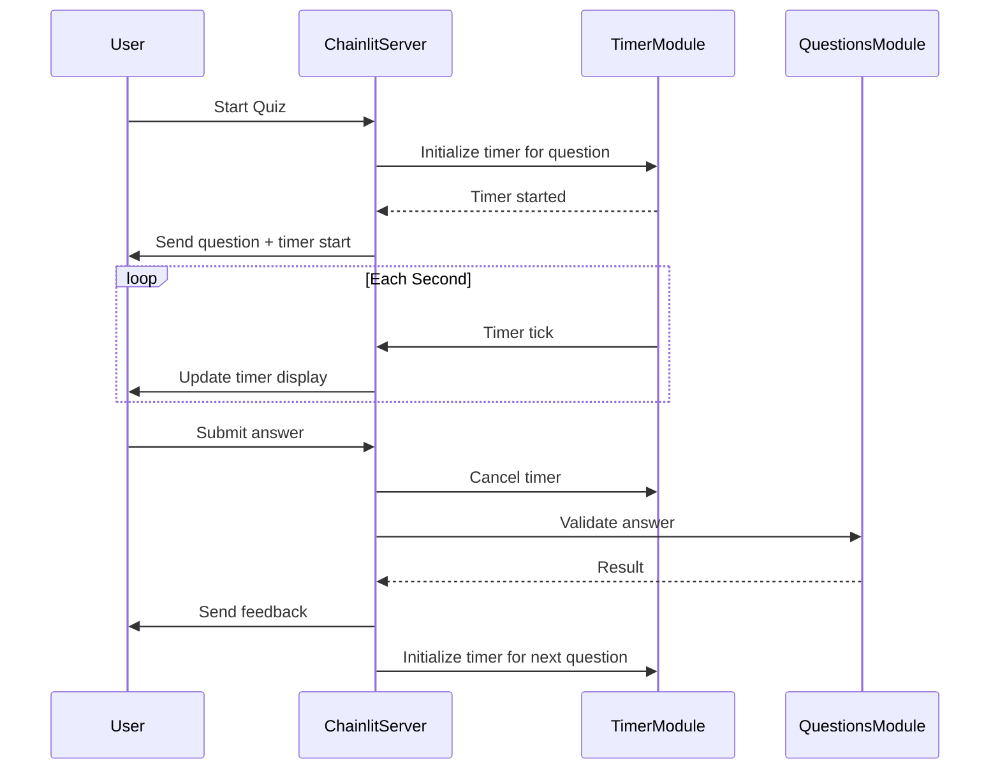
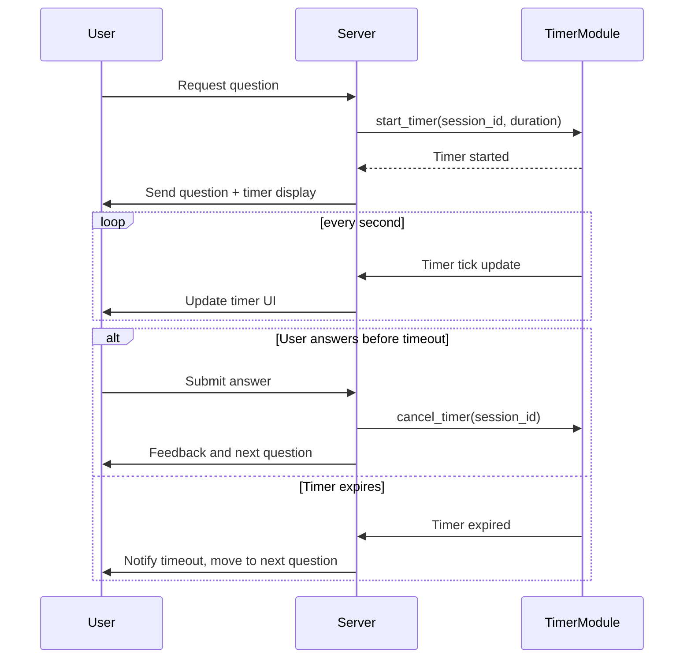

# Software Design Specification (SDS)  
## Timer Feature for MCQ Quiz Application  

**Document Version**: 1.0  
**Date**: 2024-06-10  
**Project**: MCQ Quiz Application  
**Module**: Timer Feature  
**Author**: AI-Generated (GitHub Copilot)  
**Reviewed By**: _________________  
**Approved By**: _________________  
**Approval Date**: _________________  

---

### Document History

| Version | Date | Author | Changes |

|---------|------|--------|---------|

| 1.0 | 2024-06-10 | AI-Generated | Initial SDS creation |

| | | | |

---

### Distribution List

| Role | Name | Date Sent |

|------|------|-----------|

| Technical Lead |  |  |

| QA Lead |  |  |

| Product Owner |  |  |

|  |  |  |

---

## 1. Executive Summary

The Timer Feature aims to enhance the existing MCQ Quiz Application by adding a time-bound constraint for answering each question. This functionality will improve user engagement and simulate exam-like conditions. Users will have a predefined duration to answer each question, after which the system will automatically move to the next question or record a timeout event.

This feature supports the current business objective of increasing quiz challenge and fairness by preventing indefinite time for responses. Key stakeholders include the product owner, development team, QA team, and end-users.

Success criteria include seamless integration without disrupting existing quiz flow, accurate timer display and enforcement, and positive user feedback on the new challenge aspect.

## 2. Scope & Requirements

### Functional Requirements

1. [FR-1] Display a countdown timer for each question in the quiz interface.
2. [FR-2] Enforce a time limit per question (configurable, default 30 seconds).
3. [FR-3] Automatically submit or skip question if timer expires.
4. [FR-4] Provide visual and/or audio alert when time is about to expire (e.g., last 5 seconds).
5. [FR-5] Allow restarting the timer when a new question is presented.
6. [FR-6] Record timeout events in the user’s answer data.
7. [FR-7] Disable answer submission after timer expiration.
8. [FR-8] Allow configuration of timer duration via environment or config file.
9. [FR-9] Display remaining time prominently without cluttering the UI.

### Non-Functional Requirements

1. [NFR-1] Performance: Timer updates should not degrade application responsiveness.
2. [NFR-2] Usability: Timer display must be clear and intuitive.
3. [NFR-3] Reliability: Timer must work consistently across supported browsers.
4. [NFR-4] Security: Timer logic must be enforced server-side to avoid client-side manipulation.
5. [NFR-5] Scalability: Support multiple concurrent users without performance degradation.

### Scope

**In Scope**:  
- Timer UI display for each question.  
- Timer enforcement logic in chat interaction flow.  
- Configuration support for timer duration.  
- Timeout handling and data recording.

**Out of Scope**:  
- Modifications to question content or scoring logic beyond timeout.  
- UI redesign beyond timer integration.  
- Analytics or reporting enhancements.

### Priority Areas

- High Priority: Timer enforcement and timeout recording, UI display of timer.  
- Medium Priority: Alerts and configuration flexibility.  
- Low Priority: Audio alerts, timer customization per user.

## 3. Architecture Overview

The MCQ Quiz Application is built using the Chainlit framework in Python. User session data is managed in-memory with a dictionary keyed by session id.

The Timer Feature will add a countdown timer per question, integrated into the existing asynchronous message handling flow. The timer will be managed server-side to enforce time limits, with periodic updates sent to the client for UI display.

Key architectural components involved:

- **User Session Management**: Extend session data to include timer state and expiration timestamps.
- **Timer Management Module**: New component to manage timers asynchronously per user session.
- **Message Handler Integration**: Modify `on_message` handler to enforce timeouts and handle expired timers.
- **UI Timer Display**: Client-side display via Chainlit messages updated at intervals (e.g., every second).
- **Configuration Management**: New environment variable or config entry for timer duration.

### Technology Stack

- Python 3.9+  
- Chainlit framework  
- Asyncio for asynchronous timer handling  
- In-memory session state  

### Component Interaction Diagram (Mermaid)



## 4. Component Breakdown

### 4.1 Timer Module

- **Responsibility**: Manage countdown timer per user session asynchronously.
- **Interface**:  
  - `start_timer(session_id, duration_seconds)`  
  - `cancel_timer(session_id)`  
  - `is_expired(session_id)`  
- **Design**: Use asyncio tasks or background coroutines to track timeouts.
- **Failure Handling**: Log timer errors; fallback to default timeout.

### 4.2 Session Data Extensions

- Add fields:  
  - `timer_task`: reference to running timer coroutine  
  - `timer_expiry`: timestamp when current timer expires  
  - `timeout_occurred`: boolean flag for timeout event  

### 4.3 Message Handler Modifications

- On receiving user answer, check if timer expired:  
  - If expired, reject answer and mark timeout.  
  - Else, process as normal and cancel timer.  
- On sending question, start timer and send initial timer display.

### 4.4 UI Components

- Timer display embedded in question message or separate message.
- Visual countdown updated every second.
- Alert when time is nearly up (e.g., flashing text or audio beep).

### 4.5 Configuration

- Environment variable: `QUESTION_TIMER_SECONDS` (default 30).
- Fallback to hardcoded default if not set.

## 5. API Overview

The existing application is event-driven via Chainlit handlers:

| Event | Description | Changes for Timer Feature |

|-------|-------------|--------------------------|

| `on_chat_start` | Initializes quiz | Initialize timer for first question |

| `on_message` | Processes user answers | Check timer expiration, enforce timeouts |

| Internal Timer Management | (New) | Start, update, cancel timers per session |

No external REST API changes as interactions are within chat framework.

---

## 6. Data Model & Persistence

### User Session Data Structure Extension

The in-memory user session data dictionary will be extended as follows:

| Field | Type | Description |

|-------|------|-------------|

| current_question | int | Index of current question |

| score | int | User’s current score |

| answers | list | List of answer objects |

| timer_task | asyncio.Task | Reference to running timer task |

| timer_expiry | datetime | Timestamp when timer expires |

| timeout_occurred | bool | Flag indicating if timeout happened |

| timeout_count | int | Number of timed-out questions |

---

### Answer Object Structure

| Field | Type | Description |

|-------|------|-------------|

| question_id | int | Question ID |

| user_answer | int or null | Answer index or null if timeout |

| correct | bool | Whether answer was correct |

| timed_out | bool | Whether question timed out |

---

### Persistence Strategy

- User session data remains in-memory as per current design.
- Timer-related fields are transient and reset on session restart.
- No permanent database persistence is required for timer metadata.
- Future enhancement may include persistent logging of timeouts for analytics.

## 7. Configuration & Deployment

### Configuration

- **Environment Variable**: `QUESTION_TIMER_SECONDS` (integer, default 30)
- Allows setting the duration of the timer per question without code changes.
- Fallback to default if environment variable is absent or invalid.

### Deployment Considerations

- No change to deployment process.
- Requires environment variables update on deployment servers if timer duration is customized.
- Ensure Python environment supports asyncio features used for timers.

## 8. Security & Compliance

### Security Considerations

- Timer logic is enforced server-side to prevent users bypassing time limits by client manipulation.
- Input validation remains robust to prevent injection or malformed data.
- User session data is isolated per session; timer tasks cannot interfere across sessions.
- No sensitive data introduced by timer feature.

### Compliance

- No new compliance requirements introduced.
- Existing GDPR compliance applies as no personal data is affected.

## 9. Observability

### Logging

- Log timer start and expiration events with session IDs for debugging.
- Log timeout events explicitly.
- Log timer cancellations when users submit answers early.

### Monitoring & Alerts

- Monitor rate of timeouts to detect potential UX issues.
- Alert if timer tasks fail to start or cancel properly.

### Metrics

- Collect metrics on average time taken per question.
- Track timeout frequency per user and overall.

## 10. Non-Functional Requirements

| Requirement | Target |

|-------------|--------|

| Performance | Timer updates must not increase response latency beyond 100ms |

| Scalability | Support 1000 concurrent users with stable timer operations |

| Reliability | Timer must never miss timeout events |

| Usability | Timer display visible and clear on all supported devices |

| Accessibility | Timer component complies with WCAG 2.1 AA standards |

| Internationalization | Timer display supports localization (e.g., language, format) if applicable |

---

## 11. Testing Strategy

### Unit Testing

- Test timer module functions independently:
  - Timer start, cancel, expiration detection.
  - Correct updating of session data on timeout.
- Mock asyncio timers for deterministic tests.

### Integration Testing

- Simulate user answering questions with timer active.
- Validate timeout enforcement and answer rejection.
- Test UI timer display updates and alerts.

### End-to-End Testing

- Full quiz flow with timer enabled.
- Confirm score calculation with timed-out questions.
- Verify restart functionality resets timers correctly.

### Performance Testing

- Load test with concurrent users to measure timer overhead.
- Ensure timer updates do not degrade response times.

### Security Testing

- Attempt to bypass timer enforcement using client manipulation.
- Validate server correctly rejects late answers.
- Test input sanitization remains effective.

## 12. Risks & Mitigation

| Risk | Impact | Probability | Mitigation |

|------|--------|-------------|------------|

| Timer task leaks causing memory growth | High | Medium | Proper cancellation on answer submission and session end |

| Timer drift causing inaccurate timeouts | Medium | Low | Use monotonic clocks and asyncio event loop |

| User frustration due to short timer | Medium | Medium | Make timer duration configurable; provide warnings before timeout |

| Race conditions between timer expiry and user answer | High | Low | Synchronize timer checks before processing answers |

| UI clutter or inaccessible timer display | Low | Low | Follow UI/UX best practices and accessibility guidelines |

## 13. Architecture Decision Records (ADRs)

### ADR-001: Timer Implementation Using Asyncio Tasks

**Status**: Accepted  
**Date**: 2024-06-10  
**Deciders**: Development Team  

#### Context

Requirement to implement per-user question timer with accurate timeout enforcement.

#### Decision Drivers

- Need for asynchronous non-blocking timers.  
- Integration with Chainlit event loop.  
- Scalability to multiple concurrent users.

#### Considered Options

1. Use asyncio Tasks for timers (chosen).  
2. Use external cron or scheduler system.  
3. Use client-side timers only.

#### Decision Outcome

Chosen option: "Use asyncio Tasks" because it integrates well with existing async architecture and provides precise control.

**Positive Consequences**:  
- Tight integration.  
- Low latency.  
- Easier synchronization.

**Negative Consequences**:  
- Requires careful task management to avoid leaks.

#### Links

- [Asyncio documentation](https://docs.python.org/3/library/asyncio-task.html)

## 14. Assumptions & Constraints

### Assumptions

- Users will interact via chat interface only.  
- Server resources are sufficient to handle timer tasks per session.  
- Timer duration default is acceptable for most users.  
- Network latency is minimal and does not affect timer accuracy significantly.

### Constraints

- In-memory session data limits scalability; no persistent timer state.  
- Timer enforcement depends on server uptime and async processing.  
- UI is text-based via Chainlit; no advanced graphical timer.  

## 15. Dependencies & Integration

- Depends on Chainlit framework async messaging features.  
- Integration with existing question and user session data modules.  
- Environment configuration for timer duration.  
- Potential future integration with analytics for timeout tracking.

---

## 16. Glossary & References

| Term | Definition |

|-------|------------|

| Chainlit | Python framework for building chat applications |

| Asyncio | Python asynchronous I/O library |

| Timer Task | Asyncio coroutine managing countdown per user session |

| Timeout | Event when user fails to answer within time limit |

| Session ID | Unique identifier for user session |

---

### References

- Chainlit documentation: https://chainlit.io/docs/  
- Asyncio Tasks: https://docs.python.org/3/library/asyncio-task.html  
- Python datetime module: https://docs.python.org/3/library/datetime.html  
- Mermaid diagrams: https://mermaid.js.org/  

## 17. Appendices

### Appendix A: Timer Module Example Code Snippet

```python
import asyncio
from datetime import datetime, timedelta

class TimerManager:
    def __init__(self):
        self.timers = {}

    async def start_timer(self, session_id, duration_seconds, timeout_callback):
        expiry = datetime.utcnow() + timedelta(seconds=duration_seconds)
        self.timers[session_id] = {"expiry": expiry, "task": asyncio.create_task(self._run_timer(session_id, duration_seconds, timeout_callback))}

    async def _run_timer(self, session_id, duration, timeout_callback):
        await asyncio.sleep(duration)
        if session_id in self.timers:
            await timeout_callback(session_id)

    def cancel_timer(self, session_id):
        timer = self.timers.get(session_id)
        if timer:
            timer["task"].cancel()
            del self.timers[session_id]
```

### Appendix B: Mermaid Sequence Diagram for Timer Flow



---

## 📄 Converting to Word (.docx)

To convert this Markdown document to Word format, use Pandoc:

### Prerequisites

- Install Pandoc: https://pandoc.org/installing.html  
  - Windows: `choco install pandoc` or download installer  
  - Mac: `brew install pandoc`  
  - Linux: `apt-get install pandoc`  

### Conversion Commands

**Basic Conversion**:
```bash
pandoc docs/SDS_Timer_Feature_20240610.md -o docs/SDS_Timer_Feature_20240610.docx
```

**With Table of Contents**:
```bash
pandoc docs/SDS_Timer_Feature_20240610.md -o docs/SDS_Timer_Feature_20240610.docx --toc --toc-depth=3
```

**With Custom Styling** (requires reference.docx template):
```bash
pandoc docs/SDS_Timer_Feature_20240610.md -o docs/SDS_Timer_Feature_20240610.docx --reference-doc=custom-reference.docx --toc
```

### Mermaid Diagrams in Word

Mermaid diagrams must be manually converted:

1. Copy Mermaid code to https://mermaid.live/  
2. Export as PNG/SVG  
3. Insert images into Word document  

---
