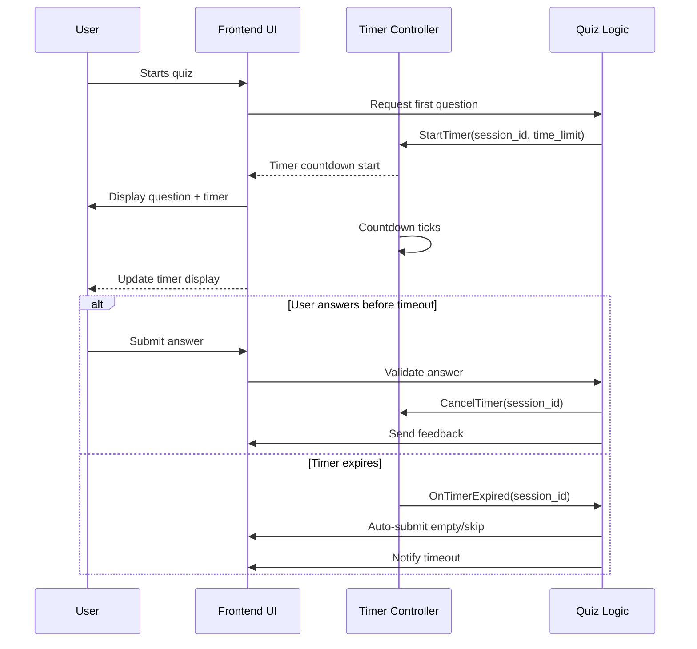

# Software Design Specification (SDS)
## Timer Feature for MCQ Quiz Application

**Document Version**: 1.0  
**Date**: 2025-11-12  
**Project**: MCQ Quiz Application  
**Module**: Timer Feature  
**Author**: AI-Generated (GitHub Copilot)  
**Reviewed By**: _________________  
**Approved By**: _________________  
**Approval Date**: _________________  

---

### Document History

| Version | Date       | Author        | Changes              |

|---------|------------|---------------|----------------------|

| 1.0     | 2025-11-12 | AI-Generated  | Initial SDS creation  |

|         |            |               |                      |

---

### Distribution List

| Role           | Name | Date Sent |

|----------------|------|-----------|

| Technical Lead |      |           |

| QA Lead        |      |           |

| Product Owner  |      |           |

|                |      |           |

---

## 1. Executive Summary

The MCQ Quiz Application currently offers an interactive quiz experience with instant feedback and score tracking. To enhance user engagement and introduce a challenge element, this specification proposes the addition of a **Timer Feature**.

The Timer Feature will track the time allowed per question or for the entire quiz session, encouraging users to answer promptly and adding a competitive edge. The timer will display countdown visuals, trigger automatic submission or question progression when time expires, and optionally allow configuration of time limits.

Key stakeholders include the product management team aiming to improve quiz engagement metrics, the development team responsible for implementation, and the QA team tasked with validation.

Success criteria involve smooth integration without disrupting existing functionality, accurate timing with minimal latency, and positive user feedback on usability.

---

## 2. Scope & Requirements

### Functional Requirements

1. [FR-1] Display a countdown timer for each question with a configurable time limit (e.g., 30 seconds per question).  
2. [FR-2] Automatically submit or skip the question when the timer expires.  
3. [FR-3] Allow configuration of timer settings (enable/disable timer, set time per question).  
4. [FR-4] Show remaining time prominently in the quiz interface.  
5. [FR-5] Pause and resume timer if user navigates away or reconnects.  
6. [FR-6] Record time taken per question for analytics and reporting.  
7. [FR-7] Provide feedback when time runs out (e.g., "Time's up! Moving to next question").  

### Non-Functional Requirements

1. [NFR-1] Timer must be accurate within 100 milliseconds.  
2. [NFR-2] Timer updates should not introduce noticeable UI lag.  
3. [NFR-3] The system must handle network disruptions gracefully, resuming timing correctly.  
4. [NFR-4] Timer feature should be scalable to support concurrent users without performance degradation.  
5. [NFR-5] The implementation must not degrade existing quiz functionality or response correctness.  

### Scope

**In Scope**:  
- Implementing timer functionality integrated into quiz question flow.  
- UI display of timer countdown.  
- Backend support for timing data recording and configuration.  
- User feedback on timer events (expiration, pause, resume).  

**Out of Scope**:  
- Timer for other application modules unrelated to the quiz.  
- Detailed analytics dashboards (only raw data collection).  
- User account level timer preferences (global settings).  

### Priority Areas

- High Priority: Timer accuracy, automatic question submission, user feedback on timeout.  
- Medium Priority: Timer configuration UI, pause/resume behavior.  
- Low Priority: Analytics data export integration.

---

## 3. Architecture Overview

The Timer Feature will integrate primarily into the existing quiz application architecture, which uses Chainlit for chat-based interactive sessions with Python backend.

### Current Architecture Summary

- **Frontend**: Chainlit chat interface displaying questions and capturing user input.  
- **Backend**: Python application (`app.py`) managing quiz state, questions, scoring, and user sessions.  
- **Data**: Static question set in `questions.py`. User session data stored in-memory during quiz.

### Proposed Architecture Enhancements

- Add a **Timer Controller** in the backend to manage timer states per user session.  
- Extend the **User Session Data** structure to include timer start time, remaining time, and pause state.  
- Modify the **Frontend UI** to display countdown timer continuously during each question.  
- Implement event handlers to detect timer expiration and trigger automatic answer submission or skip.  
- Persist timing data in session for possible analytics export.

### Technology Stack

- Python 3.10+ backend with Chainlit framework.  
- Async handling for timer events using `asyncio` and Chainlit event hooks.  
- Frontend timer display using Chainlit message updates or embedded UI components.

### Integration Points

- User session state management in `app.py`.  
- Question flow control in existing functions `send_question()`, `main()`.  
- Feedback messages on timeout events.  

### Mermaid Component Diagram

```mermaid
graph LR
    subgraph Frontend
        UI[Quiz Chat Interface]
        TimerDisplay[Timer Countdown Display]
    end

    subgraph Backend
        TimerController[Timer Controller]
        QuizLogic[Quiz Logic & State]
        QuestionsDB[Questions Database]
    end

    UI -->|User Answers| QuizLogic
    QuizLogic -->|Fetch Question| QuestionsDB
    TimerController -->|Timer Expiry Event| QuizLogic
    TimerController -->|Timer Updates| UI
    UI -->|Timer Control (Pause/Resume)| TimerController
```

---

## 4. Component Breakdown

### 4.1 Timer Controller

**Responsibilities**:  
- Manage per-user timer state (start, pause, resume, stop).  
- Track elapsed and remaining time accurately.  
- Notify quiz logic on timer expiry.  

**Interfaces**:  
- StartTimer(user_session_id, time_limit)  
- PauseTimer(user_session_id)  
- ResumeTimer(user_session_id)  
- CancelTimer(user_session_id)  
- GetRemainingTime(user_session_id)  

**Design Patterns**:  
- Observer pattern for event notifications.  
- Async task scheduling for countdown.

### 4.2 Quiz Logic (Extended)

**Responsibilities**:  
- Integrate timer events to trigger auto-submission or question progression.  
- Store timing data in user session state.  
- Provide user feedback on timeouts.  

**Modifications**:  
- Extend `user_data` dict to include timer info (start time, remaining).  
- Modify `send_question()` to start timer.  
- Modify `main()` to handle timer expiration events.

### 4.3 Frontend Timer Display

**Responsibilities**:  
- Display countdown timer prominently in chat UI.  
- Update timer display every second or more frequently.  
- Show visual alerts when time is near expiry.  

**Implementation**:  
- Use Chainlit message updates or widgets to show timer.  
- Ensure timer persists across reconnections.

---

## 5. API Overview

The Timer Feature does not introduce external REST APIs but extends internal application interfaces and event hooks.

| API/Function           | Description                               | Inputs                   | Outputs                |

|-----------------------|-------------------------------------------|--------------------------|------------------------|

| StartTimer            | Starts timer for a user session            | user_session_id, seconds  | None                   |

| PauseTimer            | Pauses the timer                           | user_session_id           | None                   |

| ResumeTimer           | Resumes paused timer                       | user_session_id           | None                   |

| CancelTimer           | Stops and removes timer                    | user_session_id           | None                   |

| GetRemainingTime      | Returns remaining time for session timer  | user_session_id           | seconds (int)          |

| OnTimerExpired        | Event triggered when timer reaches zero   | user_session_id           | Triggers auto-submission|

---

## 6. Data Model & Persistence

### 6.1 User Session Data Extension

The existing `user_data` dictionary storing user session state will be extended with timer-related fields:

| Field Name           | Type       | Description                             |

|----------------------|------------|-------------------------------------|

| current_question     | int        | Index of current question             |

| score                | int        | User's current score                  |

| answers              | list       | List of user's answers                |

| timer_start_time     | float      | Timestamp when timer started          |

| timer_remaining      | int        | Remaining time in seconds             |

| timer_paused         | bool       | Whether the timer is currently paused |

| timer_expired        | bool       | Flag indicating timer has expired     |

### 6.2 Timing Data Recording

- Time taken per question is calculated as `time_limit - timer_remaining` and stored in the answer record for analytics.

- Example answer record extension:

```python
{
    "question_id": 1,
    "user_answer": 2,
    "correct": True,
    "time_taken": 18  # seconds
}
```

### 6.3 Persistence Considerations

- Current in-memory storage will suffice for the timer feature for initial release.

- For future scalability, consider migrating session storage to Redis or database for persistence across server restarts.

---

## 7. Configuration & Deployment

### 7.1 Configuration Settings

Add configuration parameters to control timer behavior. These may be environment variables or app config:

| Parameter          | Type    | Default | Description                         |

|--------------------|---------|---------|-----------------------------------|

| TIMER_ENABLED      | bool    | True    | Enable or disable timer feature    |

| TIME_PER_QUESTION  | int     | 30      | Time limit per question (seconds)  |

| TIMER_WARNING_TIME | int     | 5       | Time remaining to trigger warning  |

### 7.2 Deployment

- No special deployment steps required; timer feature integrates into existing Python Chainlit app.

- Ensure environment variables are set for timer configuration.

- Testing should be conducted in staging before production rollout.

---

## 8. Security & Compliance

### 8.1 Security Considerations

- Timer data stored in user session is ephemeral and non-sensitive.

- Prevent manipulation of timer values by trusting server-side timer state only.

- Validate all timer-related inputs and events to avoid injection or denial-of-service attacks.

- Implement rate limiting and input sanitization as per existing app standards.

### 8.2 Compliance

- No personally identifiable information (PII) is introduced by the timer feature.

- No specific compliance impact (GDPR, HIPAA, PCI-DSS) from timer data.

- Ensure logging of timer events does not expose sensitive data.

---

## 9. Observability

### 9.1 Logging

- Log timer starts, pauses, resumes, and expirations with timestamps and user session IDs for debugging.

- Example log entry:

```
INFO: Timer started for session 12345 at 2025-11-12T10:00:00Z with 30s limit.
```

### 9.2 Monitoring

- Monitor timer event rates and failures via existing application monitoring systems.

- Alert on abnormal timer expirations or failures to start.

### 9.3 Metrics

- Collect metrics on average time taken per question, timer expiry counts, and user interaction with timer.

---

## 10. Non-Functional Requirements

| Requirement                 | Description                                  | Target                 |

|----------------------------|----------------------------------------------|------------------------|

| Performance                | Timer updates must not introduce UI lag       | < 100ms per update     |

| Scalability                | Support up to 1000 concurrent users           | No degradation         |

| Reliability                | Timer must function correctly under network interruptions | 99.9% uptime          |

| Usability                  | Timer display should be clear and non-intrusive | User satisfaction > 90% |

| Maintainability            | Code should follow existing app coding standards | Code review approved   |

---

## 11. Testing Strategy

### 11.1 Unit Testing

- Test Timer Controller methods: start, pause, resume, cancel, and get remaining time.

- Validate timer accuracy and state transitions.

- Mock user sessions to simulate timer behavior.

### 11.2 Integration Testing

- Test integration of timer with quiz logic in `app.py`.

- Verify automatic submission on timer expiry.

- Confirm UI updates for timer display.

### 11.3 End-to-End Testing

- Simulate full quiz sessions with timer enabled.

- Test timeout behavior under various network conditions.

- Validate pause/resume when user reconnects or switches tabs.

### 11.4 Performance Testing

- Measure timer update latency under load.

- Ensure no degradation of quiz responsiveness with 1000+ concurrent users.

### 11.5 Security Testing

- Attempt to manipulate timer client-side to bypass restrictions.

- Verify server-side enforcement of timer state.

- Test for denial-of-service by rapid timer events.

### 11.6 Test Coverage Targets

- 90%+ coverage on timer-related code.

- All functional requirements have associated test cases.

---

## 12. Risks & Mitigation

| Risk                                    | Mitigation Strategy                                      |

|-----------------------------------------|----------------------------------------------------------|

| Timer accuracy affected by network lag | Use server-side authoritative timer; client is display only |

| User disconnects mid-question           | Pause timer on disconnect; resume on reconnect          |

| User attempts to bypass timer           | Enforce timer expiration on server; validate answers only if timer active |

| UI timer conflicts with chat interface  | Design clear UI integration; test extensively            |

| Increased server load                   | Optimize async timer handling; monitor performance       |

---

## 13. Architecture Decision Records (ADRs)

### ADR-1: Timer Implementation Approach

**Status**: Accepted  
**Date**: 2025-11-12  
**Deciders**: Development Team  

#### Context

The application requires a timer feature to enhance quiz engagement.

#### Decision Drivers

- Accuracy and reliability  
- Minimal UI disruption  
- Maintainability  

#### Considered Options

1. Client-side timer only  
2. Server-side timer only  
3. Hybrid approach (server authoritative, client display)  

#### Decision Outcome

**Chosen option**: Hybrid approach with server authoritative timer and client display.

**Positive Consequences**:

- Prevents client manipulation  
- Accurate timing control  
- Responsive UI  

**Negative Consequences**:

- Slightly increased server complexity  

#### Links

- [Related ADR: Session Management]  
- [External Reference: Chainlit Timer Handling Best Practices]  

---

## 14. Assumptions & Constraints

### Assumptions

- Users have JavaScript enabled for timer display.  
- Server time is synchronized and accurate.  
- User sessions are stable with minimal disconnects.  

### Constraints

- Timer accuracy depends on network latency.  
- UI updates limited by Chainlit interface capabilities.  
- In-memory session storage limits persistence across restarts.  

---

## 15. Dependencies & Integration

### Internal Dependencies

- Quiz logic and user session state management in `app.py`.  
- Question data from `questions.py`.  

### External Dependencies

- Chainlit framework for chat interface and event handling.  

### Integration Sequence

1. Timer Controller integrated into backend logic.  
2. Frontend timer display added to chat interface.  
3. Configuration parameters added to environment.  
4. Testing and deployment follow integration.  

---

## 16. Glossary & References

### Glossary

| Term              | Definition                                    |

|-------------------|-----------------------------------------------|

| Timer Controller  | Backend component managing countdown timers   |

| User Session      | In-memory data structure tracking user quiz state |

| Chainlit          | Python-based conversational AI framework used |

| Quiz Logic        | Application logic handling quiz flow and scoring |

| Timer Expiry      | Event when countdown reaches zero             |

| Asyncio           | Python library for asynchronous programming   |

### References

- Chainlit Documentation: https://chainlit.io/docs  
- Python Asyncio: https://docs.python.org/3/library/asyncio.html  
- Mermaid Diagrams: https://mermaid.live/  

---

## 17. Appendices

### 17.1 Timer Feature Sequence Diagram

The following sequence diagram illustrates the interaction flow for the timer feature during a quiz question.



### 17.2 Code Snippet Example: Timer Start Integration

```python
# Extend user_data to include timer info
user_data[session_id]["timer_start_time"] = time.time()
user_data[session_id]["timer_remaining"] = TIME_PER_QUESTION
user_data[session_id]["timer_paused"] = False

# Start an async timer task
async def timer_task():
    await asyncio.sleep(TIME_PER_QUESTION)
    if not user_data[session_id]["timer_paused"]:
        await on_timer_expired(session_id)

asyncio.create_task(timer_task())
```

---

## 📄 Converting to Word (.docx)

To convert this Markdown document to Word format, use Pandoc:

### Prerequisites

- Install Pandoc: https://pandoc.org/installing.html  
  - Windows: `choco install pandoc` or download installer  
  - Mac: `brew install pandoc`  
  - Linux: `apt-get install pandoc`  

### Conversion Commands

**Basic Conversion**:

```bash
pandoc docs/SDS_Timer_Feature_for_MCQ_Quiz_Application_20251112.md -o docs/SDS_Timer_Feature_for_MCQ_Quiz_Application_20251112.docx
```

**With Table of Contents**:

```bash
pandoc docs/SDS_Timer_Feature_for_MCQ_Quiz_Application_20251112.md -o docs/SDS_Timer_Feature_for_MCQ_Quiz_Application_20251112.docx --toc --toc-depth=3
```

**With Custom Styling** (requires reference.docx template):

```bash
pandoc docs/SDS_Timer_Feature_for_MCQ_Quiz_Application_20251112.md -o docs/SDS_Timer_Feature_for_MCQ_Quiz_Application_20251112.docx --reference-doc=custom-reference.docx --toc
```

### Mermaid Diagrams in Word

Mermaid diagrams must be manually converted:  
1. Copy Mermaid code to https://mermaid.live/  
2. Export as PNG/SVG  
3. Insert images into Word document

---
