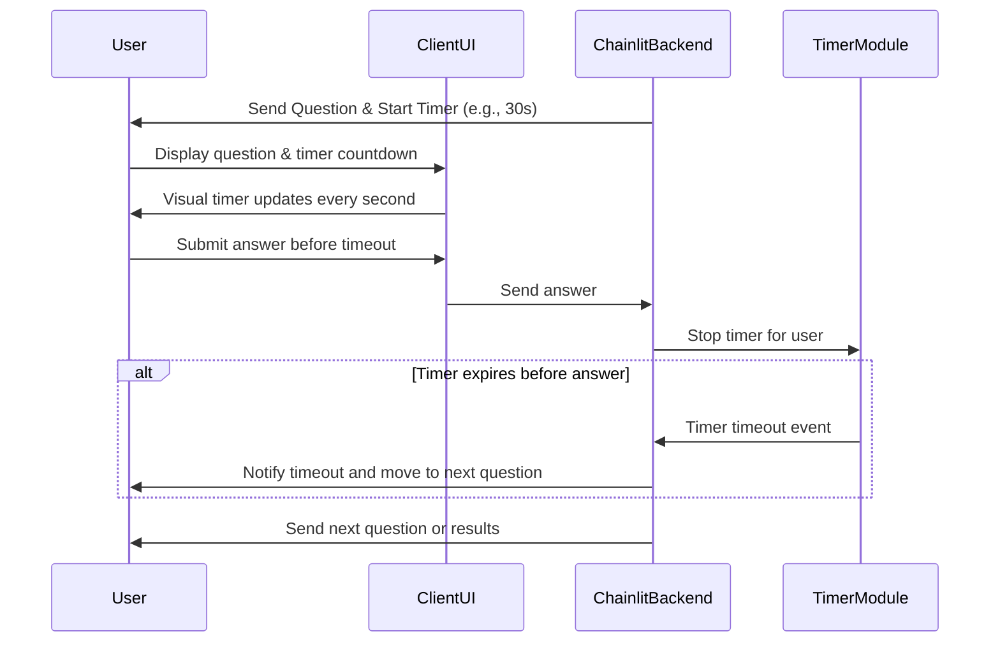

# Software Design Specification (SDS)  
## Timer Feature for MCQ Quiz Application  

**Document Version**: 1.0  
**Date**: 2024-06-10  
**Project**: MCQ Quiz Application  
**Module**: Timer Feature  
**Author**: AI-Generated (GitHub Copilot)  
**Reviewed By**: _________________  
**Approved By**: _________________  
**Approval Date**: _________________  

---

### Document History

| Version | Date | Author | Changes |

|---------|------|--------|---------|

| 1.0 | 2024-06-10 | AI-Generated | Initial SDS creation |

|  |  |  |  |

---

### Distribution List

| Role | Name | Date Sent |

|------|------|-----------|

| Technical Lead |  |  |

| QA Lead |  |  |

| Product Owner |  |  |

|  |  |  |

---

## 1. Executive Summary

The Timer Feature is intended to enhance the existing MCQ Quiz Application by introducing a countdown timer for each question. This feature aims to improve user engagement by adding a time-bound challenge to quiz participation. The timer will track the time allocated per question, provide visual feedback to users, and automatically submit the answer or move to the next question when the time expires.

This enhancement aligns with the goal of making the quiz interactive and engaging while maintaining fair assessment by limiting the time for each response. The timer feature will be implemented as an extension of the current chat-based interface, preserving the existing user experience flow.

Key stakeholders include the development team responsible for the MCQ application, the QA team for testing the timer behavior, and product management overseeing feature delivery and user engagement metrics.

Success criteria include seamless integration without performance degradation, accurate timing functionality, clear user notification on time limits, and robust handling of edge cases such as user inactivity or refresh actions.

## 2. Scope & Requirements

### Functional Requirements

1. [FR-1] Display a countdown timer for each question once it is presented to the user.

2. [FR-2] Set a configurable time limit per question (default: 30 seconds).

3. [FR-3] Automatically submit the current answer or mark it as unanswered and proceed to the next question when the timer expires.

4. [FR-4] Provide visual indication (e.g., timer countdown text or progress bar) to notify users of remaining time.

5. [FR-5] Pause the timer if the quiz page loses focus or the user navigates away, and resume upon return.

6. [FR-6] Prevent timer manipulation or bypass by users.

7. [FR-7] Allow quiz restart to reset timer states.

8. [FR-8] Log timer events for analytics and debugging purposes.

### Non-Functional Requirements

1. [NFR-1] Performance: Timer updates should not introduce noticeable latency or UI blocking.

2. [NFR-2] Security: Timer mechanism should be resistant to tampering or cheating attempts.

3. [NFR-3] Scalability: Support concurrent users without degradation in timer accuracy.

4. [NFR-4] Usability: Timer display must be clear and accessible to users.

5. [NFR-5] Compatibility: Must work consistently across supported browsers and devices.

### Scope

**In Scope**:  
- Implementation of the question timer within the chat UI.  
- Timer configuration and state management in user sessions.  
- Automatic progression on timer expiry.  
- Visual timer display and updates.  
- Backend logic integration for timeouts and answer processing.  

**Out of Scope**:  
- Timer for overall quiz duration (only per-question timer).  
- Persistent timer state across user sessions or device changes.  
- Analytics dashboard (beyond event logging).  
- UI redesign beyond timer display addition.  

### Priority Areas

- High Priority: Timer accuracy and automatic question submission.  
- Medium Priority: Timer pause/resume on tab focus change.  
- Low Priority: Timer event logging and analytics integration.  

## 3. Architecture Overview

The Timer Feature will be integrated into the existing MCQ Quiz Application built using Chainlit, a chat-based interactive application framework. The current architecture consists of a Python backend handling quiz logic and user session management, with Chainlit managing message flow and state.

### System Context

- **User Client (Browser)**: Receives questions and timer display, sends answers and timer expiry notifications.  
- **Chainlit Backend**: Manages quiz state, user session data, question flow, and enforces timer logic.  
- **Timer Module (New)**: Embedded in backend and frontend logic to track question time and trigger transitions.  

### Component Interactions

- Upon sending a question (`send_question()`), the timer starts counting down for the configured duration.  
- Client-side UI displays countdown and visually updates with each tick (e.g., every second).  
- If user submits answer before timeout, timer stops and answer is processed.  
- If timer expires, backend treats as unanswered or invalid and moves to next question automatically.  
- Timer state is stored in the `user_data` session dictionary alongside question indexes and score.  
- Timer pause/resume hooks into browser focus events via Chainlit or frontend JavaScript integration.  

### Technology Stack

- Python 3.x for backend quiz logic.  
- Chainlit framework for chat interface and session management.  
- Asyncio for asynchronous timer and message handling.  
- Potential lightweight frontend timer display enhancements via Chainlit's message updates or custom components.  

### Mermaid Sequence Diagram: Timer Interaction Flow



## 4. Component Breakdown

### 4.1 Timer Module

- **Responsibilities**:  
  - Manage countdown per question per user session.  
  - Trigger automatic answer submission or question progression on timeout.  
  - Integrate with existing quiz flow and user session data.  
  - Handle pause/resume conditions due to browser focus changes.  

- **Interfaces**:  
  - API to start, stop, and reset timer for a session.  
  - Event callbacks for timeout notifications.  
  - Integration with Chainlit message handlers for user answers and quiz state changes.  

- **Design Patterns**:  
  - Observer pattern for event notifications on timer expiry.  
  - State management pattern for timer states (running, paused, stopped).  

- **Code References**:  
  - Extend `app.py` main logic, especially `send_question()`, `main()` message handler, and user session data `user_data`.  
  - New async timer tasks using `asyncio` to manage countdown without blocking main event loop.  

### 4.2 User Session Data Extension

- Add fields to track timer start time, remaining time, and paused state per user session key in `user_data`.  

### 4.3 UI Timer Display

- Modify message content or send additional timer update messages to client.  
- Use Chainlit's messaging system to update or append countdown messages.  
- Optionally, inject frontend JavaScript components if Chainlit supports, to render a live countdown timer.  

### 4.4 Answer Submission Handling

- On timer expiry, enforce automatic submission of "no answer" or skip.  
- Provide feedback message for timeout scenario.  
- Ensure score and answer storage consistent with manual answer submission.  

## 5. API Overview

The current MCQ Application exposes no external REST API but uses Chainlit's event-driven message interface. The timer feature will interact internally with existing message handlers and user session data.

| Event / Method | Description | Input | Output / Effect |

|----------------|-------------|-------|-----------------|

| `send_question()` | Sends question to user and starts timer | User session ID | Sends question & timer start signal |

| `main(message)` | Handles user answer messages | User answer message | Processes answer, stops timer |

| `timer_expiry_handler(session_id)` | Internal handler for timer expiry | Session ID | Marks question unanswered, sends timeout message, moves to next question |

| `pause_timer(session_id)` | Pauses timer on browser tab unfocus | Session ID | Pauses countdown |

| `resume_timer(session_id)` | Resumes timer on browser tab focus | Session ID | Resumes countdown |

No external API calls are added; all logic remains in-process in backend and Chainlit client.

---

## 6. Data Model & Persistence

### 6.1 User Session Data Extension

The timer feature requires extending the existing user session data stored in the `user_data` dictionary with the following fields:

| Field Name         | Type          | Description                              |
|--------------------|---------------|------------------------------------------|
| `timer_start_time`  | `float` (timestamp) | The epoch time when timer started.        |
| `timer_duration`    | `int` (seconds) | Configured time duration per question.     |
| `timer_remaining`   | `int` (seconds) | Remaining time when paused.                 |
| `timer_paused`      | `bool`          | Flag indicating if timer is paused.         |
| `timer_task`        | `asyncio.Task`  | Reference to the running timer async task. |

These fields will be managed in the session dictionary keyed by user session ID, ensuring isolation between concurrent users.

### 6.2 Data Validation

- Validate that `timer_duration` is a positive integer, defaulting to 30 seconds if unspecified.
- Ensure `timer_remaining` cannot be negative.
- On session reset (quiz restart), reset all timer fields to initial state.

### 6.3 Persistence

- Timer states are ephemeral and stored only in memory during session lifetime.
- No persistent storage is used for timer data as it is transient and tied to live quiz session.
- Logging of timer events (start, pause, expiry) may be appended to application logs or an analytics system if integrated.

## 7. Configuration & Deployment

### 7.1 Configuration Options

- `QUESTION_TIMER_DURATION`: Integer value representing seconds allowed per question. Default: 30 seconds.
- `TIMER_ENABLED`: Boolean flag to enable or disable the timer feature. Default: True.
- Configurable via environment variables or application configuration file.

### 7.2 Deployment Considerations

- No additional infrastructure required beyond existing deployment.
- Ensure asynchronous event loop (asyncio) is supported in deployment environment.
- Confirm Chainlit version compatibility with async timer tasks and message updates.

### 7.3 Environment Variables Example

```bash
QUESTION_TIMER_DURATION=30
TIMER_ENABLED=true
```

### 7.4 Deployment Steps

1. Merge timer feature code changes into main branch.
2. Update configuration files or environment variables with timer settings.
3. Deploy application as per standard CI/CD pipeline.
4. Monitor application logs for any timer-related errors.
5. Inform QA to begin timer feature testing.

## 8. Security & Compliance

### 8.1 Authentication & Authorization

- Timer feature does not introduce new authentication mechanisms.
- User sessions remain protected by existing Chainlit session management.
- No elevated privileges required for timer operations.

### 8.2 Input Validation & Tampering Prevention

- User input for answers continues to be validated as integers within valid option range.
- Timer state runs on backend and is not modifiable by client messages.
- Timer expiry logic enforced server-side to prevent client-side manipulation.
- Implement sanity checks on timer events to detect anomalies (e.g., premature expiry).

### 8.3 Data Protection

- Timer data is transient and does not include personal data.
- Logs of timer events should exclude sensitive user information.
- Follow existing application data protection policies.

### 8.4 Compliance Considerations

- No new personal data processing introduced by timer feature.
- No compliance impact on GDPR, HIPAA, PCI-DSS expected.
- Audit logging of timer events recommended for traceability.

## 9. Observability

### 9.1 Logging

- Log timer start, pause, resume, and expiry events with timestamp and user session ID.
- Log any errors or exceptions in timer task execution.
- Use existing application logging infrastructure.

### 9.2 Monitoring & Alerting

- Monitor timer task failures or abnormal terminations.
- Alert on repeated timer errors indicating potential bugs or performance issues.

### 9.3 Performance Metrics

- Track average timer accuracy and drift per session.
- Measure user abandonment or timeout rates per question.

### 9.4 Health Checks

- Timer feature health tied to overall application health.
- Confirm async event loop responsiveness under load.

## 10. Non-Functional Requirements

### 10.1 Performance

- Timer updates must not block main message loop.
- Use asynchronous timers with minimal CPU and memory footprint.
- Visual timer updates sent at reasonable intervals (e.g., 1 second).

### 10.2 Scalability

- Support hundreds or thousands of concurrent timers (users) without degradation.
- Timer data stored per session in memory; ensure efficient cleanup on session end.

### 10.3 Usability

- Timer UI must be clear, visible, and intuitive.
- Provide warning near timer expiry (optional, e.g., last 5 seconds flashing).
- Ensure timer works on all supported browsers and devices.

### 10.4 Reliability & Availability

- Timer feature should not cause application crashes.
- Gracefully handle user disconnects or refreshes.
- Resume or reset timer state as appropriate.

### 10.5 Accessibility

- Timer display must be accessible via screen readers.
- Use ARIA labels or descriptive text as needed.

---

## 11. Testing Strategy

### 11.1 Unit Testing

- Test timer start, pause, resume, and stop functions independently.
- Verify timer countdown accuracy and expiry triggers.
- Validate user session data updates with timer fields.

### 11.2 Integration Testing

- Test timer integration with question sending and answer handling in `app.py`.
- Simulate user inactivity to verify automatic question progression on timeout.
- Verify timer pause/resume behavior on browser tab focus changes.

### 11.3 End-to-End Testing

- Conduct full quiz runs with timer enabled.
- Confirm visual timer display updates in user chat interface.
- Verify correct behavior on timeouts, answer submissions, and quiz restarts.

### 11.4 Security Testing

- Attempt to manipulate timer state from client-side; verify backend enforcement.
- Validate input sanitization and timer boundary conditions.

### 11.5 Performance Testing

- Test application under load with multiple concurrent timers.
- Measure timer accuracy and resource utilization.

### 11.6 Test Coverage

- Aim for 100% coverage on timer-related code.
- Include positive, negative, and edge cases.

## 12. Risks & Mitigation

| Risk | Impact | Likelihood | Mitigation Strategy |

|------|--------|------------|---------------------|

| Timer desynchronization between backend and client UI | Medium | Medium | Use server-side authoritative timer; client only for display |

| User refresh or disconnect during timer countdown | Medium | Medium | Reset or pause timer on user reconnect |

| Performance degradation under high concurrent users | High | Low | Optimize async timer implementation; monitor resource usage |

| User attempts to bypass or cheat timer | High | Low | Enforce timer logic server-side; validate all inputs |

| Timer UI clutter or confusion | Low | Medium | Clear, accessible timer design; user feedback |

## 13. Architecture Decision Records (ADRs)

### ADR-1: Timer Implementation Approach

**Status**: Accepted  
**Date**: 2024-06-10  
**Deciders**: Development Team  

#### Context

Need to implement a timer per question to limit user response time in chat-based quiz.

#### Decision Drivers

- Accurate timing  
- Minimal impact on existing architecture  
- Compatibility with Chainlit async messaging  

#### Considered Options

1. Client-side only timer using JavaScript.  
2. Server-side timer with async tasks and client updates.  
3. Hybrid approach with server authoritative timer and client display.  

#### Decision Outcome

**Chosen option**: Option 3 - Hybrid timer with server authoritative control and client display.

**Positive Consequences**:
- Prevents timer manipulation by users.
- Ensures consistent behavior regardless of client environment.
- Leverages existing async Python backend.

**Negative Consequences**:
- More complex implementation.
- Requires additional messaging for timer updates.

#### Links
- [Chainlit documentation](https://chainlit.io)  
- [Asyncio timers](https://docs.python.org/3/library/asyncio-task.html)

## 14. Assumptions & Constraints

### Assumptions

- Users have stable internet connection for timely message delivery.
- Chainlit framework supports asynchronous message updates.
- Default timer duration of 30 seconds is acceptable; configurable if needed.
- Users interact primarily via web browsers.

### Constraints

- Timer state is stored in-memory; no persistence across sessions or devices.
- Limited to per-question timer; no overall quiz timer.
- No major UI redesign allowed; timer must fit into existing message flow.
- Backend environment supports asyncio for async timer tasks.

## 15. Dependencies & Integration

### Internal Dependencies

- Chainlit session management and message handling modules.
- `questions.py` for question data.
- `app.py` main quiz logic.

### External Dependencies

- None beyond Chainlit framework and Python 3.x standard libraries.

### Integration Points

- Extend `send_question()` to start timer.
- Modify `main()` message handler to stop timer on answer.
- Add timer expiry handler to trigger question progression.
- Use Chainlit event hooks for browser tab focus changes to pause/resume timer.

---

## 16. Glossary & References

### Glossary

| Term | Definition |

|------|------------|

| Chainlit | Python framework for building interactive chat applications. |

| Timer Task | An asynchronous task managing countdown per question. |

| Asyncio | Python library providing asynchronous I/O capabilities. |

| User Session | Data structure storing per-user quiz state. |

| Timer Expiry | Event when countdown reaches zero. |

| UI | User Interface. |

### References

- Chainlit Official Documentation: https://chainlit.io  
- Asyncio Python Library: https://docs.python.org/3/library/asyncio.html  
- Python Asyncio Task Documentation: https://docs.python.org/3/library/asyncio-task.html  

## 17. Appendices

### 17.1 Mermaid Diagrams

#### Timer Interaction Sequence Diagram


### 17.2 Code Sample: Async Timer Implementation Snippet

```python
import asyncio

async def question_timer(session_id, duration):
    try:
        await asyncio.sleep(duration)
        # Handle timer expiry logic here:
        # Mark question unanswered, notify user, send next question
    except asyncio.CancelledError:
        # Timer was stopped or paused
        pass
```

---

## 📄 Converting to Word (.docx)

To convert this Markdown document to Word format, use Pandoc:

### Prerequisites

- Install Pandoc: https://pandoc.org/installing.html  
  - Windows: `choco install pandoc` or download installer  
  - Mac: `brew install pandoc`  
  - Linux: `apt-get install pandoc`  

### Conversion Commands

**Basic Conversion**:
```bash
pandoc docs/SDS_Timer_Feature_20240610.md -o docs/SDS_Timer_Feature_20240610.docx
```

**With Table of Contents**:
```bash
pandoc docs/SDS_Timer_Feature_20240610.md -o docs/SDS_Timer_Feature_20240610.docx --toc --toc-depth=3
```

**With Custom Styling** (requires reference.docx template):
```bash
pandoc docs/SDS_Timer_Feature_20240610.md -o docs/SDS_Timer_Feature_20240610.docx --reference-doc=custom-reference.docx --toc
```

### Mermaid Diagrams in Word

Mermaid diagrams must be manually converted:

1. Copy Mermaid code to https://mermaid.live/  
2. Export as PNG or SVG  
3. Insert images into Word document  

---
