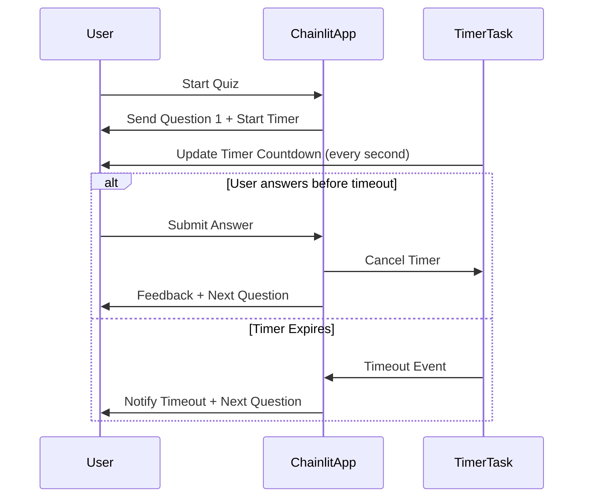

# Software Design Specification (SDS)  
## Timer Feature for MCQ Quiz App

**Document Version**: 1.0  
**Date**: 2024-06-05  
**Project**: MCQ Quiz Application (Python, Chainlit)  
**Module**: Timer Feature  
**Author**: AI-Generated  
**Reviewed By**: _________________  
**Approved By**: _________________  
**Approval Date**: _________________  

---

### Document History

| Version | Date       | Author       | Changes              |
|---------|------------|--------------|----------------------|
| 1.0     | 2024-06-05 | AI-Generated | Initial SDS creation  |

---

### Distribution List

| Role           | Name         | Date Sent  |
|----------------|--------------|------------|
| Technical Lead |              |            |
| QA Lead        |              |            |
| Product Owner  |              |            |

---

## 1. Executive Summary

This document specifies the design for adding a **timer feature** to the existing MCQ Quiz Application built with Python and Chainlit. The timer will enforce a per-question time limit, promoting timely responses and increasing quiz challenge.

Currently, the app presents questions sequentially and waits indefinitely for user input. The timer feature will impose a configurable time limit (e.g., 30 seconds) for each question. If the user fails to answer within the time, the system will automatically mark the question as unanswered or incorrect and proceed to the next question.

The feature aims to improve user engagement and simulate real exam conditions.

Key stakeholders include product management, development, and QA teams.

Success will be measured by correct timer enforcement, seamless user experience, and no negative impact on existing functionality.

---

## 2. Scope & Requirements

### Functional Requirements

- [FR-1] Add a configurable timer for each question (default: 30 seconds).  
- [FR-2] Display countdown timer visibly to the user during each question.  
- [FR-3] Automatically advance to the next question when timer expires.  
- [FR-4] Mark unanswered questions due to timeout appropriately in user results.  
- [FR-5] Allow users to see remaining time in real-time (updated every second).  
- [FR-6] Provide configuration option to enable/disable timer for flexibility.

### Non-Functional Requirements

- [NFR-1] Timer accuracy must be within ±1 second.  
- [NFR-2] UI updates must be smooth and non-blocking.  
- [NFR-3] Timer implementation must not degrade app performance.  
- [NFR-4] Must be compatible with Chainlit framework and existing async architecture.  
- [NFR-5] Security: Prevent any client-side tampering with timer value.

### Scope

**In Scope**:  
- Timer logic backend integration.  
- User interface display of timer within Chainlit messages.  
- Handling timeout events and automatic question progression.  
- Configuration management for timer settings.

**Out of Scope**:  
- Major UI redesign beyond timer display.  
- Changes to question content or scoring logic (except timeout handling).  
- Persistence of timer state across sessions or page reloads.

### Priority Areas

- High Priority: Timer enforcement logic, UI display, timeout handling.  
- Medium Priority: Configuration options, user notification on timeout.  
- Low Priority: Customizable timer durations per question (optional future extension).

---

## 3. Architecture Overview

The current MCQ app uses Chainlit, an asynchronous Python framework for chat-based interaction. The architecture consists of:

- **User Session Management**: Tracks current question index, score, and answers per user session.  
- **Question Delivery**: Sends questions to users as formatted chat messages.  
- **User Input Processing**: Receives and validates user answers asynchronously.  
- **Result Calculation**: Computes score and displays results at the end.

### Timer Feature Integration

The timer feature will be integrated by extending the existing question delivery and input processing flow:

- On sending each question, a **timer countdown** starts asynchronously.  
- The timer periodically updates the user with remaining time via Chainlit messages or UI elements.  
- If a valid answer is received before timeout, the timer cancels and normal flow continues.  
- If the timer expires first, the system automatically marks the question as unanswered and moves on.  

This requires adding asynchronous timer tasks linked with user sessions and modifying message handling to accommodate timeout events.

### Technology Stack

- **Language**: Python 3.10+  
- **Framework**: Chainlit (async chat app)  
- **Data Storage**: In-memory user session data dictionary  
- **Libraries**: Asyncio for timing and concurrency  

### Mermaid Diagram: High-Level Sequence of Timer Feature



---

## 4. Component Breakdown

### Existing Components

- **app.py**: Main application logic including question sending, answer handling, and result calculation.  
- **questions.py**: Contains question data and helper functions.  
- **Chainlit framework**: Provides chat session management and async messaging.

### New/Modified Components for Timer Feature

- **Timer Manager Module** (new):  
  - Responsible for starting, tracking, and cancelling timers per user session.  
  - Uses asyncio tasks to run countdown asynchronously.  
  - Interfaces with app.py to notify timeout events.

- **UI Timer Display** (modified):  
  - Enhancement to question messages to include timer countdown display.  
  - Possibly implemented by sending periodic updated messages or using Chainlit UI components if supported.

- **Answer Handling Logic** (modified):  
  - Enhanced to accept cancellation signals when timer expires.  
  - Marks unanswered due to timeout distinctly in user_data.

### Interfaces

- `TimerManager.start_timer(session_id, duration)` → starts timer for user.  
- `TimerManager.cancel_timer(session_id)` → cancels active timer if exists.  
- `TimerManager.timeout_callback(session_id)` → called on timeout to trigger auto-advance.

---

## 5. API Overview

The MCQ app does not expose external REST APIs; all interactions occur via Chainlit's chat interface asynchronously. The timer feature will not introduce new external APIs but will extend existing internal asynchronous messaging and event handling.

### Relevant Internal APIs and Interfaces

| Interface                  | Description                                          | Location      |
|----------------------------|----------------------------------------------------|---------------|
| `cl.on_chat_start`          | Handler to initialize quiz and user data           | `app.py`      |
| `send_question()`           | Sends current question and starts timer            | `app.py`      |
| `cl.on_message`             | Handles user answers and timer cancellation         | `app.py`      |
| `TimerManager.start_timer`  | Starts countdown timer for session                  | New module    |
| `TimerManager.cancel_timer` | Cancels active timer if user answers early          | New module    |
| `TimerManager.timeout_callback` | Called when timer expires to auto-advance        | New module    |

### Request/Response Flow Changes

- On question send, `send_question()` triggers `TimerManager.start_timer()` with configured duration.
- Timer sends countdown updates to user via Chainlit messages or UI (every second).
- On user answer, `cl.on_message` cancels timer via `TimerManager.cancel_timer()`.
- On timeout, `TimerManager.timeout_callback()` triggers automatic advancement and timeout notification.

### Authentication & Authorization

No changes needed; all chat sessions managed by Chainlit's user session mechanism.

### Error Handling

- Timer task failures log errors and fallback to default behavior (no timer enforcement).
- Invalid user inputs during countdown handled as before, with added timeout awareness.

---

## 6. Data Model & Persistence

### Existing Data Model

- `user_data` dictionary in-memory keyed by user session ID.  
- Stores:  
  - `current_question`: int  
  - `score`: int  
  - `answers`: list of dicts with question_id, user_answer, correct

### Data Model Extensions for Timer

- Add `timer_active`: boolean flag per session to track if timer is running.  
- Add `timeout_answers`: list or flag to record which questions were unanswered due to timeout.

Example structure per session:

```python
user_data[session_id] = {
    "current_question": int,
    "score": int,
    "answers": list,
    "timer_active": bool,
    "timeout_answers": list  # optional, track question IDs timed out
}
```

### Persistence Considerations

- All data remains in-memory; no database changes required.  
- Timer state does not persist across user disconnects or page reloads. If desired, future extension could store timer state persistently.

---

## 7. Configuration & Deployment

### Configuration

Introduce configuration parameters for timer feature:

- `TIMER_ENABLED` (bool, default `True`): Enable or disable timer feature globally.  
- `TIMER_DURATION_SECONDS` (int, default `30`): Duration per question in seconds.

Configuration can be set via environment variables or a config file loaded at app startup.

### Deployment Considerations

- Timer feature requires no new infrastructure.  
- Deployment involves updating `app.py` to include timer logic and adding the new Timer Manager module.  
- Ensure Python environment supports asyncio (Python 3.10+ recommended).  
- Recommend thorough testing in staging before production rollout.

---

## 8. Security & Compliance

### Security Measures

- Timer logic runs server-side; client cannot manipulate timer values directly.  
- Validate all user inputs as before to prevent injection or malformed data.  
- Do not expose raw timer internal states externally.  
- Use secure session IDs managed by Chainlit to isolate user data.

### Compliance Considerations

- No personally identifiable information (PII) captured or processed by timer feature.  
- No new data retention policies impacted.  
- Standard app security and privacy policies apply.

---

## 9. Observability

### Logging

- Log timer start, cancel, and timeout events per user session for audit.  
- Log errors in timer task execution.  

### Monitoring

- Track metrics:  
  - Number of timers started/cancelled/expired.  
  - Average time taken per question.  
- Use existing infrastructure or add lightweight monitoring hooks.

### Alerting

- Alert on repeated timer task failures or anomalies in timer durations.

---

## 10. Testing Strategy

### Unit Testing

- Test `TimerManager` methods: start, cancel, and timeout callback.  
- Mock Chainlit messaging to verify timer updates and timeout notifications.  
- Validate timer cancels correctly on user answer.  
- Confirm timeout marks question unanswered and advances quiz.

### Integration Testing

- Simulate full quiz session with timer enabled.  
- Verify countdown messages sent every second.  
- Confirm correct behavior when user answers early or time expires.  
- Test that disabling timer bypasses timer logic.

### Manual Testing

- Test UI timer display for correctness and responsiveness.  
- Verify multiple concurrent users have independent timers.  
- Test edge cases: rapid answers, network delays, session disconnects.

### Performance Testing

- Measure app responsiveness with timers running for many concurrent users.  
- Ensure no significant latency or resource consumption increase.

---

## 11. Risks & Mitigation

| Risk                                     | Probability | Impact      | Mitigation                             |
|------------------------------------------|-------------|-------------|--------------------------------------|
| Timer mismatch due to async delays       | Medium      | Medium      | Use precise asyncio timing and testing|
| User confusion by timer updates/messages | Medium      | Low         | Design clear and non-intrusive UI    |
| Timer task memory leaks or resource use  | Low         | High        | Proper cancellation and cleanup      |
| Timer conflicts with Chainlit session    | Low         | High        | Use Chainlit user session IDs safely |
| Network latency causes UI desync         | Medium      | Medium      | Graceful timeout fallback             |

---

## 12. Architecture Decision Records (ADR)

### ADR-001: Use Asyncio Tasks for Timer Implementation

- *Decision*: Implement per-user timers as asyncio tasks for concurrency and cancellation.  
- *Rationale*: Fits Chainlit async model, lightweight, easy to cancel timers.  
- *Consequences*: Requires careful task management to avoid leaks.

### ADR-002: Timer Updates via Periodic Chainlit Messages

- *Decision*: Send timer countdown updates periodically as chat messages.  
- *Rationale*: Chainlit chat interface is message-based; no native UI timer widget.  
- *Consequences*: May cause message clutter; design minimal update frequency.

### ADR-003: Store Timer State In-Memory

- *Decision*: Timer state and flags stored in-memory in `user_data`.  
- *Rationale*: Simple, no persistence required for timer state.  
- *Consequences*: Timer resets on user reconnect or server restart.

---

## 13. Assumptions & Constraints

- Users are connected with reliable network for timely message delivery.  
- Chainlit framework supports asynchronous message sending with minimal delay.  
- Timer duration is fixed per quiz session (not per question).  
- No browser-side timer UI control; all timer logic server-side.  
- Single-instance deployment or session affinity for consistent user state.

---

## 14. Dependencies & Integration

### Dependencies

- Python 3.10+ (for asyncio features)  
- Chainlit framework (latest stable version)  
- Standard Python libraries (asyncio, logging)

### Integration Points

- Modify `app.py` to integrate with new Timer Manager module.  
- Update `send_question()` to start timers.  
- Modify `cl.on_message` to cancel timers on user answer.  
- Update results processing to handle timeout answers.

---

## 15. Implementation Plan

### Development Steps

1. Create `timer_manager.py` module with asyncio timer task management.  
2. Modify `app.py`:  
   - Enhance `send_question()` to start timer.  
   - Modify `cl.on_message` to cancel timer on valid answer.  
   - Add timeout handling logic to advance questions automatically.  
3. Update user session data structure to include timer flags.  
4. Add configuration parameters for timer enablement and duration.  
5. Implement periodic timer update messages to user.  
6. Write unit and integration tests for timer logic.  
7. Perform manual UI testing for timer display and behavior.

### Timeline

- Development: 1 week  
- Testing & QA: 1 week  
- Deployment: 1 day  
- Monitoring & Bug Fixes: 2 weeks post-deployment

---

## 16. Rollout & Rollback Strategy

### Rollout

- Deploy timer feature initially in staging environment for end-to-end testing.  
- Monitor logs and user feedback for timer accuracy and usability.  
- Roll out gradually to production users with option to disable timer via config.  
- Communicate feature availability and instructions to users.

### Rollback

- Disable timer feature by setting `TIMER_ENABLED = False` in configuration.  
- Remove timer-related code if necessary in future releases.  
- Ensure backward compatibility with no timers.

---

## 17. Maintenance & Support

- Monitor timer metrics and logs regularly.  
- Address user feedback on timer usability.  
- Update timer duration or UI based on product requirements.  
- Maintain test coverage for timer feature.  
- Document timer feature in user and developer guides.

---

## 18. Glossary & References

| Term           | Definition                                      |
|----------------|------------------------------------------------|
| Chainlit       | Python framework for building chat applications |
| Asyncio        | Python library for asynchronous concurrency    |
| Timer Task     | Async task that counts down time per question  |
| Session ID     | Unique identifier for user chat session         |
| Timeout        | Event when timer reaches zero without answer    |

**References**:  
- Chainlit Documentation: https://docs.chainlit.io  
- Python Asyncio: https://docs.python.org/3/library/asyncio.html

---

## 19. Appendices

### Appendix A: Sample Timer Manager Module Code Snippet

```python
import asyncio
from chainlit import Message

class TimerManager:
    def __init__(self):
        self.timers = {}

    async def start_timer(self, session_id, duration, timeout_callback):
        if session_id in self.timers:
            self.cancel_timer(session_id)
        self.timers[session_id] = asyncio.create_task(
            self._run_timer(session_id, duration, timeout_callback)
        )

    def cancel_timer(self, session_id):
        task = self.timers.get(session_id)
        if task:
            task.cancel()
            del self.timers[session_id]

    async def _run_timer(self, session_id, duration, timeout_callback):
        for remaining in range(duration, 0, -1):
            await Message(content=f" Time remaining: {remaining} seconds").send()
            await asyncio.sleep(1)
        await timeout_callback(session_id)
```

### Appendix B: Configuration Sample

```env
TIMER_ENABLED=True
TIMER_DURATION_SECONDS=30
```

---

##  Converting to Word (.docx)

To convert this Markdown document to Word format, use Pandoc:

### Prerequisites
- Install Pandoc: https://pandoc.org/installing.html
  - Windows: `choco install pandoc` or download installer
  - Mac: `brew install pandoc`
  - Linux: `apt-get install pandoc`

### Conversion Commands

**Basic Conversion**:
```bash
pandoc docs/SDS_Timer_Feature_20240605.md -o docs/SDS_Timer_Feature_20240605.docx
```

**With Table of Contents**:
```bash
pandoc docs/SDS_Timer_Feature_20240605.md -o docs/SDS_Timer_Feature_20240605.docx --toc --toc-depth=3
```

**With Custom Styling**:
```bash
pandoc docs/SDS_Timer_Feature_20240605.md -o docs/SDS_Timer_Feature_20240605.docx --reference-doc=custom-reference.docx --toc
```

### Mermaid Diagrams in Word

Mermaid diagrams must be manually converted:

1. Copy Mermaid code to https://mermaid.live/  
2. Export as PNG/SVG  
3. Insert images into Word document

---